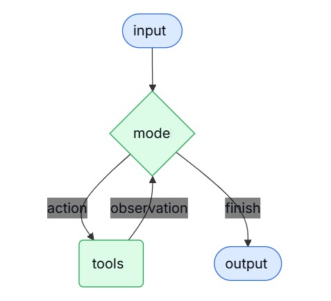

Agent可以让LLM和Tool结合，这样LLM就可以分析task，调用合适的Tool，然后再利用Tool的结果反馈给LLM再次分析\
这样不断的循环，最后达成最终的解决方案

当达到某个指定条件，或者循环达到上限，循环就会断开，并返回最终结果\



通过create_agent函数，可以创建一个可发布生产的agent\
create_agent 函数创建agent时，langchain内部会通过 LangGraph，把一个 agent 的执行过程搭建成“节点 + 边”的有向图（graph），构建出了一个基于图结构的 Agent 运行时系统

示例：
```python
from langchain.agents import create_agent

agent = create_agent("openai:gpt-5", tools=tools)
```


