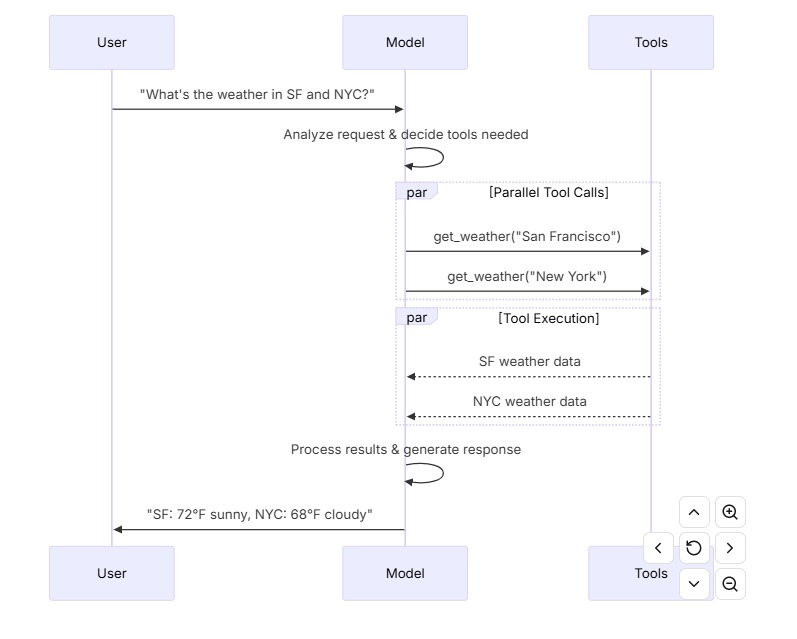

# 工具和工具调用
模型能够请求调用工具，比如：
- 访问数据库
- web检索
- 执行代码

工具是以下事物的组合：
- 一个模式，包括工具的名称、描述和/或参数定义（通常是 JSON 模式）
- 一个要执行的函数或协程

工具调用可以理解为函数调用

以下是用户和模型之间，基本的工具调用流程示例：


通过bind_tools属性，将模型和工具绑定，这样在后续的调用中，模型可以根据需要调用不同的工具\
一些模型提供商也提供了内置工具供模型调用
```python
from langchain.tools import tool

@tool
def get_weather(location: str) -> str:
    """Get the weather at a location."""
    return f"It's sunny in {location}."


model_with_tools = model.bind_tools([get_weather])

response = model_with_tools.invoke("What's the weather like in Boston?")
for tool_call in response.tool_calls:
    # View tool calls made by the model
    print(f"Tool: {tool_call['name']}")
    print(f"Args: {tool_call['args']}")
```

当模型绑定用户自定义工具时，模型的响应包括执行工具的请求\
当仅使用模型时，需要执行所请求的工具并将结果返回给模型，以便在后续推理中使用\
当使用代理时，代理循环将处理工具执行循环


# 常见工具调用方式

- 工具执行循环\
  当模型返回工具调用时，你需要执行这些工具并将结果传回模型\
  这会创建一个对话循环，使模型可以使用工具结果来生成最终响应\
  LangChain 包含处理此协调的代理抽象\
  每个工具返回的 ToolMessage 都包含一个与原始工具调用匹配的 tool_call_id，帮助模型将结果与请求对应起来。

  ```python
  # Bind (potentially multiple) tools to the model
  model_with_tools = model.bind_tools([get_weather])

  # Step 1: Model generates tool calls
  messages = [{"role": "user", "content": "What's the weather in Boston?"}]
  ai_msg = model_with_tools.invoke(messages)
  messages.append(ai_msg)

  # Step 2: Execute tools and collect results
  for tool_call in ai_msg.tool_calls:
      # Execute the tool with the generated arguments
      tool_result = get_weather.invoke(tool_call)
      messages.append(tool_result)

  # Step 3: Pass results back to model for final response
  final_response = model_with_tools.invoke(messages)
  print(final_response.text)
  # "The current weather in Boston is 72°F and sunny."
  ```


- Forcing tool calls\
  默认情况下，模型可以根据用户的输入自由选择使用工具列表里的任何工具\
  但也可以让模型使用特定的工具

  示例：允许模型使用任何工具
  ```python
  model_with_tools = model.bind_tools([tool_1], tool_choice="any")
  ```

  示例：强制模型使用特定工具
  ```python
  model_with_tools = model.bind_tools([tool_1], tool_choice="tool_1")
  ```

- 并行工具调用\
  很多模型在特定场景可以支持同时并行调用多个工具\
  这使模型能够同时从不同来源收集信息\
  模型能够根据所请求操作的独立性智能地判断何时适合进行并行执行\
  比如, 当需要查询A和B两个城市的天气时，模型会同时并行调用获取指定城市天气的工具，该过程模型会并行\
  当需要查询指定经纬度地区的天气时，模型会先通过经纬度查询所在城市，然后再通过城市查看城市所在天气，该过程模型会串行

  示例：
  ```python
  model_with_tools = model.bind_tools([get_weather])

  response = model_with_tools.invoke(
      "What's the weather in Boston and Tokyo?"
  )


  # The model may generate multiple tool calls
  print(response.tool_calls)
  # [
  #   {'name': 'get_weather', 'args': {'location': 'Boston'}, 'id': 'call_1'},
  #   {'name': 'get_weather', 'args': {'location': 'Tokyo'}, 'id': 'call_2'},
  # ]


  # Execute all tools (can be done in parallel with async)
  results = []
  for tool_call in response.tool_calls:
      if tool_call['name'] == 'get_weather':
          result = get_weather.invoke(tool_call)
      ...
      results.append(result)
  ```

  大部分模型都默认支持并行工具调用\
  但有一些模型是可以disable并行特性的\
  示例：
  ```python
  model.bind_tools([get_weather], parallel_tool_calls=False)
  ```

- 流式工具调用\
  当流式处理模型的响应输出时，工具调用会通过ToolCallChunk逐步构建\
  这样就可以看到工具调用的整个过程，而不用等待到整个响应结束

  示例1: 
  ```python
  for chunk in model_with_tools.stream(
      "What's the weather in Boston and Tokyo?"
  ):
      # Tool call chunks arrive progressively
      for tool_chunk in chunk.tool_call_chunks:
          if name := tool_chunk.get("name"):
              print(f"Tool: {name}")
          if id_ := tool_chunk.get("id"):
              print(f"ID: {id_}")
          if args := tool_chunk.get("args"):
              print(f"Args: {args}")

  # Output:
  # Tool: get_weather
  # ID: call_SvMlU1TVIZugrFLckFE2ceRE
  # Args: {"lo
  # Args: catio
  # Args: n": "B
  # Args: osto
  # Args: n"}
  # Tool: get_weather
  # ID: call_QMZdy6qInx13oWKE7KhuhOLR
  # Args: {"lo
  # Args: catio
  # Args: n": "T
  # Args: okyo
  # Args: "}
  ```

  示例2：将每次返回的chunk拼接在一起后，再输出
  ```python
  gathered = None
  for chunk in model_with_tools.stream("What's the weather in Boston?"):
      gathered = chunk if gathered is None else gathered + chunk
      print(gathered.tool_calls)]
  ```