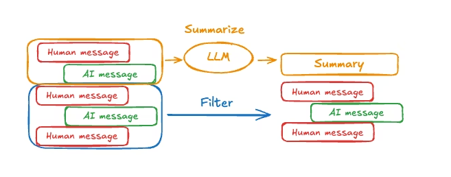

[目录](../目录.md)

# 常见模式
启用短期记忆后，长对话可能会超出 LLM 的上下文窗口。常见的解决方案有：
- **Trim messages（裁剪消息）**\
  在调用LLM前，移除前N条或后N条消息
- **Delete messages（删除消息）**\
  从LangGraph状态中永久删除消息
- **Summarize messages（总结消息）**\
  对历史中较早的消息进行总结，并将其替换为一段摘要
- **Custom strategies（自定义策略）**\
  自定义策略（例如消息过滤等）

这些方法可以让agent跟踪对话，同时又不会超出 LLM 的上下文窗口限制


## Trim messages（裁剪消息）
大多数模型都有最大支持的上下文窗口（以 token 为单位）\
一种常用的截断方式是：计算对话历史的总 token 数，当接近模型上限时自动裁剪\
在 LangChain 中，可以直接使用内置的消息裁剪工具，指定需要保留的最大 token 数量，并设置裁剪策略（例如只保留最新的 max_tokens 内容）\
如果要在Agent中实现自动裁剪历史消息，可通过@before_model中间件装饰器，在模型调用前统一处理上下文


```python
from langchain.messages import RemoveMessage
from langgraph.graph.message import REMOVE_ALL_MESSAGES
from langgraph.checkpoint.memory import InMemorySaver
from langchain.agents import create_agent, AgentState
from langchain.agents.middleware import before_model
from langgraph.runtime import Runtime
from langchain_core.runnables import RunnableConfig
from typing import Any


@before_model
def trim_messages(state: AgentState, runtime: Runtime) -> dict[str, Any] | None:
    """Keep only the last few messages to fit context window."""
    messages = state["messages"]

    if len(messages) <= 3:
        return None  # No changes needed

    first_msg = messages[0]
    recent_messages = messages[-3:] if len(messages) % 2 == 0 else messages[-4:]
    new_messages = [first_msg] + recent_messages

    return {
        "messages": [
            RemoveMessage(id=REMOVE_ALL_MESSAGES),
            *new_messages
        ]
    }

agent = create_agent(
    your_model_here,
    tools=your_tools_here,
    middleware=[trim_messages],
    checkpointer=InMemorySaver(),
)

config: RunnableConfig = {"configurable": {"thread_id": "1"}}

agent.invoke({"messages": "hi, my name is bob"}, config)
agent.invoke({"messages": "write a short poem about cats"}, config)
agent.invoke({"messages": "now do the same but for dogs"}, config)
final_response = agent.invoke({"messages": "what's my name?"}, config)

final_response["messages"][-1].pretty_print()
"""
================================== Ai Message ==================================

Your name is Bob. You told me that earlier.
If you'd like me to call you a nickname or use a different name, just say the word.
"""
```

## Delete messages（删除消息）
可以直接从 graph state 中删除消息，以此管理对话历史\
当需要移除特定消息，或清空整段对话历史时，这种方法非常实用\
删除消息需要使用RemoveMessage工具\
要让RemoveMessage正常生效，状态字段必须使用add_messages reducer\
默认的AgentState已内置该reducer，可直接使用


示例：要删除特定消息
```python
from langchain.messages import RemoveMessage  

def delete_messages(state):
    messages = state["messages"]
    if len(messages) > 2:
        # remove the earliest two messages
        return {"messages": [RemoveMessage(id=m.id) for m in messages[:2]]}
```

示例：删除所有消息
```python
from langgraph.graph.message import REMOVE_ALL_MESSAGES  

def delete_messages(state):
    return {"messages": [RemoveMessage(id=REMOVE_ALL_MESSAGES)]}
```


**删除消息的注意事项**\
执行消息删除操作后，务必保证剩余对话历史格式合法有效, 同时需遵循对应大模型服务商的调用规范, 常见约束如下：
- 部分平台要求对话历史必须以用户消息作为起始内容
- 绝大多数平台规定，携带工具调用内容的模型回复消息，后方必须搭配对应的工具结果消息


```python
from langchain.messages import RemoveMessage
from langchain.agents import create_agent, AgentState
from langchain.agents.middleware import after_model
from langgraph.checkpoint.memory import InMemorySaver
from langgraph.runtime import Runtime
from langchain_core.runnables import RunnableConfig


@after_model
def delete_old_messages(state: AgentState, runtime: Runtime) -> dict | None:
    """Remove old messages to keep conversation manageable."""
    messages = state["messages"]
    if len(messages) > 2:
        # remove the earliest two messages
        return {"messages": [RemoveMessage(id=m.id) for m in messages[:2]]}
    return None


agent = create_agent(
    "gpt-5-nano",
    tools=[],
    system_prompt="Please be concise and to the point.",
    middleware=[delete_old_messages],
    checkpointer=InMemorySaver(),
)

config: RunnableConfig = {"configurable": {"thread_id": "1"}}

for event in agent.stream(
    {"messages": [{"role": "user", "content": "hi! I'm bob"}]},
    config,
    stream_mode="values",
):
    print([(message.type, message.content) for message in event["messages"]])

for event in agent.stream(
    {"messages": [{"role": "user", "content": "what's my name?"}]},
    config,
    stream_mode="values",
):
    print([(message.type, message.content) for message in event["messages"]])
```

```json
[('human', "hi! I'm bob")]
[('human', "hi! I'm bob"), ('ai', 'Hi Bob! Nice to meet you. How can I help you today? I can answer questions, brainstorm ideas, draft text, explain things, or help with code.')]
[('human', "hi! I'm bob"), ('ai', 'Hi Bob! Nice to meet you. How can I help you today? I can answer questions, brainstorm ideas, draft text, explain things, or help with code.'), ('human', "what's my name?")]
[('human', "hi! I'm bob"), ('ai', 'Hi Bob! Nice to meet you. How can I help you today? I can answer questions, brainstorm ideas, draft text, explain things, or help with code.'), ('human', "what's my name?"), ('ai', 'Your name is Bob. How can I help you today, Bob?')]
[('human', "what's my name?"), ('ai', 'Your name is Bob. How can I help you today, Bob?')]
```

## Summarize messages（消息总结）
前文提到，单纯裁剪、删除历史消息容易直接丢弃重要对话信息，造成内容缺失\
为此业界常用更稳妥的优化方案：调用大语言模型对早期对话历史进行精简汇总

如需在Agent内实现对话历史自动总结，可直接使用框架内置的消息总结能力




```python
from langchain.agents import create_agent
from langchain.agents.middleware import SummarizationMiddleware
from langgraph.checkpoint.memory import InMemorySaver
from langchain_core.runnables import RunnableConfig


checkpointer = InMemorySaver()

agent = create_agent(
    model="gpt-5.4",
    tools=[],
    middleware=[
        SummarizationMiddleware(
            model="gpt-5.4-mini",
            trigger=("tokens", 4000),
            keep=("messages", 20)
        )
    ],
    checkpointer=checkpointer,
)

config: RunnableConfig = {"configurable": {"thread_id": "1"}}
agent.invoke({"messages": "hi, my name is bob"}, config)
agent.invoke({"messages": "write a short poem about cats"}, config)
agent.invoke({"messages": "now do the same but for dogs"}, config)
final_response = agent.invoke({"messages": "what's my name?"}, config)

final_response["messages"][-1].pretty_print()
"""
================================== Ai Message ==================================

Your name is Bob!
"""
```