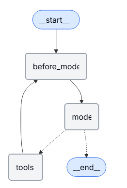
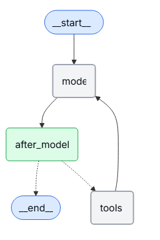

[目录](../目录.md)


可以通过多种方式访问和修改 agent 的短期记忆（即 state）

# Tools（工具）

**在工具中读取短期记忆（Read short-term memory in a tool）**\
在工具中，你可以通过 runtime 参数（类型为 ToolRuntime）访问短期记忆（state）\
runtime 参数对工具签名是隐藏的（模型看不到它），但工具可以通过它访问 state

```python
from langchain.agents import create_agent, AgentState
from langchain.tools import tool, ToolRuntime


class CustomState(AgentState):
    user_id: str

@tool
def get_user_info(
    runtime: ToolRuntime
) -> str:
    """Look up user info."""
    user_id = runtime.state["user_id"]
    return "User is John Smith" if user_id == "user_123" else "Unknown user"

agent = create_agent(
    model="gpt-5-nano",
    tools=[get_user_info],
    state_schema=CustomState,
)

result = agent.invoke({
    "messages": "look up user information",
    "user_id": "user_123"
})
print(result["messages"][-1].content)
# > User is John Smith.
```


**从工具写入短期记忆（Write short-term memory from tools）**\
在执行过程中，若要修改 agent 的短期记忆（即 state），可以直接从工具返回状态更新\
这种方式适用于持久化中间结果，或让后续工具 / 提示词能够访问这些信息

```python
from langchain.tools import tool, ToolRuntime
from langchain_core.runnables import RunnableConfig
from langchain.messages import ToolMessage
from langchain.agents import create_agent, AgentState
from langgraph.types import Command
from pydantic import BaseModel


class CustomState(AgentState):
    user_name: str

class CustomContext(BaseModel):
    user_id: str

@tool
def update_user_info(
    runtime: ToolRuntime[CustomContext, CustomState],
) -> Command:
    """Look up and update user info."""
    user_id = runtime.context.user_id
    name = "John Smith" if user_id == "user_123" else "Unknown user"
    return Command(update={
        "user_name": name,
        # update the message history
        "messages": [
            ToolMessage(
                "Successfully looked up user information",
                tool_call_id=runtime.tool_call_id
            )
        ]
    })

@tool
def greet(
    runtime: ToolRuntime[CustomContext, CustomState]
) -> str | Command:
    """Use this to greet the user once you found their info."""
    user_name = runtime.state.get("user_name", None)
    if user_name is None:
       return Command(update={
            "messages": [
                ToolMessage(
                    "Please call the 'update_user_info' tool it will get and update the user's name.",
                    tool_call_id=runtime.tool_call_id
                )
            ]
        })
    return f"Hello {user_name}!"

agent = create_agent(
    model="gpt-5-nano",
    tools=[update_user_info, greet],
    state_schema=CustomState,
    context_schema=CustomContext,
)

agent.invoke(
    {"messages": [{"role": "user", "content": "greet the user"}]},
    context=CustomContext(user_id="user_123"),
)
```

# Prompt（提示词）
可以在中间件中访问短期记忆（state），从而基于对话历史或自定义状态字段来创建动态提示词
```python
from langchain.agents import create_agent
from typing import TypedDict
from langchain.agents.middleware import dynamic_prompt, ModelRequest


class CustomContext(TypedDict):
    user_name: str


def get_weather(city: str) -> str:
    """Get the weather in a city."""
    return f"The weather in {city} is always sunny!"


@dynamic_prompt
def dynamic_system_prompt(request: ModelRequest) -> str:
    user_name = request.runtime.context["user_name"]
    system_prompt = f"You are a helpful assistant. Address the user as {user_name}."
    return system_prompt


agent = create_agent(
    model="gpt-5-nano",
    tools=[get_weather],
    middleware=[dynamic_system_prompt],
    context_schema=CustomContext,
)

result = agent.invoke(
    {"messages": [{"role": "user", "content": "What is the weather in SF?"}]},
    context=CustomContext(user_name="John Smith"),
)
for msg in result["messages"]:
    msg.pretty_print()
```

```text
================================ Human Message =================================

What is the weather in SF?
================================== Ai Message ==================================
Tool Calls:
  get_weather (call_WFQlOGn4b2yoJrv7cih342FG)
 Call ID: call_WFQlOGn4b2yoJrv7cih342FG
  Args:
    city: San Francisco
================================= Tool Message =================================
Name: get_weather

The weather in San Francisco is always sunny!
================================== Ai Message ==================================

Hi John Smith, the weather in San Francisco is always sunny!
```


# Before model（模型调用前）
你可以在 @before_model 中间件中访问 agent 的短期记忆（state），在模型调用前处理消息


```python
from langchain.messages import RemoveMessage
from langgraph.graph.message import REMOVE_ALL_MESSAGES
from langgraph.checkpoint.memory import InMemorySaver
from langchain.agents import create_agent, AgentState
from langchain.agents.middleware import before_model
from langchain_core.runnables import RunnableConfig
from langgraph.runtime import Runtime
from typing import Any


@before_model
def trim_messages(state: AgentState, runtime: Runtime) -> dict[str, Any] | None:
    """Keep only the last few messages to fit context window."""
    messages = state["messages"]

    if len(messages) <= 3:
        return None  # No changes needed

    first_msg = messages[0]
    recent_messages = messages[-3:] if len(messages) % 2 == 0 else messages[-4:]
    new_messages = [first_msg] + recent_messages

    return {
        "messages": [
            RemoveMessage(id=REMOVE_ALL_MESSAGES),
            *new_messages
        ]
    }


agent = create_agent(
    "gpt-5-nano",
    tools=[],
    middleware=[trim_messages],
    checkpointer=InMemorySaver()
)

config: RunnableConfig = {"configurable": {"thread_id": "1"}}

agent.invoke({"messages": "hi, my name is bob"}, config)
agent.invoke({"messages": "write a short poem about cats"}, config)
agent.invoke({"messages": "now do the same but for dogs"}, config)
final_response = agent.invoke({"messages": "what's my name?"}, config)

final_response["messages"][-1].pretty_print()
"""
================================== Ai Message ==================================

Your name is Bob. You told me that earlier.
If you'd like me to call you a nickname or use a different name, just say the word.
"""
```


# After model（模型调用后）
可以在 @after_model 中间件中访问 agent 的短期记忆（state），在模型调用后处理消息。


```python
from langchain.messages import RemoveMessage
from langgraph.checkpoint.memory import InMemorySaver
from langchain.agents import create_agent, AgentState
from langchain.agents.middleware import after_model
from langgraph.runtime import Runtime


@after_model
def validate_response(state: AgentState, runtime: Runtime) -> dict | None:
    """Remove messages containing sensitive words."""
    STOP_WORDS = ["password", "secret"]
    last_message = state["messages"][-1]
    if any(word in last_message.content for word in STOP_WORDS):
        return {"messages": [RemoveMessage(id=last_message.id)]}
    return None

agent = create_agent(
    model="gpt-5-nano",
    tools=[],
    middleware=[validate_response],
    checkpointer=InMemorySaver(),
)
```