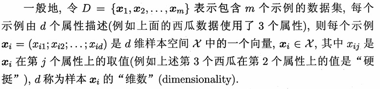
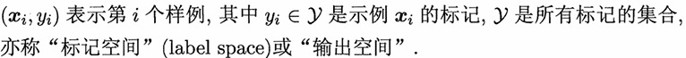

# 绪论

## 引言

- 机器学习
  机器学习是致力于研究如何通过计算机手段，利用经验来改善系统自身性能的一门学科
  所谓经验，通常以数据形式存在
  机器学习研究的主要内容，是关于在计算机上从数据中产生"模型"的算法，即"学习算法"
  计算机科学是研究算法的，那么机器学习作为计算机科学的一个分支，是专门研究如何"学习"的"学习算法"的

- 模型和模式
  模型泛指从数据中学得的结果
  模型指全局性结果(比如一颗决策树)，模式指局部性结果(比如一条规则)

- 关于学习的定义
  假设用 P来评估计算机程序在某任务类 T上的性能
  若一个程序通过利用经验E在T中任务获得了性能改善
  则我们就说关于T 和P， 该程序对E进行了学习

## 基本属术语

- 数据集
  用于机器学习的一组记录数据的集合，称为一个数据集

- 示例(样本)
  数据集中，每条记录是关于一个事件或对象的描述，这样一条记录就称为一个示例或样本
  有时整个数据集也可称为一个"样本"，因为它可看作对样本空间的一个采样
  通过上下文可判断出"样本"是指单个示例还是数据集

- 属性(特征)
  反映事件或对象在某方面的表现或性质的事项，称为属性或特征
  属性的取值，称为属性值
  属性张成的空间称为属性空间，或样本空间，或输入空间
  属性空间中的每个点对应一个坐标向量，而一个示例又是空间中的一个点，因此一个示例又称为一个特征向量
  属性的个数，也称为示例的维数

- 数学表示
  

- 学习(训练)
  从数据中学得模型的过程，称为学习或训练
  该过程通过执行某个学习算法来完成

- 训练数据
  训练过程中使用的数据，称为训练数据

- 训练样本
  训练数据中的每个样本，称为一个训练样本
  训练样本，也可称为训练示例，或训练例

- 训练集合
  训练样本组成的集合，称为训练集

- 假设
  通过学习训练数据而获得的模型，是机器针对数据总结而获得的某种潜在规律，称为假设

- 真相(真实)
  数据背后，真实存在的潜在规律自身，称为真相或真实
  比如，警察办案，嫌疑人相当于是"假设"，他是通过分析线索得出来的(相当于训练数据)，那么真正的凶手相当于是"真相"或"真实"
  学习的目的就是为了找出或逼近真相

- 模型
  “学习算法”通常需要设置参数，设置不同的参数和(或)使用不同的训练数据，产生的结果也会不同
  如果一个“学习算法”给定了参数和训练数据，那么此时的模型也可称为"学习器"，即该算法的一个实例

- 标记
  训练一个模型，光有示例数据是不够的，还要有标记，这样才可以预测新的数据
  标记就是每个样本指定一个结果

- 样例
  拥有标记信息的示例，称为样例
  如果将标记看作对象本身的一部分，则样例有时也称为样本

  一般地，用
  

- 学习任务分类
  模型预测的是离散值，此类学习任务称为分类
  模型预测的是连续值，则为回归