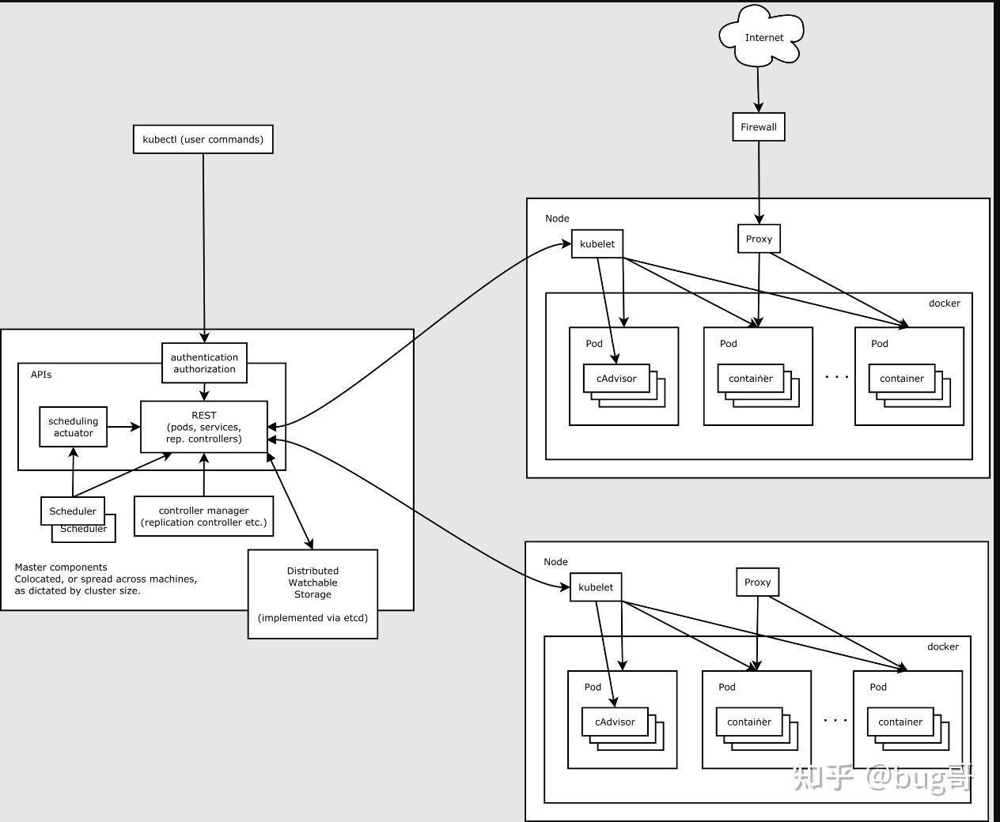
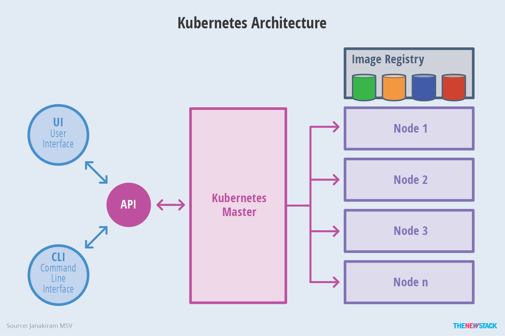
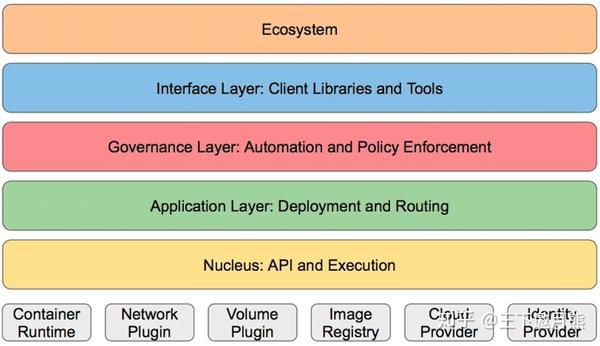

# 关于 k8s
## 什么是 k8s
k8s 全称kubernetes，是一个开源的，用于管理云平台中多个主机上的容器化的应用\
k8s 是一个管理多容器的平台，它提供了一种机制，让应用的部署，规划，更新，维护变得简单且高效

**k8s 与 docker**
- docker：只能管理单主机
- k8s：能管理多主机

## k8s 特点
k8s 主要有以下特点：

- **自我修复**
  容器在崩溃 (比如内存溢出) 后可以自动重启

- **弹性伸缩**
  可根据实际情况，自动增加或减少容器数量

- **自动部署和回滚**
  自动按照配置文件的要求部署，比如：
  - 滚动更新 (循序渐进)
  - 自动回退版本

- **服务发现和负载均衡**
k8s 内置了一些服务发现和负载均衡的功能，无需额外再配置类似的功能\
比如，当应用需要负载均衡时，可以使用内置的负载均衡服务，而无需应用额外去安装nginx

- **机密和配置管理**
k8s 内置了专门保存敏感信息以及配置信息的功能

- **存储编排**
将服务器的物理磁盘映射为虚拟磁盘\
存储数据时只需关心虚拟磁盘，具体的物理存储无需关心

- **批处理**
  提供了一些批量执行的功能

# k8s架构

## k8s集群架构
k8s是客户端 + 服务端 (C/S) 架构，其中服务端是主从结构 (控制平面 + Node) \
一般情况下，Pod 只运行于 Node，但也可以运行于控制平面，因此控制平面和 Node 可以是同一台机器（集群可以只有一个机器）\
官方约定集群配置是：至少 1 个控制平面 + 至少 1 个 Node

## k8s服务端架构
k8s集群服务端由以下组件组成：
- **控制平面(Control plane)**
  安装时自带

- **节点(Node)**
  安装时自带

- **附加组件**
  可选安装

### 控制平面
控制平面(control plane), 它担当了k8s的master节点，架构图如下：

控制平面包含以下组件：

- **kube-api server**
提供接口服务，基于REST风格开放k8s接口\
所有控制平面和Node之间的通信都通过kube-api server实现的\
例如，客户端(kubectl, Dashboard)请求，控制面板和Node间的通信，Noe和Node间的通信

kube-api server包含了涉及集群中各种操作的接口(比如各种节点的任务处理)\
对k8s中做的任何操作的请求，首先是进入到kube-api server中，然后再去调用某个具体接口进行操作\
比如，kubectl命令行发出的指令，先是对API-Sever发REST请求，然后再通过kube-api server接口进行操作

因此，控制面板是集群最关键的组件，kube-api server又是控制面板最关键的组件

- **kube-controller-manager(控制器管理器)**
管理各种类型的控制器, 负责运行控制器进程

**关于控制器**
控制器是k8s集群的组件，有很多类型的控制器，它们负责将集群的实际状态持续调整为期望状态\
控制器会针对k8s中的各种资源进行管理，资源类型包括Pod，Node，任务，调度等各个层面

从逻辑上讲，每个控制器都是一个单独的进程，但是为了降低复杂性，它们都被编译到同一个可执行文件，并在同一个进程中运行

控制器主要包括：
- 节点控制器(node controller)
负责在节点出现故障时，进行通知和响应
- 任务控制器(job controller)
监测代表一次性任务的job对象，然后创建Pods来运行这些任务直至完成
- 端点分片控制器(endpointslice controller)
填充端点分片(endpointslice)对象(以提供service和pod之间的链接)
- 服务账号控制器(servce account controller)
为新的命名空间创建默认的服务账号(service account)

- **cloud-controller-manager(云控制器管理器)**
与第三方云平台提供的控制器 api对接管理功能

- **kube-scheduler(调度器)**
负责将Pod基于一定的算法，将其调用到更合适的节点(服务器)上, 比如：\
存储要求高的Pod应用 → 分配给存储型节点\
内存要求高的Pod应用 → 分配给内存型节点

- **etcd**
可理解为k8s内置的键值类型的分布式数据库，提供了基于Raft算法实现自主的集群高可用\
老版本: 基于内存\
新版本: 持久化存储

注：由于控制面板在k8s集群中处于最关键地位，可以通过将控制面板配置在多个节点上，将其设置为高可用

### 节点
节点(Node)，也就是k8s的node节点，架构图如下：

Node节点包含以下组件：

- **kubelet**
kubelet是在每个节点上运行的代理，主要负责以下：

- Pod的生命周期
负责把集群中声明的Pod转化为本机上的容器进程，维护它们的生命周期并向控制平面汇报状态

- 存值
负责节点本地存值操作，比如节点本地执行挂载/卸载和在容器内挂载卷的操作

- 网络
kubelet参与网络初始化的协调(主要是调用 CNI 插件配置 Pod 的网络命名空间、接口、IP 等)

注：它并不直接实现集群网络数据平面（如路由、转发、Service 负载均衡）

- **kube-proxy(网络代理)**
负责service的服务发现以及对应的负载均衡(4层负载)

- **container runtime(容器运行时环境)**
包括以下几种运行时：
- Docker
- Containerd
- CRI-O(container runtime interface)
注：

1) Docker不是k8s唯一可用的运行时方案
2) 需要现在节点服务器上预先安装对应的运行时

比如，当使用Docker作为运行时，需要在节点服务器上预先安装Docker，然后再安装集群

- **Pod**
负责包含和运行容器，一个Pod可以看作一个容器组\
正常工作状态下，1个节点内至少要有1个Pod，1个Pod下至少要有1个容器\
非正常状态下(比如Pod在初始化中或结束中)，Pod可能不包含容器

### 附加组件
- **kube-dns**
负责为整个集群提供DNS服务\
比如，当节点A和节点B之间通信时，节点A可以通过服务名找到节点B的IP，进而找到节点B

- **Ingress Controller**
为服务提供外网入口

- **Prometheus**
负责资源监控

- **Dashboard**
提供GUI

- **Federation**	
提供跨可用区的集群

- **Fluentd-elasticsearch**
提供集群日志采集，存储与查询

## k8s分层架构

- **生态系统**	
基于k8s构建的一系列应用，比如：附加组件

- **接口层**	
所有生态系统的应用都要调用k8s的接口，这些接口组成了k8s的接口层

- **管理层**	
系统度量，比如：基础设置，容器和网络的度量\
自动化，比如：自动扩展，动态provision等\
策略管理，比如：RBAC,Quota,PSP, NetworkPolicy等

- **应用层**	
部署，比如：无状态应用，有状态应用，批处理任务，集群应用等\
路由，比如：服务发现，DNS解析等

- **核心层**	
k8s最核心的功能，对外提供API构建高层的应用，对内提供插件式应用执行环境

# 服务分类
服务主要分为有状态服务和无状态服务，具体如下：

- 无状态服务
  - 特点
    服务在删掉或追加后，在没有任何额外的操作的情况下，对系统没有任何影响
    不会对本地环境产生任何依赖，例如不会存储数据到本地磁盘
  - 代表应用
    Nginx，Apache
  - 优点
    对客户端透明，无依赖关系，可以高效实现扩容，迁移
  - 缺点
    不能存储数据，需要额外的数据服务支撑

- 有状态服务
  - 特点
    服务在追加后，需要做一些额外的操作(从既存的服务进行迁移或恢复数据)，才能确保对系统没有任何影响
    会对本地环境产生依赖，例如需要存储数据到本地磁盘
  - 代表应用
    所有数据库服务(MySQL, Redis)
  - 优点
    可以独立存储数据，实现数据管理
  - 缺点
    集群环境下需要实现主从，数据同步，备份，水平扩容复杂

