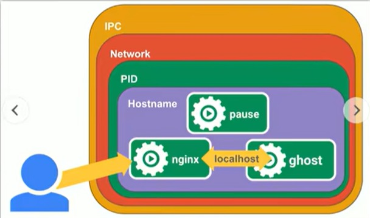
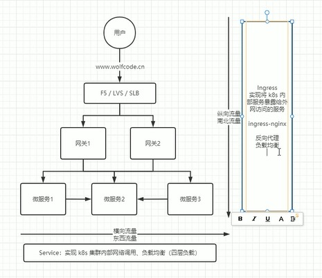
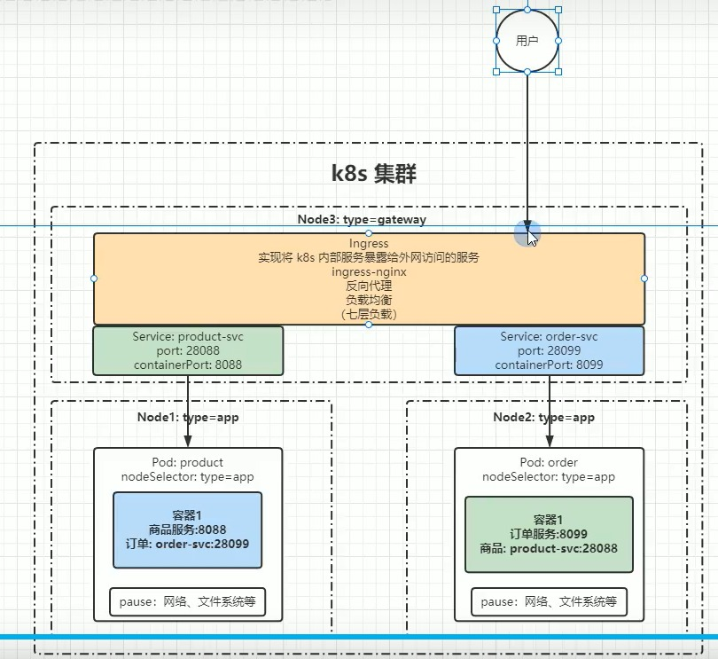

# 资源
k8s的理念是：一切皆资源，万物皆对象\
如果将k8s资源比作Java类，k8s对象是基于Java类创建的Java对象

k8s中的所有内容都被抽象为"资源"，资源的类别有很多，如Pod，Service，Node等都是资源\
k8s的对象就是资源的实例，是持久化的实体，如某个具体的pod，某个具体的Node\
k8s使用这些实体去表示整个集群的状态

对象的创建，删除，修改都是通过"kubernetes API"，也就是API server组件提供的API接口实现的\
命令行工具kubectl实际上也是调用kubernetes API

可以通过"kubectl命令 + 配置文件"来创建这些对象\
配置文件就是描述对象属性的文件\
配置文件格式可以是json或yaml，常用yaml


## 资源分类
k8s主要分以下几种资源：
- **元数据(Meta)**
对于资源的元数据描述，每一个资源都可以使用元数据\
元数据是有固定数量的，不支持自定义额外扩展\
集群和命名空间的资源都可以使用，不专属于集群或命名空间

- **集群级(Cluster)**
集群级资源作用于集群之上\
集群下的所有资源都可以共享使用

- **命名空间级(Namespaces)**
命名空间级资源作用于命名空间之上\
同一命名空间下的所有资源都可以在该命令空间范围内共享使用\
不同命名空间的资源互不干扰


### 元数据
元数据级类型资源主要包含以下：

- **Horizontal Pod Autoscaler(HPA)**
Pod自动扩容：可以根据CPU使用率或自定义指标(metrics)，自动对Pod进行扩缩容
  - 控制管理器每隔30s（可以通过-horizontal-pod-autoscaler-sync-period修改）查阅metrics的资源使用情况
  - 支持三种metrics类型
    1) 预定义metrics(比如Pod的cpu)以利用率的方式计算
    2) 自定义Pod metrics，以原始值(raw value)的方式计算
    3) 自定义object metrics
  - 支持两种metrics查阅方式：heapster和自定义的REST API
  - 支持多metrics

- **Pod Template**	
Pod Template是关于Pod的定义，但是被包含在其他的k8s对象中\
例如Deployment，Statefulset，Daemonset等控制器\
控制器通过Pod Template信息来创建Pod

- **LimitRange**	
可以对集群内Request和Limits的配置做一个全局的统一的限制\
相当于批量设置了某一个范围内(比如某个命名空间)的Pod的资源使用限制
  - Request：最小资源，比如2GB，表示至少要有2GB
  - Limits：最大资源，比如5GB，表示最多不能超过5GB


### 集群级
主要包括以下集群级资源：

- **Namespace**
命名空间本身也是一种资源，它属于集群级资源

- **Node**
不像其他的资源(如Pod和Namespace)，Node本质上不是k8s来创建的，k8s只是管理Node上的资源\
虽然可以通过Manifest创建一个Node对象，但k8s也只是去检查是否真的是有这么一个Node，如果检查失败，也不会往上调度Pod

- **ClusterRole**
代表集群级别上的一组权限

- **ClusterRoleBinding**
将ClusterRole绑定到集群级别的资源上(不能是命名空间级别资源上)\
注: ClusterRoleBinding只能绑定ClusterRole


### 命名空间级
命名空间级资源主要包含以下几类型：
- 工作负载型
- 服务发现型
- 存储型
- 特殊类型
- Role&RoleBinding


#### 工作负载型
命名空间级的工作负载型资源主要用于支撑k8s的运行，主要包括：
- Pod
- Pod副本
- 各种控制器


##### Pod
当两个容器有强依赖关系时，可以将它们放入同一个Pod中，使其共享Pod内的网络以及文件系统\
Pod作为一个容器组，是k8s中最小的可部署单元\
一个Pod包含了一个应用程序容器(某些情况下是多个容器)，存储资源，一个唯一的网络IP地址，以及一些确定容器该如何运行的选项\
一个Pod代表了k8s中一个独立的应用程序运行实例，该实例可能由单个容器，或几个紧耦合在一起的多个容器组成\
k8s是通过Pod管理容器的，而不是直接管理容器

- **Pod与容器**
k8s Pod和容器的配置方式有以下几种：

  - one-container-per-pod\
  一个Pod中只运行一个容器\
  该方式是k8s中最常见的配置方式，此时可以将Pod当作是该容器的wrapper

  - multi-containers-per-pod\
  一个Pod中运行多个容器\
  当一个应用需要多个容器相互协作时，可以将这些紧密耦合，共享资源且始终在一起运行的容器编排在同一个Pod中


- **Pause容器**
k8s会为每一个Pod创建一个名为pause的容器\
pause容器会为Pod中其他的应用服务的容器提供共享的网络和文件系统等资源\
比如，同一个Pod内有容器A和容器B，容器A可以通过localhost访问容器B



- **Pod的容器类型**
Docker是k8s Pod中使用最广泛的容器引擎\
k8s Pod同时也支持其他类型的容器引擎


##### 副本
副本就是一个Pod可以被复制成多份，每一份可被称之为副本\
这些副本除了一些描述性的信息(比如Pod的名字，uid等)不一样外，其他信息都是一样的\
比如Pod内部的容器，容器数量，容器里面运行的应用等的这些信息都是一样的，这些副本提供同样的功能

k8s的控制器会指定Pod Template以及副本数("replicas"属性)\
控制器会根据Pod Template创建副本数指定个数的Pod\
如果当前集群中该Pod的数量与副本数指定的值不一致时，k8s会采取策略尽量使Pod的数量达到副本数设置的数量


###### 控制器
不同的服务类型是需要用不同类型的控制器来发布的\
基于发布不同类型的服务，控制器主要包括以下几种：
- 适用于发布无状态服务的控制器
- 适用于发布有状态服务的控制器
- 适用于发布守护进程服务的控制器
- 适用于发布任务或者定时任务的控制器


###### 无状态服务发布
ReplicationController，ReplicaSet和Deployment是专门针对于无状态服务进行部署的控制器

- **ReplicationController(RC)**
根据某一个Pod模板，根据定义的副本数，动态发布Pod，Pod个数与副本数保持一致\
主流版本已弃用

- **ReplicaSet(RS)**
对ReplicationController做了升级，可以通过Selector/Label来选择对哪些Pod生效\
可以直接创建使用，但推荐直接使用Deployment

- **Deployment(Deploy)**
对ReplicaSet再次做了封装，提供了更丰富的部署相关的功能

  - 创建ReplicaSet/Pod
    创建Deployment的同时，会自动创建与之关联的ReplicaSet和Pod

  - 滚动升级/回滚	
    当容器的内容发生变更，会自动触发Deployment的滚动更新\
    滚动升级/回滚的目的是，让用户在无感知的情况下进行升级/回滚

    ----------------------示例---------------------
    背景：当前Deployment对应的ReplicaSet是ReplicaSet1, 它包括PodA和PodB

    - 滚动升级：
      此时，修改了Deployment的Pod Template配置之后，它会按照以下步骤执行升级操作：

      1) 基于ReplicaSet1创建ReplicaSet2，ReplicaSet2是空的，不包含任何Pod
      2) 在ReplicaSet2里，基于修改后的Pod Template创建新的PodA，
      3) 将ReplicaSet1里的基于修改前的Pod Template创建的PodA禁用
      4) 在ReplicaSet2里，基于修改后的Pod Template创建新的PodB
      5) 将ReplicaSet1里的基于修改前的Pod Template创建的PodB禁用

      注：ReplicaSet1会整体被保留一段时间，它不会被立即删除，以备未来做回滚

     - 滚动回滚
      滚动升级后，执行kubectl rollout命令后，它会按照以下步骤执行回滚操作：

      1) 将ReplicaSet1里的PodA恢复正常\
      2) 将ReplicaSet2里的PodA禁用\
      3) 将ReplicaSet1里的PodB恢复正常\
      4) 将ReplicaSet2里的PodB禁用\
      注：ReplicaSet2不会被立即删除，它的replica数会变成0

    - 平滑扩缩容\
      可以通过扩缩容的命令(kubectl scale)实现\
      命令也可以针对ReplicaSet，但是不推荐

    - 暂停与恢复Deployment\
      如果短时间内需要修改的次数很多，会频繁触发Deployment的自动滚动更新\
      这会导致Deployment在后台的更新操作过于密集\
      可以先将Deployment暂停，等全部修改做完之后，再将Deployment恢复\
      这样只要将最后的一次修改做一次更新升级即可

      注：\
        当滚动更新正在进行中再次发生修改时，会进行以下操作：
        - 当前正在滚动更新的ReplicaSet停止更新，并记入历史版本
        - 最新的修改再次触发新的滚动更新

注：可以直接创建ReplicationController和ReplicaSet，但不建议，一般是建议创建Deployment


    
###### 有状态服务发布
StatefulSet是专门针对于有状态服务进行部署的一个控制器\
通过名称"Stateful"可知它是针对有状态服务的

StatefulSet发布多个Pod时，这些Pod是会分主次的，即Master和Slave\
创建的第一个Pod通常会被初始化为Master，其他的Pod会作为Slave\
一般来说，Master是可读写的，Slave是只读的，Slave之间也是有顺序的

**示例：**\
通过StatefulSet发布Pod，Pod的副本数是3，Pod里的应用是MySQL数据库，每个Pod绑定独立PV/PVC
以下是发布的大体步骤：

1)	创建 StatefulSet
定义副本数3，配置 .volumeClaimTemplates 创建独立 PVC

2)	创建 Pod-0	
调度、挂载 PVC、启动 MySQL 主节点，初始化数据目录，Pod-0 Ready
  1) StatefulSet 控制器创建Pod-0
  2) k8s调度器将Pod-0调度到某个节点, 并挂载独立 PVC
  3) Pod-0启动MySQL容器，初始化MySQL数据目录
  4) Pod-0进入Running & Ready状态
  注：Pod-0作为第一个节点Pod，通常初始化为主节点（Master）

3)	创建 Pod-1	
  调度、挂载 PVC、启动 MySQL 从节点，连接 Pod-0 进行数据复制，Pod-1 Ready
  1) StatefulSet控制器检测到 Pod-0 Ready，开始创建 Pod-1
  2) k8s调度器将Pod-1调度到某个节点，并挂载独立 PVC
  3) Pod-1启动MySQL容器，初始化MySQL数据目录
  4) Pod-1启动后，通过配置的启动脚本或初始化逻辑，连接 Pod-0（主节点）进行复制配置
  注：Pod-1 作为从节点（Slave），开始从 Pod-0 同步数据
  5) Pod-1从Pod-0同步数据完成后，Pod-1进入 Ready 状态

4)	创建 Pod-2	
  调度、挂载 PVC、启动 MySQL 从节点，连接主节点或其他从节点同步数据，Pod-2 Ready
  1) StatefulSet控制器检测到 Pod-1 Ready，开始创建 Pod-2
  2) k8s调度器将Pod-2调度到某个节点，并挂载独立 PVC
  3) Pod-2启动MySQL容器，初始化MySQL数据目录
  4) Pod-2启动后，通过配置的启动脚本或初始化逻辑，连接 Pod-0 或 Pod-1（根据复制拓扑）进行复制配置
  5) Pod-2 同步完成后进入 Ready

5)	集群运行	
三个 Pod 互相通信，数据同步，保证高可用和数据持久化

三个 Pod 都处于 Ready，MySQL 主从复制集群正常运行\
每个 Pod 有稳定的 DNS 名称，如 mysql-0.mysql.default.svc.cluster.local，方便相互访问\
PVC 保证数据持久化，Pod 重启后数据不丢失

StatefulSet主要包括以下特点:

- 稳定的持久化存储	
基于volumeClaim Template实现

- 稳定的网络标志	
基于Headless Service实现

- 有序部署，有序扩展	
基于0..N-1，按照顺序扩展\
在部署或扩展时, 会依据定义的顺序依次进行\
即从0到N-1，在下一个Pod运行之前，所有之前的Pod必须都是running和ready状态\
基于init containers来实现

- 有序收缩，有序删除	
基于0..N-1，按照顺序删除
        

StatefulSet主要由以下部分组成：
- Headless Service	
用于定义网络标志(DNS domain)，对于有状态服务的DNS管理，解决网络问题\
它为每个Pod定义的DNS格式为：
```yaml
yaml -(0..N-1)...svc.cluster.local]]>
```

  - serviceName	
  Headless Service的名字

  - 0..N-1	
  pod所在的序号，从0开始到N-1

  - statefulSetName	
  statefulSet的名字

  - namespace	
  服务所在的namespace，Headless Service和statefulSet必须在相同的namespace

  - .cluster.local	
  Cluster Domain
注：.namespace.svc.cluster.local部分通常可以省略

- VolumeClaim Template	
用于创建持久化卷的模板，解决存储问题
   


注：
1) k8s v1.5以上版本才支
2) 所有Pod的Volume必须使用PersistentVolume或者是管理员事先创建好
3) 为保证数据安全，删除StatefulSet时不会删除Volume
4) StatefulSet需要一个Headless Service来定义DNS domain，Headless Service需要在StatefulSet之前创建好


###### 守护进程发布
DaemonSet是专门针对于守护进程进行部署的控制器，它会为每一个匹配的Node都部署一个守护进程\
该守护进程其实就是在每个匹配的Node上运行的一个Pod副本，常用来部署一些集群的日志，监控或者其他系统管理应用\
包括以下典型的应用：

- 日志收集\	
比如fluentd，logstash等

- 系统监控\	
比如Prometheus Node Exporter，collectd，New Relic agent，Ganlia gmond等

- 系统程序\
比如kube-proxy，kube-dns，glusterd，ceph等

DaemonSet也是用来创建Pod的，它会根据selector将所有匹配到的Node都部署一个守护程序(Pod副本)


###### 任务/定时任务发布

- job\
启动一次性任务，即启动一个一次性Pod，任务完成后销毁Pod，不再重新启动新容器

- cronjob\
定时任务，在Job基础上加了定时功能，可以schedule执行


#### 服务发现


##### Service
Service主要用于k8s集群内部的网络通信，比如Node之间，Pod之间的通信(即便Pod处在不同的Node里)\
由于k8s内部是无法直接访问Pod的，因此就通过Service暴露端口的方式接收通信请求，再将请求转发到Pod\
也就是Pod是通过service来暴露自己，进而提供服务的

如果一个应用的背后由一组Pod支撑，那么Service就是这个应用服务的抽象，它定义了Pod逻辑集合和访问这个Pod集合的策略\
Service不代表一个Node，而是代表一组Pod

Service也可以处理外部请求，对外提供一个访问入口，外部请求访问该入口后，通过负载均衡转发到Pod集合中某一个Pod的容器内\
这仅限于某些service类型，比如NodePort，LoadBalancer，但Service主要还是处理k8s内部请求

**东西流量和南北流量**
- 东西流量\
横向流量, 通过service实现集群内部各个节点的访问

- 南北流量\
纵向流量，通过Ingress实现k8s内部服务暴漏外网访问




##### Ingress
Ingress主要用于处理k8s外部网络请求，实现k8s内部服务暴露外网访问

**示例**\
k8s集群下有三个Node，配置如下：

- Node1\
部署了Product Pod提供product-svc服务

- Node2\
部署了Order Pod提供order-svc服务

- Node3\
作为网关节点接受外部请求，部署了Ingress Controller\
外部用户访问Node3的Ingress，Ingress将请求转发到集群内部的Pod中

注：Node1和Node2用来提供应用服务，Node3作为网关节点接受外部请求，并根据请求内容将流量转发至Node1和Node2
\


#### 存储


##### Volume
数据卷，共享Pod中容器使用的数据，用来放持久化的数据，比如数据库数据\
一旦容器挂掉，它可以确保容器中的数据不会丢失，主要针对有状态服务\
有以下两种类型：

- **PV**	
全称: Persistent Volume\
定义：PV 是集群中的一块存储资源，类似于云盘、NFS、iSCSI 等存储系统的抽象\
特点：
1) 由管理员预先创建，或者通过 StorageClass 动态供应
2) 生命周期独立于使用它的 Pod
3) 描述了存储的容量、访问模式（如 ReadWriteOnce、ReadOnlyMany、ReadWriteMany）、存储类型等信息
作用：为集群提供持久化存储资源

- **PVC**	
全称: Persistent Volume Claim\
定义：PVC 是用户对存储资源的请求，类似于“我要一个多大容量、什么访问模式的存储卷”\
特点：
1) 用户通过 PVC 声明所需的存储大小和访问模式
2) PVC 会绑定到一个符合条件的 PV
3) PVC 的生命周期通常与 Pod 绑定，Pod 通过 PVC 使用存储
作用：让用户无需关心底层存储细节，只需声明需求即可使用持久化存储


##### CSI
英文全称：Container Storage Interface\
它是由来自Kubernetes，Mesos，Docker等社区成员联合制定的一个行业标准接口规范，旨在将任意存储系统暴漏给容器化应用程序

CSI规范定义了存储提供商实现CSI兼容的Volumn Plugin的最小操作集和部署建议\
CSI规范的主要焦点是声明Volume Plugin必须实现的接口


#### 特殊类型配置


##### ConfigMap
用于保存key-value类型的配置信息，它可以被加载到Pod中，使容器可以读取里面的配置信息\
ConfigMap可以统一管理Pod配置，每个Pod/Container都可以读取ConfigMap中的配置，这样就无需为每个Pod/Container单独管理配置了


##### Secret
功能与ConfigMap类似，只是多了一个加密的功能，从而确保数据的安全性\
它解决了密码，token，密钥等敏感数据的配置问题，而不需要把这些敏感数据暴露到镜像或者Pod Spec中

Secret的使用方式有以下几种方式：
- Volume挂载
- 环境变量注入


Secret有以下三种类型：
- Service Account\
用来访问k8s API，由k8s自动创建，并且会自动挂载到Pod容器内的/run/secret/kubernetes.io/serviceaccount目录中

- Opaque\
采用base64编码格式，用来存储密码，密钥等，默认使用该种类型\
注：base64不是真正意义上的加密，它只是对数据进行可编码，它是可以通过解码的方式还原数据的

- kubernetes.io/dockerconfigjson\
用来存储私有docker仓库的认证信息


##### Downward API
Downward API这个模式和其他模式不一样的地方在于它不是为了存放容器的数据也不是用来进行容器和宿主机的数据交换的\
而是让Pod里的容器能够直接获取到这个Pod对象本身的一些信息，即共享Pod信息到容器里

Downward API提供了以下两种方式，用于将Pod的信息注入到容器内部：

- 环境变量\
  用于单个变量，可以将Pod信息和容器信息直接注入容器内部

- Volume挂载\
  将Pod信息生成为文件，直接挂载到容器内部中去


#### Role&RoleBinding


##### Role
Role定义了命名空间级别的一组权限的集合，作用域是整个命名空间\
例如：role可以包含列出Pod权限及列出Deployment权限，通过Role用于给某个Namespace中的资源进行鉴权


##### RoleBinding
RoleBinding既可以作用于Role，也可以作用于ClusterRole\
虽然RoleBinding是命名空间级别的，但它可以绑定一个ClusterRole，从而在该命名空间内赋予ClusterRole定义的权限

注：\
Binding表示将ClusterRole和Role绑定到什么地方去\
RoleBinding表示将ClusterRole和Role绑定到RoleBinding所在命名空间的对象上\
ClusterRoleBinding表示将ClusterRole绑定到ClusterRoleBinding所在集群的对象上


## 资源清单
所有的资源都可以通过整个yaml进行描述，创建k8s的对象都是通过yaml文件的方式进行配置的
