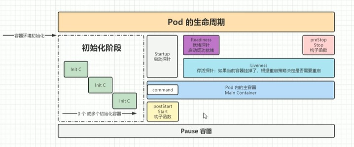

# 深入Pod


## Pod配置文件
以下是一个Pod配置的简单实例
```yaml
apiVersion: v1  #api文档版本 
kind: Pod  #资源对象类型，可以是Pod，Deployment，Statefulset一类的对象
metadata:
  name: nginx-demo  #Pod的名字
  labels:  #定义Pod的标签, 标签的key-value是自定义的
    type: app
    version: 1.0.0
  namespace: 'default'  #配置命名空间
spec:  #期望Pod按照这里的描述进行构建
  containers:  #对于pod中的容器的描述
  - name: nginx  #容器的名称
    image: nginx-1.7.9 #执行容器的镜像，镜像必须存在于docker-hub或其他仓库
    imagePullPolicy: IfNotPresent  #镜像拉取策略，如果本地有就用本地的镜像，没有就拉取远程的镜像
    command:  #指定容器启动时执行的命令
    - nginx
    - -g
    - 'daemon off;'  #最终执行命令：nginx -g 'daemon off;'
    workingDir: /usr/share/nginx/html  #定义容器启动后的工作目录
    ports:
    - name: http  #端口名称，自定义
      containerPort: 80 #容器内要暴露的端口 
      protocol: TCP  #描述该端口基于哪种协议
    env:  #定义环境变量
    - name: JVM_OPTS
      value: '-Xms128m -Xmx128m'
    resources:
      requests:  #最少需要多少资源
        cpu: 100m  #限制CPU最少使用0.1个核心
        memory: 128Mi  #限制内存最少使用128M
      limits:  #最少需要多少资源
        cpu: 200m  #限制CPU最多使用0.2个核心
        memory: 256Mi  #限制内存最多使用256M 
  restartPolicy: OnFailure  #只有失败的情况才会重启
```

将以上内容保存至nginx-demo.yaml文件中并创建Pod，执行命令：
```shell
kubectl create -f nginx-demo.yaml
```


## 探针
探针是k8s用来监控容器内应用的一种监控机制\
探针有多种类型，可以根据不同类型的探针来判断容器应用的当前状态


### 探针类型
探针有以下几种类型：
- StartupProbe
- LivenessProbe
- ReadinessProbe


#### StartupProbe
StartupProbe用于判断应用程序是否已经启动\
k8s v1.16新增\
当配置了startupProbe之后，会先禁用所有其他探针，优先执行startProbe, 直到startupProbe成功之后，其他探针才会继续


注：\
由于有时候不能准确预估应用一定是多长时间启动成功\
如果没有StartupProbe，另外两种探针只能通过hardcode的方式来预估初始化时长，会很不方便\
而配置了startupProbe后，只有应用启动成功后，才会执行另外两种探针，因此可以更加方便的结合使用另外两种探针使用

例如：一个应用，启动时间是11s，而此时如果livenessProbe监测的时间间隔设置为10s\
那么livenessProbe在第10s的时候发现应用没有被启动，它会重启应用，重启后经过10s之后再发现应用还是没启动(应用启动需要11s), 它会无限循环不停重启
```yaml
startupProbe:
  httpGet:
    path: /api/startup
    port: 80
```


#### LivenessProbe
LivenessProbe用于探测容器中的应用是否正在运行\
如果探测失败，kubelet会根据配置的重启策略进行重启容器\
若没有配置，默认就认为容器启动成功，不会执行重启策略
```yaml
livenessProbe:
  failureThreshold: 5
  httpGet:
    path: /health
    port: 8080
    schema: HTTP
  initialDelaySeconds: 60
  periodSeconds: 10
  successThreshold: 1
  timeoutSeconds: 5
```
注：LivenessProbe检查要尽可能轻量且能快速判断是否需要重启


#### ReadinessProbe
ReadinessProbe用于探测容器内的程序是否健康以接收外部请求\
如果它的返回值是success，那么就认为该容器已经完全启动，并且该容器是可以接受外部流量的
```yaml
readinessProbe:
  failureThreshold: 3 #错误次数
  httpGet；
    path: /ready
    port: 8181
    schema: HTTP
  periodSeconds: 10 #间隔时间
  successThreshold: 1
  timeoutSeconds: 5
```
**示例：**\
比如Pod里一个web服务器容器启动后，在该容器正式ready之前，不允许它接受外部请求，只有容器ready之后才允许接受外部请求


#### 三种探针的比较
- StartupProbe
  - 目的
    用于判断容器应用是否成功完成启动过程（启动阶段\
    在启动时间很长或需要复杂初始化时，防止 LivenessProbe 在启动期间误重启容器

  - 触发后果
    连续失败达到 failureThreshold后，kubelet会杀死并重启容器\
    在StartupProbe存在并且未通过之前，LivenessProbe和ReadinessProbe都被禁用

  - 使用场景
    适用于启动慢、初始化复杂或需要较长warm-up\
    如 JVM 应用、数据库迁移、加载大缓存等

  - 执行顺序
    优先执行，执行成功后才能执行其他两个探针

  - 总结	
    判断“能否完成启动”，在启动阶段优先；失败会重启
    

- LivenessProbe	
  - 目的
    用于判断容器是否“存活”（是否处于可恢复的运行状态\
    失败会触发容器重启

  - 触发后果
    失败后容器被重启	

  - 使用场景
    用于检测死锁、主线程挂起、无法提供服务等致命错误 时需要重启恢复的情况

  - 执行顺序
    StartupProbe执行后，才可以执行，与ReadinessProbe并行执行

  - 总结	
    判断“是否活着”，失败会重启


- ReadinessProbe
  - 目的
    用于判断容器是否“就绪”可以接收流量\
    失败会把Pod从Service/Endpoint列表中移除，但不重启容器

  - 触发后果
    失败后Pod被标记为不就绪（不接受流量）\
    不会重启容器

  - 使用场景
    用于动态控制流量转发\
    例如应用初始化完成、依赖不可用时临时摘除流量

  - 执行顺序
    StartupProbe执行后，才可以执行，与LivenessProbe并行执行

  - 总结	
    判断“是否就绪接收流量”，失败仅影响流量路由，不重启


### 探测方式
探针的探测方式有以下几种：
- ExecAction
- TCPSocketAction
- HTTPGetAction
注：这些探测方式都适用于三种类型的探针


#### ExecAction
在容器内部执行一个命令，如果返回值为0，则任务容器是健康的
```yaml
livenessProbe:
  exec:
    command:
    - cat
    - /health
```


#### TCPSocketAction
通过tcp连接监测容器内端口是否开放\
如果开放，则证明该容器健康
```yaml
livenessProbe:
  tcpSocket:
    port: 80
```


#### HTTPGetAction
通过发送HTTP请求到容器内的应用程序，如果接口返回的状态码在200~400之间，则认为容器健康\
生产环境使用该方式较多
```yaml
livenessProbe:
  failureThreshold: 5
  httpGet:
    path: /health
    port: 8080
    schema: HTTP
    httpHeaders:
    - name: XXX
      value: XXX
```


### 参数配置
以下是探针相关的一些参数的配置：

- initialDelaySeconds	
  初始化延迟时间\
  例：initialDelaySeconds: 60\
  表示60s内，livenessProbe和readinessProbe都不会执行，60s之后这两个探针才会执行

- timeoutSeconds	
  超时时间\
  例：timeoutSeconds: 2\
  不管探测方式是Exec Action，TCPSocketAction，还是HTTPGetAction，超过这个超时时间(2s)，就会认为失败

- periodSeconds	
  监测间隔时间\
  例：periodSeconds: 5\
  上一次执行失败后，间隔多长时间(5s)后再次执行

- successThreshold	
  例：successThreshold: 1\
  检查1次成功就表示成功

- failureThreshold	
  例：ailureThreshold: 2\
  监测失败2次就表示失败


### 示例
- 示例1
按照如下方式配置startupProbe\
.spec.contianers[0].startupProbe.httpGet.path处设置的/api/path这个路径在nginx中是不存在，因此Pod会创建失败
```yaml
apiVersion: v1  #api文档版本 
kind: Pod  #资源对象类型，可以是Pod，Deployment，Statefulset一类的对象
metadata:
  name: nginx-demo  #Pod的名字
  labels:  #定义Pod的标签, 标签的key-value是自定义的
    type: app
    version: 1.0.0
  namespace: 'default'  #配置命名空间
spec:  #期望Pod按照这里的描述进行构建
  containers:  #对于pod中的容器的描述
  - name: nginx  #容器的名称
    image: nginx-1.7.9 #执行容器的镜像，镜像必须存在于docker-hub或其他仓库
    imagePullPolicy: IfNotPresent  #镜像拉取策略，如果本地有就用本地的镜像，没有就拉取远程的镜像
    startupProbe:  #应用启动startupProbe探针
      httpGet:   #探针方式：基于http请求探测
        path: /api/path  # http请求路径
        port: 80  #请求端口
      failureThreshold: 3  #失败3次才算真正失败
      periodSeconds: 10  #每间隔10s监测一次
      successThreshold: 1  #只要请求成功1次就算成功
      timeoutSeconds: 5  # 请求超时时间为5s
    command:  #指定容器启动时执行的命令
    - nginx
    - -g
    - 'daemon off;'  #最终执行命令：nginx -g 'daemon off;'
    workingDir: /usr/share/nginx/html  #定义容器启动后的工作目录
    ports:
    - name: http  #端口名称，自定义
      containerPort: 80 #容器内要暴露的端口 
      protocol: TCP  #描述该端口基于哪种协议
    env:  #定义环境变量
    - name: JVM_OPTS
      value: '-Xms128m -Xmx128m'
    resources:
      requests:  #最少需要多少资源
        cpu: 100m  #限制CPU最少使用0.1个核心
        memory: 128Mi  #限制内存最少使用128M
      limits:  #最少需要多少资源
        cpu: 200m  #限制CPU最多使用0.2个核心
        memory: 256Mi  #限制内存最多使用256M 
  restartPolicy: OnFailure  #只有容器失败的情况才会重启容器
```

- 示例2
将示例1的配置，按照如下方式修改\
说明：将.spec.contianers[0].startupProbe.httpGet.path改成/index.html后，则Pod创建成功，因为nginx是存在/index.html这个路径的
```yaml
......
    startupProbe:  #应用启动startupProbe探针
      httpGet:   #探针方式：基于http请求探测
        path: /index.html  # http请求路径
        port: 80  #请求端口
      failureThreshold: 3  #失败3次才算真正失败
      periodSeconds: 10  #每间隔10s监测一次
      successThreshold: 1  #只要请求成功1次就算成功
      timeoutSeconds: 5  # 请求超时时间为5s
......
```

- 示例3
将示例1的配置，按照如下方式修改\
将.spec.contianers[0].startupProbe.httpGet改成tcpSocket后，则Pod创建成功\

因为只要tcp可以连接，就认为是成功的，这种方式很适合nginx，事实上只要tcp可以连接，就可以确定nginx是可以连通的
```yaml
......
    startupProbe:  #应用启动startupProbe探针
      #httpGet:   #探针方式：基于http请求探测
      #  path: /index.html  # http请求路径
      tcpSocket:  #只要tcp能连接，就认为是成功的
        port: 80  #请求端口
      failureThreshold: 3  #失败3次才算真正失败
      periodSeconds: 10  #每间隔10s监测一次
      successThreshold: 1  #只要请求成功1次就算成功
      timeoutSeconds: 5  # 请求超时时间为5s
......
```

- 示例4
将示例1的配置，按照如下方式修改\
将.spec.contianers[0].startupProbe.httpGet改成exec后，则Pod创建失败

startupProbe的超时时间是5s，而exec命令执行时，设置了sleep 5s，加上执行echo命令，导致整体exec命令执行时间是超过5s的，因此每次exec命令执行都会超过5s，最终导致每次执行都失败\
如果将exec命令中的sleep操作去掉，则会创建成功
```yaml
......
    startupProbe:  #应用启动startupProbe探针
      exec:
        command:
        - sh
        - -c
        - "sleep 5; echo 'success' > /inited;"
      failureThreshold: 3  #失败3次才算真正失败
      periodSeconds: 10  #每间隔10s监测一次
      successThreshold: 1  #只要请求成功1次就算成功
      timeoutSeconds: 5  # 请求超时时间为5s
......
```


- 示例5
按照如下方式配置startupProbe和livenessProbe，则Pod创建失败
startupProbe会成功，但livenessProbe会失败，因为index_test.html是不存在的
```yaml
......
    startupProbe:  #应用启动startupProbe探针
      exec:
        command:
        - sh
        - -c
        - "sleep 3; echo 'success' > /inited;"
      failureThreshold: 3  #失败3次才算真正失败
      periodSeconds: 10  #每间隔10s监测一次
      successThreshold: 1  #只要请求成功1次就算成功
      timeoutSeconds: 5  # 请求超时时间为5s
    livenessProbe:  #应用启动livenessProbe探针
      httpGet:
        path: /index_test.html  # 此文件不存在
        port: 80
      failureThreshold: 3  #失败3次才算真正失败
      periodSeconds: 10  #每间隔10s监测一次
      successThreshold: 1  #只要请求成功1次就算成功
      timeoutSeconds: 5  # 请求超时时间为5s 
......
``` 
登录节点服务器，将index_test.html复制到容器的/usr/share/nginx/html/目录下，再次创建Pod就会成功，执行以下命令:
  
```shell 
echo 'started' > index_test.html  #宿主机执行该命令创建index_test.html

kubectl cp index_test.html > nginx-demo:/usr/share/nginx/html
```
注：容器处于失败状态下是不可以执行kubectl cp命令的，但容器由于livenessProbe的设置, 它是处于在不断重启的过程中的，因此会处于短暂处于running的状态，此时是可以执行cp命令的


- 示例6
按照如下方式配置在startupProbe和livenessProbe的基础上配置readinessProbe，则Pod创建失败\
因为没有index_test.html，同样执行kubectl cp命令将宿主机本地的index_test.html 拷贝至容器指定路径下后，三个探针的测试都通过了，最终pod创建成功
```yaml
......
    startupProbe:  #应用启动startupProbe探针
      exec:
        command:
        - sh
        - -c
        - "sleep 3; echo 'success' > /inited;"
      failureThreshold: 3  #失败3次才算真正失败
      periodSeconds: 10  #每间隔10s监测一次
      successThreshold: 1  #只要请求成功1次就算成功
      timeoutSeconds: 5  # 请求超时时间为5s
    livenessProbe:  #应用启动livenessProbe探针
      httpGet:
        path: /index_test.html  # 此文件不存在
        port: 80
      failureThreshold: 3  #失败3次才算真正失败
      periodSeconds: 10  #每间隔10s监测一次
      successThreshold: 1  #只要请求成功1次就算成功
      timeoutSeconds: 5  # 请求超时时间为5s 
    readinessProbe:
      httpGet:
        path: /index_test.html  #没有这个文件
        port: 80
      failureThreshold: 5  #失败5次才算真正失败
      periodSeconds: 10  #每间隔10s监测一次
      successThreshold: 1  #只要请求成功1次就算成功
      timeoutSeconds: 5  # 请求超时时间为5s  
......
```


## InitContainer
启动主容器之前，会先启动initContainer\
在initContainer中，会先完成主容器所需的初始化操作，然后再启动主容器


**关于initContainer和postStart钩子函数**
相对于postStart来说，首先initContainer能够保证一定在主容器之前执行，而postStart不能\
postStart更适合去执行一些命令操作，适合一些简单的命令\
initContainer实际就是一个容器，可以独立的容器环境下执行更复杂的初始化功能

在Pod配置中加入initContainers参数：\
下面的代码位于deploy配置的.sepc.template.spec下
```yaml
spec:
  initContainers:
  - image: nginx
    imagepullPolicy: IfNotPresent
    command: ["sh","-c","sleep 10; echo 'inited;' >> ~/.init"]
    name: init-test
```
注：initContainer和主容器之间是隔离的，定义在init-test上的command只会在initContainer上执行

  

## 生命周期


生命周期按照以下步骤执行：

1) 容器环境初始化
   比如下载容器镜像，设置环境变量等， 容器环境初始化后才可以开始Pod的生命周期

2) 执行初始化容器，如果有多个初始化容器，它们会依次执行
   注:
   初始化容器是在主容器启动之前运行的一类特殊容器，它们是Pod里自定义的
   开始执行初始化容器的同时，也会同时创建Pause容器

3) 执行Start钩子函数(postStart)
   比如启动主容器之前要做的一些操作，可以在这个函数里实现

4) 启动Pod内的主容器
   容器启动期间，依次执行以下：
   1) 启动startupProbe
   2) 同时启动livenessProbe和readinessProbe
   注：主容器就是承担主要业务逻辑或核心功能的容器

5) 正常删除Pod，或者滚动更新替换容器时，执行PreStop钩子函数\
   比如应用关闭后保存一些重要信息，或者销毁缓存\
   注：如果Pod突然挂掉，该函数不会被执行

注：
1) 一般来说，preStop函数使用的多，而postStart比较少
2) Pod内的主容器在启动时，是可以执行一些命令的，而此时postStart函数可能也正在运行\
   因为两者都是在容器启动后执行, 两边的程序可能会造成冲突\
   因此推荐将postStart函数的逻辑放在初始化容器来实现\
   例如：
   ```yaml
    apiVersion: v1  
    kind: Pod  
    metadata:
    name: nginx-demo 
    labels:
        type: app
        version: 1.0.0
    namespace: 'default' 
    spec:  
    containers:  
    - name: nginx  
        image: nginx-1.7.9 
        imagePullPolicy: IfNotPresent  
        startupProbe: 
    ......
        lifecycle:  # 定义生命周期
        postStart: #容器创建完成后执行的动作，不能保证该操作一定在容器的command之前操作，一般不使用
            exec: #可以是exec， httpGet, tcpSocket
            command:
                - sh
                - -c 
                - 'mkdir /data'
        preStop: #在容器停止前执行的动作
            httpGet:  #发送一个http请求
            path: /
            port: 80  
    ......
   ```


### Pod退出流程
Pod退出后会依次做以下删除操作：

1) Endpoint删除Pod的ip地址
2) Pod变成Terminating状态
   变为删除中的状态后，会给pod一个宽限期(terminationGracePeriodSeconds)，让Pod去执行一些清理或销毁操作
   配置如下
    ```yaml
    apiVersion: v1  
    kind: Pod  
    metadata:
    name: nginx-demo 
    labels:
        type: app
        version: 1.0.0
    namespace: 'default' 
    spec:  
    terminationGracePeriodSeconds: 30   #作用于pod中的所有容器
    containers:  
    - name: nginx  
        image: nginx-1.7.9 
        imagePullPolicy: IfNotPresent  
    ......
    ```
3) 执行preStop的指令


### PreStop的应用
PreStop有以下常用场景：
- 注册中心下线
- 数据清理
- 数据销毁


示例\
按照如下方式配置lifecycle中的postStart函数和preStop函数
```yaml
apiVersion: v1  #api文档版本 
kind: Pod  #资源对象类型，可以是Pod，Deployment，Statefulset一类的对象
metadata:
  name: nginx-demo  #Pod的名字
  labels:  #定义Pod的标签, 标签的key-value是自定义的
    type: app
    version: 1.0.0
  namespace: 'default'  #配置命名空间
spec:  #期望Pod按照这里的描述进行构建
  terminationGracePeriodSeconds: 60  #Pod被删除时，给Pod多长时间处理，即使比如prestop的command执行时间是50s，terminating状态也是30s
  containers:  #对于pod中的容器的描述
  - name: nginx  #容器的名称
    image: nginx-1.7.9 #执行容器的镜像，镜像必须存在于docker-hub或其他仓库
    imagePullPolicy: IfNotPresent  #镜像拉取策略，如果本地有就用本地的镜像，没有就拉取远程的镜像
    lifecycle:  #生命周期的配置
      postStart:  #生命周期启动阶段做的事情，不一定在command之前运行
        exec:
          command:
          - sh
          - -c
          - "echo '<h1>post start</h1>' > /usr/share/nginx/html/prestop.html"
       preStop:
         exec:
           command:
           - sh
           - -c
           - "sleep 50; echo 'sleep 50s finished.. pre stop' >> /usr/share/nginx/html/prestop.html"
    command:  #指定容器启动时执行的命令
    - nginx
    - -g
    - 'daemon off;'  #最终执行命令：nginx -g 'daemon off;'
    workingDir: /usr/share/nginx/html  #定义容器启动后的工作目录
    ports:
    - name: http  #端口名称，自定义
      containerPort: 80 #容器内要暴露的端口 
      protocol: TCP  #描述该端口基于哪种协议
    env:  #定义环境变量
    - name: JVM_OPTS
      value: '-Xms128m -Xmx128m'
    resources:
      requests:  #最少需要多少资源
        cpu: 100m  #限制CPU最少使用0.1个核心
        memory: 128Mi  #限制内存最少使用128M
      limits:  #最少需要多少资源
        cpu: 200m  #限制CPU最多使用0.2个核心
        memory: 256Mi  #限制内存最多使用256M 
  restartPolicy: OnFailure  #只有失败的情况才会重启
```


创建Pod后，宿主机执行以下命令会正常显示 <h1>post start</h1>
```shell
curl <pod ip>/prestop.html  # 返回<h1>post start</h1>
```
删除Pod后，Pod处于Terminating状态的时间为60s，宿主机执行以下命令会正常显示以下结果

```shell
<h1>post start</h1>
sleep 50s finished.. pre stop
```
注：如果terminationGracePeriodSeconds设置为30s，则 "sleep 50s finished.. pre stop"不会被显示，因为preStop命令需要至少50s的时间


## 完整示例
以下示例包含了三个探针，两个生命周期函数，以及初始化容器的配置
```yaml
apiVersion: v1
kind: Pod
metadata:
  name: demo-pod-with-init-lifecycle-probes
  labels:
    app: demo
spec:
  # 1) 三个初始化容器：做环境检查、下载依赖、数据库迁移等
  initContainers:
    - name: init-check-env
      image: busybox:1.36
      command: ["sh", "-c", "echo 'Checking environment...'; env; sleep 2"]
      resources:
        requests:
          cpu: "50m"
          memory: "64Mi"
        limits:
          cpu: "200m"
          memory: "128Mi"
    - name: init-download-assets
      image: curlimages/curl:8.8.0
      command:
        - sh
        - -c
        - |
          echo "Downloading assets...";
          curl -fsSL https://example.com/assets.tar.gz -o /work/assets.tar.gz || exit 1;
          echo "Assets downloaded."
      volumeMounts:
        - name: workdir
          mountPath: /work
    - name: init-db-migrate
      image: bitnami/kubectl:1.30
      command:
        - sh
        - -c
        - |
          echo "Simulating DB migration..."; 
          # 假设通过一个服务探活来判断数据库是否可用
          # 实际生产中可替换为 flyway/liquibase/应用内置迁移命令
          for i in $(seq 1 30); do
            nc -zv db.example.svc.cluster.local 5432 && echo "DB ready" && exit 0;
            echo "Waiting DB... $i"; sleep 2;
          done;
          echo "DB not ready in time"; exit 1
      securityContext:
        runAsNonRoot: true
        runAsUser: 1000
        allowPrivilegeEscalation: false

  # 2) 主容器，包含 lifecycle（postStart / preStop）与三种探针
  containers:
    - name: app
      image: nginx:1.27-alpine
      ports:
        - name: http
          containerPort: 8080
      command: ["sh", "-c"]
      args:
        - |
          # 简单起一个 Nginx 并将 8080 转发到 80
          sed -i 's/listen       80;/listen 8080;/' /etc/nginx/conf.d/default.conf;
          nginx -g 'daemon off;'
      env:
        - name: APP_ENV
          value: "production"

      # lifecycle 定义：postStart / preStop
      lifecycle:
        postStart:
          exec:
            command:
              - sh
              - -c
              - |
                echo "[postStart] Initializing side tasks...";
                # 例如：预热缓存、生成临时文件等
                mkdir -p /var/cache/app && echo "warmed" > /var/cache/app/status
        preStop:
          exec:
            command:
              - sh
              - -c
              - |
                echo "[preStop] Graceful shutdown start...";
                # 通知应用进入优雅退出（这里仅示例打印）
                # 可在真实应用里触发 SIGTERM 处理或调用退出 API
                sleep 5
                echo "[preStop] Cleanup done."

      # 3) 三个探针：startupProbe / readinessProbe / livenessProbe
      # startupProbe：容器启动初期的就绪检查，避免过早开始 liveness/readiness
      startupProbe:
        httpGet:
          path: /healthz/startup
          port: http
          scheme: HTTP
        failureThreshold: 30   # 最多失败 30 次
        periodSeconds: 2       # 每 2 秒探测一次
        timeoutSeconds: 1

      # readinessProbe：是否可对外提供流量
      readinessProbe:
        httpGet:
          path: /healthz/ready
          port: http
          scheme: HTTP
        initialDelaySeconds: 5
        periodSeconds: 5
        timeoutSeconds: 2
        successThreshold: 1
        failureThreshold: 3

      # livenessProbe：进程是否存活
      livenessProbe:
        httpGet:
          path: /healthz/live
          port: http
          scheme: HTTP
        initialDelaySeconds: 10
        periodSeconds: 10
        timeoutSeconds: 2
        successThreshold: 1
        failureThreshold: 3

      resources:
        requests:
          cpu: "100m"
          memory: "128Mi"
        limits:
          cpu: "500m"
          memory: "256Mi"

      volumeMounts:
        - name: workdir
          mountPath: /usr/share/nginx/html/assets
        - name: cache
          mountPath: /var/cache/app

  volumes:
    - name: workdir
      emptyDir: {}
    - name: cache
      emptyDir: {}

  restartPolicy: Always
```
