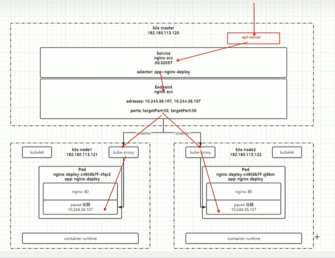
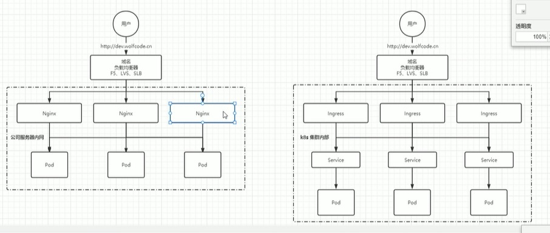

# 服务发现


## service
```shell
kubectl get svc
kubectl get endpoints

endpoint返回的IP端口是pod所在node的ip和端口
```



### 创建Service
Service的创建方式有以下几种
- 定义配置文件\
执行命令：
```yaml
kubectl create -f XXX.yaml
```

- kubectl命令\	
执行命令：
```yaml
# 直接创建
kubectl create service clusterip my-svc --tcp=80:8080

# 从现有对象（deployment/pod/statefulset）生成Service
kubectl expose deployment my-app --port=80 --target-port=8080 --type=ClusterIP --name=my-app-svc
```


### Service命令操作
创建service配置文件如下，文件名nginx-svc.yaml
```yaml
apiVersion: v1  
kind: Service  # 资源类型为Service
metadata:
  name: nginx-svc  # Service名字
  labels:
    app: nginx  # Service自己本身的标签
spec:
  selector:  # 匹配哪些pod会被该service代理
    app: nginx-deploy  # 所有匹配到该标签的pod会都可以被该service进行访问
  ports:  # 端口映射
  - port: 80  # service自己的端口，在使用内网IP时使用
    targetPort: 80  #目标Pod的端口，
    name: web  # 为端口起个名字
  type: NodePort  # 随机启动一个端口映射，映射到ports中的端口，该端口是直接绑定在node上的，且集群中每一个Node都会绑定这个端口，如果采用映射固定端口的方式，可能会产生端口冲突，随机的方式会避免这个问题，也可以将服务暴漏给外部访问，但是这种方式实际生产不推荐，因为效率较低，而且service是四层负载
```

查看service信息，通过service的cluster ip进行访问，执行命令：
```shell
kubectl get svc
```

查看Pod信息，通过Pod的ip进行访问，执行命令：
```shell
kubectl get po -o wide
```

创建其他pod通过service name进行访问(推荐)，执行命令
```shell
kubectl exec -it busybox -- sh  # 进入容器busybox
curl http://nginx-svc   # 容器内执行该命令
```

默认在当前namespace中访问，如果需要跨namespace访问pod，则在service name后面加上“.<namespace>”即可
```shell
curl http://nginx-svc.default
```


### 代理k8s外部服务
案例
- 各环境访问名称统一	
- 访问k8s集群外的其他服务	
- 项目迁移	

实现方式\
1）编写service配置文件时，不指定selector属性，当不指定selector时，k8s是不会自动创建endpoint的\
2）自己创建endpoint


service配置, 执行kubectl create创建
```shell
apiVersion: v1  
kind: Service  # 资源类型为Service
metadata:
  name: nginx-svc-external  # Service名字
  labels:
    app: nginx  # Service自己本身的标签
spec:
  ports:  # 端口映射
  - port: 80  # service自己的端口，在使用内网IP时使用
    targetPort: 80  #目标Pod的端口，
    name: web  # 为端口起个名字
  type: ClusterIP
```

endpoint配置，执行kubectl create创建
```shell
apiVersion: v1
kind: Endpoints
metadata:
  labels:
    app: nginx # 与service一致
  name: nginx-svc-external # 与service一致
  namespace: default # 与service一致
subsets:
- address:
  - ip: <target ip> # 目标ip地址
  ports: # 与service一致
  - name: web
    port: 80
    protocal: TCP
```


### 反向代理外部域名
除了可以通过配置IP的方式，也可以配置为域名的方式
```shell
apiVersion: v1
kind: Service
metadata:
  labels:
    app: wolfcode-external-domain
  name: wolfcode-external-domain
spec:
  type: ExternalName
  externalName: www.wolfcode.cn
```


### 常用类型
- ClusterIP\
  只能在集群内部使用，不配置类型的话默认就是ClusterIP

- ExternalName\
  返回定义的CNAME别名，可以配置为域名

- NodePort\
  会在所有安装了kube-proxy的节点都绑定一个端口，此端口可以代理至对应的Pod\
  集群外部可以使用任意节点ip + nodePort的端口号访问到集群中对应Pod中的服务

  当类型设置为NodePort后，可以在ports配置中增加nodePort配置指定端口\
  需要在下方的端口范围内，如果不指定会随机指定端口\
  端口范围：30000~32767\
  端口范围配置在/usr/lib/systemd/system/kube-apiserver.service文件中

- LoadBalancer\
  使用云服务商(阿里云，腾讯云)提供的负载均衡器服务


## ingress
ingress就是niginx的抽象以及实现



### 安装ingress
https://kubernetes.github.io/ingress-nginx/deploy/#using-helm

- 添加heml仓库
```shell
helm repo add ingress-nginx https://kubernetes.github.io/ingress-nginx  # 添加仓库

helm repo list   # 查看仓库列表
helm search repo ingress-nginx  # 搜索ingress-nginx
```

- 下载包
```shell
helm pull ingress-nginx/ingress-nginx
```

- 配置参数
将下载好的安装包解压
```shell
tar xf ingress-nginx-XXXX.tgz
```

解压后，进入解压完成的目录
```shell
cd ingress-nginx
```

修改values.yaml\
镜像地址：修改为国内镜像\
.controller.image.registry设置为registry.cn-hangzhou.aliyuncs.com\
.controller.image.image设置为google_containers/nginx-ingress-controller\
.controller.image.digest，.controller.image.digestChroot注释掉，即不需要校验哈希值\
还有一些修改，没有记录


hostNetwork: true\
dnsPolicy: ClusterFirstWithHostNet\
修改部署配置的kind: DaemonSet\
nodeSelector:\
  ingress: "true" # 增加选择器，如果node上有ingress=true就部署\
将service中的type由LoadBalancer修改为ClusterIP, 如果服务器是云平台才用LoadBalancer\
将docker.io/jettech-webhook-certgen修改为国内镜像\
3.4.6_服务发现-Ingress：安装ingress-nginx_哔哩哔哩_bilibili


- 创建namespace
```shell
kubectl create ns ingress-nginx  # 为ingress专门创建一个namespace
```

- 安装ingress
```shell
kubectl label node k8s-node2 ingress=true  #为需要部署ingress的节点上加标签

helm install ingress-nginx -n ingress-nginx  # 安装ingress-nginx
```


### 基本使用
通过以下配置创建Ingress，文件名wolfcode-ingress.yaml
```yaml
apiVersionL networking.k8s.io/v1  # 网络相关的API
kind: Ingress  # 资源类型是Ingress
metadata:
  name: wolfcode-ingress-nginx
  annotations:
    kubernetes.io/ingress.class: "nginx"
spec:
  rules:  # ingress规则配置，可以配置多个
  - host: k8s.wolfcode.cn  # 域名配置，可以使用通配符
    http:
      paths:  # 相当于nginx的location配置，可以配置多个
      - pathType: Prefix # 路径类型，按照路径类型进行匹配， ImplementationSpecific需要指定IngressClass，具体匹配规则以IngressClass中的规则为主。Exact：精确匹配URL需要与path完全匹配上，且区分大小写。Prefix：表示前缀匹配，以/为分隔符来进行前缀匹配 
        backend:
          service:
            name: nginx-svc # 代理到哪个service
            port: 
              number: 80  # service的端口
        path: /api  # 等价于nginx中的location的路径前缀匹配
```

```shell
kubectl create -f wolfcode-ingress.yaml
```