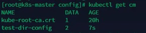
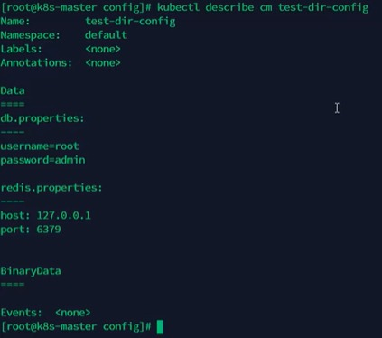
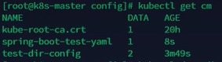
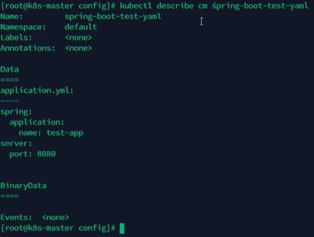
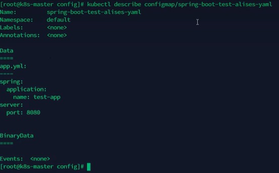
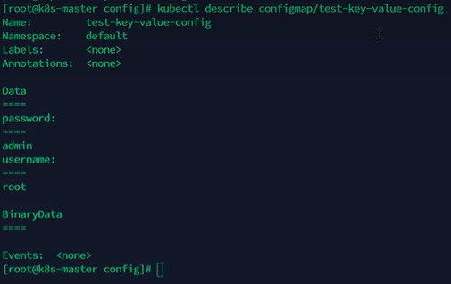
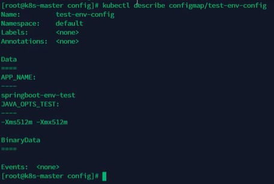
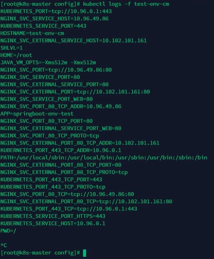
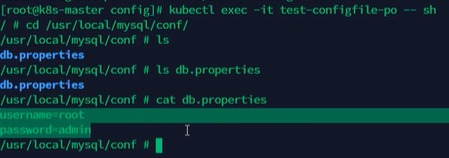
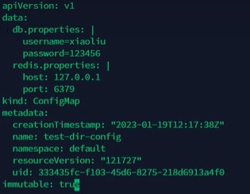

# 配置管理
k8s提供了一种集中进行配置管理的方式，它无需每个容器单独对配置进行管理维护


## ConfigMap
configmap提供了可以使用明文存储键-值对信息的方式


### 创建ConfigMap
- 示例1：基于文件夹创建configmap\
创建db.properties文件，内容如下：
```shell
username=root
password=admin
```

创建redis.properties文件，内容如下：
```shell
host: 127.0.0.1
port: 6379
```


将db.properties和redis.properties两个文件保存至/test文件夹下\
进入到/test文件夹同级目录，创建configmap，执行命令：
```shell
kubectl create configmap test-dir-config --from-file=test/
```

获取configmap列表，执行命令：
```shell
kubectl get cm  # 可以查看刚才看到的configmap
```


查看configmap具体信息，执行命令：
```shell
kubectl describe cm test-dir-config
```



- 示例2: 基于文件创建configmap（推荐）\
创建application.yaml文件，内容如下：
```yaml
spring:
  application:
    name: test-app
server: 
  port: 8080
```

将application.yaml文件保存至/test目录下

创建configmap，执行命令：
```shell
kubectl create configmap spring-boot-test-yaml --from-file=/test/application.yaml
```

获取configmap列表，执行命令：
```shell
kubectl get cm  # 可以查看刚才看到的configmap
```



查看configmap具体信息，执行命令：
```shell
kubectl describe cm spring-boot-test-yaml
```



再次通过以下方式创建configmap，执行命令：
```shell
kubectl create configmap spring-boot-test-alises-yaml --from-file=app.yml=/test/application.yaml
```

查看configmap详细信息，执行命令：
```shell
kubectl describe cm spring-boot-test-alises-yaml

kubectl describe configmap/spring-boot-test-alises-yaml  #另一种表达方式
```
\
注：文件名变成了app.yml, 而不是application.yaml


- 示例3：直接指定key-value\
一般不建议使用该方式，但如果参数少是可以

创建configmap，执行命令：
```shell
kubectl create configmap test-key-value-config  --from-literal=username=root --from-literal=password=admin
```

查看configmap详细信息，执行命令：
```shell
kubectl describe configmap test-key-value-config
```
\
注：通过键值对直接创建cm是没有文件名的


### 使用ConfigMap

- 示例1\
创建configmap，执行命令：
```shell
kubectl create configmap test-env-config --from-literal=JAVA_OPTS_TEST='-Xms512m -Xmx512m' --from-literal=APP_NAME=springboot-env-test
```

查看configmap详细信息，执行命令：
```shell
kubectl describe configmap test-env-config
```



执行kubectl create命令创建如下Pod，文件名env-test-pod.yaml文件
```yaml
apiVersion: v1
kind: Pod
metadata:
  name: test-env-pod
spec:
  containers:
  - name: env-test
    image: alpine  # 轻量级的linux系统
    command: ["/bin/sh","-c","env; sleep 3600"] # 为避免执行命令后直接退出容器，设置睡眠3600秒
    imagePullPolicy: IfNotPresent
    env:
    - name: JAVA_VM_OPTS
      valueFrom: 
        configMapKeyRef:
          name: test-env-config # configmap的名字
          key: JAVA_OPTS_TEST # 从configmap中获取名字为key的value，将其赋值给容器本地的环境变量JAVA_VM_OPTS     
     - name: APP
       valueFrom:
         configMapKeyRef:
           name: test-env-config
           key: APP_NAME
  restartPolicy: Never
```

查看pod容器中的日志，可以发现环境变量已被设置，执行命令：
```shell
kubectl logs -f test-env-pod  # -f不是file，是follow的意思
```



- 示例2\
执行kubectl create命令创建如下Pod，文件名file-test-pod.yaml文件
```yaml
apiVersion: v1
kind: Pod
metadata:
  name: test-configfile-pod
spec:
  containers:
  - name: config-test
    image: alpine  # 轻量级的linux系统
    command: ["/bin/sh","-c","env; sleep 3600"]
    imagePullPolicy: IfNotPresent
    env:
    - name: JAVA_VM_OPTS
      valueFrom: 
        configMapKeyRef:
          name: test-env-config # configmap的名字
          key: JAVA_OPTS_TEST # 从configmap中获取名字为key的value，将其赋值给容器本地的环境变量JAVA_VM_OPTS     
     - name: APP
       valueFrom:
         configMapKeyRef:
           name: test-env-config
           key: APP_NAME
    volumeMounts:  # 加载数据卷
    - name: db-config  # 要加载数据卷的名字
      mountPath: "/usr/local/mysql/conf"  # 想要将数据卷中的文件加载到哪个目录下
      readOnly: true  # 是否只读
  volumes:  #数据卷挂载， configMap，sercret
    - name: db-config  # 数据卷的名字，名字可以自定义
      configMap: #数据卷类型为configMap
        name: test-dir-config  # configMap的名字，跟想要加载的configmap name相同
        items:  # 对configmap中的key进行映射，如果不指定，默认会将configmap中所有的key全部转换为同名的文件
        - key: "db.properties"  # configmap中的key
          path: "db.properties"  # 将该key中的值转换为文件
  restartPolicy: Never
```
注：如果path: "db.properties" 改成path: "/test1/test2/db_test.properties",那么该文件在容器内的生成路径为/usr/local/mysql/conf/test1/test2/db_test.properties

进入容器，可以看到指定路径下有db.properties，执行命令：
```shell
kubectl exec -it test-configfile-pod -- sh

ls /usr/local/mysql/conf  # 可以发现db.properties文件存在
cat /usr/local/mysql/conf/db.properties  # 内容跟创建configmap时一致
```



## secret
与ConfigMap类似，用于存储配置信息，但是主要用于存储敏感信息，需要加密的信息\
secret可以提供数据加密，解密的功能(base64编码解码)

在创建secret时，要注意如果要加密的字符中，包含了有特殊字符，需要使用转义字符转义\
例如,"$"需要写成"\$", 也可以对特殊字符使用单引号描述，这样就不需要转义了\
例如, 1$289*-! 可以写成'1$289*-!'

通过literal方式创建generic secret, 执行命令：
```shell
kubectl create secret generic orig-secret --from-literal=username=admin --from-literal=password='1$289*-!' # password如果不进行转义或单引号括起来，secret虽然创建成功，但其实password的值是有缺失的
```

创建docker-registry secret，执行命令：
```shell
kubectl create secret docker-registry <name> --docker-username=<username> --docker-password=<password> --docker-email=<email address> [--docker-server=<server>]
```

查看docker-registry secret的详细信息，执行命令：
```shell
kubectl eidt secret <secret_name> 

# 将.dockerconfigjson的value解码，就可以看到明文
echo <.dockerconfigjson string> | base64 -d
```

执行kubectl create命令创建如下Pod，文件名：private-image-pull-pod.yaml
```yaml
apiVersion: v1
kind: Pod
metadata:
  name: private-image-pull-pod
spec:
  imagePullSecrets: # 配置登录docker registry
  - name: harbor-secret  # 设置secret name，用这个secret的credentials信息登录镜像私有库
  containers:
  - name: nginx
    image: 192.168.113.122:8858/opensource/nginx:1.9.1  # 镜像位于私有仓库,且本地不存在
    command: ["/bin/sh","-c", "sleep 3600"]
    imagePullPolicy: IfNotPresent
    env:
    - name: JAVA_VM_OPTS
      valueFrom: 
        configMapKeyRef:
          name: test-env-config
          key: JAVA_OPTS_TEST     
     - name: APP
       valueFrom:
         configMapKeyRef:
           name: test-env-config
           key: APP_NAME
    volumeMounts:  # 加载数据卷
    - name: db-config  
      mountPath: "/usr/local/mysql/conf"  
      readOnly: true  # 是否只读
  volumes:  #数据卷挂载， configMap，sercret
    - name: db-config  # 数据卷的名字，名字可以自定义
      configMap: #数据卷类型为configMap
        name: test-dir-config  
        items:  
        - key: "db.properties"  # configmap中的key
          path: "db.properties"  # 将该key中的值转换为文件
  restartPolicy: Never
```
注：额外配置.sepc.imagePullSecrets


## SubPath
使用ConfigMap或secret挂载到目录的时候，会将容器中原来的目录覆盖掉\
此时可能只想覆盖目录中的某一个文件，但是这样的操作会覆盖整个文件夹，因此需要使用到subpath

比如以下配置，pod启动后，会将整个/usr/local/mysql/conf目录覆盖，整个目录原来的文件就都没有了，会只有db.properties
```yaml
volumeMounts:  # 加载数据卷
    - name: db-config  
      mountPath: "/usr/local/mysql/conf"  
      readOnly: true  # 是否只读
  volumes:  #数据卷挂载， configMap，sercret
    - name: db-config  # 数据卷的名字，名字可以自定义
      configMap: #数据卷类型为configMap
        name: test-dir-config  
        items:  
        - key: "db.properties"  # configmap中的key
          path: "db.properties"  # 将该key中的值转换为文件
```


subPath的配置方式如下：
```yaml
containers:
....
  volumeMounts:
  - mountPath: /etc/nginx/nginx.conf 
    name: config-volume
    subPath: etc/nginx/nginx.conf # 与volumes.[0].items.path 相同
volumes:
- configMap:
  name: nginx-conf  # configMap名字
  items:
    key: nginx.conf  #configMap中的文件名
    path: etc/nginx/nginx.conf  # subpath路径
```
说明：\
1） 定义volumes时需要增加items属性，配置key和path，且path的值不能从/开始\
2）在容器的volumeMounts中增加subpath属性，该值与volumes中的items.path的值相同


## 配置的热更新
通常会将项目的配置文件作为configmap，然后挂载到Pod

如果更新configmap中的配置，它是否也会将更新同步到pod中，会分以下几种情况：
- 默认方式\
  会更新\
  更新周期：更新时间+缓存时间

- subPath\
  不会更新\
  对于subPath的方式，可以取消subPath的使用，将配置文件挂载到一个不存在的目录，避免目录的覆盖，然后再利用软连接的形式，将该文件链接到目标位置\
  但是如果目标位置原本就有文件，可能无法创建软链接，此时可以基于前面讲过的poststart操作执行删除命令，将默认的文件删除即可\
  注：poststart操作和pod中的command会有冲突，也可以将删除操作放在初始化容器里执行

  例如：configmap的配置文件是nginx.conf, 它原来是挂载到容器的/etc/nginx/nginx.conf的，同时/etc/nginx下还有很多其他的文件\
  可以先将挂载路径改为容器的/configmap/nginx/nginx.conf， /configmap/nginx/是专门为configmap挂载，里面只有nginx.conf文件\
  然后在/etc/nginx/下创建一个软链接，指向/configmap/nginx/nginx.conf

  每次更改，都可以删除文件，删除操作可以在初始化容器里执行

- 变量形式\
  如果pod中的一个变量是从configmap或secret中得到，同样也是不会更新的


**示例:**\

- 示例1：通过edit命令直接修改configMap\
修改db.properties里的value值，执行命令：
```shell
kubectl edit configmap test-dir-config
```
eidt之后，进入容器内部后，需要过一段时间(更新时间+缓存时间)，会发现configmap挂载到容器内部的db.properties文件里的值也被更新


- 示例2：通过replace替换\
由于configmap的创建通常都是基于文件创建的，并不会编写yaml配置文件，因此修改时也是直接修改配置文件，而replace是没有--from-file参数的，因此无法实现基于源配置文件的替换，可以通过以下方式实现\
configmap是根据宿主机上的db.properties文件创建的，先修改宿主机的该文件，然后再执行以下命令：
```shell
kubectl create cm test-dir-conig --from-file=db.properties --dry-run -o yaml | kubectl replace -f-
```
注：该命令的重点在于--dry-run参数，该参数的意思打印yaml文件，但不会将文件发送给api server，再结合-o yaml输出yaml文件就可以得到一个配置好但是没有发给apiserver的文件，然后再结合replace监听控制台输出得到yaml数据即可实现替换


## 不可变secret和configmap
对于一些敏感服务的配置文件，在线上有时是不允许修改的\
此时在配置configmap时可以设置immutable：true来禁止修改\
