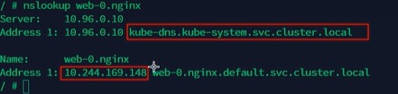

# 资源调度


## Label(标签)
Label的配置方式有以下几种
- 定义配置文件\
  在各类资源的spec.metadata.labels中进行配置

- kubectl命令\
  可以通过kubectl命令行的方式，为资源添加label

  - 临时创建label
    ```shell
    kubectl label <资源类型> <资源名称> <label-key>=<label-value> -n <namespace>

    #示例
    kubectl label po nginx-demo app=hello -n kube-system
    ```

  - 修改已经存在的标签
    ```shell
    kubectl label <资源类型> <资源名称> <label-key>=<label-value> -n <namespace> --overwrite

    #示例
    kubectl label po nginx-demo app=hello -n kube-system --overwrite
    ```

  - 查看label
    ```shell
    # selector按照label单值查找资源
    kubectl get <资源类型> -A -l <label-key>=<label-value>
    #示例
    kubectl get po -A -l app=hello

    #查看指定资源类型下的所有资源的labels
    kubectl get <资源类型> -n <namepsace> --show-labels
    #示例
    kubectl get po -n kube-system --show-labels
    ```


## Selector(选择器)
Selector的配置方式有以下几种

- 定义配置文件\
  在各对象的配置spec.selector或其他可以写selector的属性中编写

- kubectl命令
  ```shell
  #匹配单个值，查找app=hello的pod
  kubectl get po -A -l app=hello

  #匹配多个值
  kubectl get po -A -l 'k8s-app in (metrics-server,kubernetes-dashboard)'

  # 查找version!=1 and app=nginx的pod信息
  kubectl get po -l version!=1,app=nginx

  #不等值+语句
  kubectl get po -l 'version!=1,app=nginx,test in (xxx,xxx,xx
  ```


## Deployment


### 创建Deployment
Deployment的创建方式有以下几种

- 定义配置文件\
  执行命令：
  ```shell
  kubectl create -f xxx.yaml --record
  ```
  注：–record会在annotation中记录当前命令创建或升级了资源，后续可以查看做过哪些变动操作

- kubectl命令	
  执行命令：
  ```shell
  kubectl create deploy nginx-deploy --image=nginx:1.7.9
  ```


### 查看Deployment
查看Deployment信息，执行命令：
```shell
kubectl get deployment  #返回nginx-deploy记录
kubectl get replicaset  #返回nginx-deploy-xxxxxxxxxx记录
kubectl get pod  #返回nginx-deploy-xxxxxxxxxx-xxxxx记录

kubectl get deploymenet <deployment name> -o yaml  #以yaml格式输出deployment配置

kubectl get po,rs,deploy  # 可以同时输出po，rs和deploy信息
```
注：\
Deployment包含了ReplicaSet，ReplicaSet包含了Pod\
比如Deployment的name是nginx-deploy，则其对应的ReplicaSet就是nginx-deploy-xxxxxxxxxx, 对应的Pod就是nginx-deploy-xxxxxxxxxx-xxxxx

以下是Deployment配置实例
```yaml
apiVersion: apps/v1  # deployment api 版本
kind: Deployment  # 资源类型为deployment
metadadta；  # 元数据
  labels:  #标签配置信息
    app: nginx-deploy
  name: nginx-deploy  # deployment名字
  namespace: default  # 所在命名空间
spec:
  replicas； 1  # 期望副本数
  revisionHistoryLimit: 10  #进行滚动更新后保留的历史版本数
  selector:  # 选择器
    matchLabels:  #按照标签匹配
      app: nginx-deploy   # 匹配的标签key-value
  strategy:  # 更新策略
    rollingUpdate:  # 滚动更新配置 
      maxSurge: 25%  # 进行滚动更新时，更新的个数最多可以超过期望副本数的个数或比例
      maxUnavailable； 25%  #进行滚动更新时，最大不可用比例，表示在所有副本数中，最多可以有多少个可以不更新成功
    type: RollingUpdate  # 更新类型，采用滚动更新
  template:  #Pod模板
    metadata:  # Pod的元数据
      labels:  # Pod标签
        app: nginx-deploy
    spec:  # Pod期望
      containers:  # Pod容器
      - image: nginx:1.7.9  # Pod镜像
        imagePullPolicy: IfNotPresent   # Pod容器拉取策略
        name: nginx  # Pod容器名称
      restartPolicy: Always  # 重启策略
      terminationGracePeriodSeconds: 30  # 最大宽限时间
```


### 滚动更新

- 示例\
以下是当前Deployment的配置信息
```shell
apiVersion: apps/v1  # deployment api 版本
kind: Deployment  # 资源类型为deployment
metadadta；  # 元数据
  labels:  #标签配置信息
    app: nginx-deploy
    test: test
  name: nginx-deploy  # deployment名字
  namespace: default  # 所在命名空间
spec:
  replicas: 1  # 期望副本数
  revisionHistoryLimit: 10  #进行滚动更新后保留的历史版本数
  selector:  # 选择器
    matchLabels:  #按照标签匹配
      app: nginx-deploy   # 匹配的标签key-value
  strategy:  # 更新策略
    rollingUpdate:  # 滚动更新配置 
      maxSurge: 25%  # 进行滚动更新时，更新的个数最多可以超过期望副本数的个数或比例
      maxUnavailable； 25%  #进行滚动更新时，最大不可用比例，表示在所有副本数中，最多可以有多少个可以不更新成功
    type: RollingUpdate  # 更新类型，采用滚动更新
  template:  #Pod模板
    metadata:  # Pod的元数据
      labels:  # Pod标签
        app: nginx-deploy
    spec:  # Pod期望
      containers:  # Pod容器
      - image: nginx:1.7.9  # Pod镜像
        imagePullPolicy: IfNotPresent   # Pod容器拉取策略
        name: nginx  # Pod容器名称
      restartPolicy: Always  # 重启策略
      terminationGracePeriodSeconds: 30  # 最大宽限时间
```

修改nginx版本号， 命令如下：
```shell
kubectl set image deployment/nginx-deployment nginx=nginx:1.9.1  # 通过set image命令修改

kubectl set image deployment/nginx-deployment nginx=nginx:1.9.1 --record  # --record参数用于写明修改原因，便于回滚时找到指定的历史版本

kubectl edit deployment/nginx-deployment  #直接edit修改
```

查看滚动更新的过程， 命令如下：
```shell
kubectl rollout status deploy <deployment_name>
```

通过kubectl edit命令，在metadadta.labels追加了test:test标签，保存后，会发现：\
1) Deployment并没有触发更新\
2) 通过kubectl decribe查看event，也不会发现有添加标签操作的记录\
注: 只有当修改了Deployment配置文件中的template.spec中的属性后，才会触发更新操作

通过kubectl edit命令，将spec.replicas从1更新为3，保存后，会发现：\
1) Deployment并没有触发更新\
2) Pod数量会按照Pod Template的最新配置，从1个变成3个, 但不会滚动更新

通过kubectl edit命令，将spec.template.spec.containers[0].image改成1.9.1后，保存后，会发现：\
1) Deployment触发了滚动更新，由于更新是滚动进行，ready总数在更新过程中一直不变\

通过kubectl set image命令，将image更新为1.9.1后，会发现：\
1) Deployment触发了滚动更新，由于更新是滚动进行，ready总数在更新过程中一直不变

注：\
1) 滚动更新过程是可以通过kubectl describe 的event追踪到的\
2) 滚动更新后，可以通过以下命令，看到两个rs，历史版本的rs下，desired，current字段都是0，当前最新的rs是有值的，执行命令：
```shell
kubectl get rs --show-labels
```

同时也会发现pod都是关联到最新的rs上的，执行命令：
```shell
kubectl get po --show-labels
```

**并发滚动更新**\
当前deploy下有一个rs1，修改deploy后，会创建rs2进行滚动更新\
此时如果rs2尚未滚动更新完成再次对deploy进行修改，那么会创建rs3进行滚动更新，原先正在进行滚动更新的rs2会停止\
r2和r3都会被记录到历史中


### 回滚
Deployment可以执行回滚操作，来回退到一个历史版本\
例如：当前的Deployment不稳定，一直crash looping，可以执行回滚操作，将其回退到历史上某一个稳定的版本

默认情况下，k8s会在系统中保存前两次的deployment的rollout历史记录，以便可以随时回退\
可以修改Deployment配置的.spec.revisionHistoryLimit属性来更改可以保存的revision数，如果设置为0，则表示不允许Deployment回退

- 示例：\
更新Deployment的镜像时，镜像参数不小心写错，比如应该是nginx1.9.1，但写成了nginx1.91，执行命令：
```shell
kubectl set image deployment/nginx-deploy nginx=nginx:1.91  #误将Deployment镜像版本更新为1.91
```

监控滚动升级状态发现，由于镜像名称错误导致下载镜像失败，因此更新过程会被卡住，执行命令：
```shell
kubectl rollout status deployment nginx-deploy  # 监控滚动更新状态
```

结束监听后，获取rs信息，可以看到新增的rs副本数是1(原来的rs的副本数是3), 但其状态是not ready, 执行命令：
```shell
kubectl get rs
```

通过kubectl get pods获取pods的信息，可以看到关联到新的rs的pod，状态处于imagePullBackOff状态, 原来deploy的3个pod是running，新的deploy的1个pod是imagePullBackOff, 执行命令：
```shell
kubectl get pods
```

此时查看deploy，发现ready是3/3. up-to-date是1，available是3\
虽然deploy也是可用的，但是修改后的deploy并没有更新进来
```shell
kubectl get deploy
```

为了修复这个问题，需要找到回退的reversion进行回退\
先获取reversion列表，执行命令:
```shell
kubectl rollout history deployment/nginx-deploy
```

查看历史某版本的详细信息, 执行命令:\
注: 它只会返回历史版本当时修改的section的信息，不会将整个yaml都输出
```shell
kubectl rollout history deployment/nginx-deploy --revision=2
```

确认要回退的版本后，就可以回退到上一个版本， 执行命令:
```shell
kubectl rollout undo deployment/nginx-deploy
```

也可以通过以下命令，回退到指定的revision
```shell
kubectl rollout undo deployment/nginx-deploy --to-revision=2
```

查看到版本已经回退到对应的历史revision上了，执行命令:
```shell
kubectl get deployment nginx-deploy
kubectl describe deployment nginx-deploy
```

此时再查看rs，发现历史版本的rs有了数字，而原来最新的rs下没有了数字
```shell
kubectl get rs
```


### 扩缩容
可以通过以下两种方式进行扩缩容

- kube scale命令\	
  通过kube scale命令可以进行自动扩缩容
  ```shell
  kubectl scale --replicas=6 deploy nginx-deploy
  ```

- kube edit编辑replicas\
  通过kube edit编辑replicas也可以实现扩缩容

注: 扩容与缩容只是直接创建副本数，没有更新Pod template, 因此不会创建新的rs


### 暂停与恢复
由于每次对Pod template中的信息发生修改后，都会触发更新Deployment操作\
那么此时如果频繁修改信息，都会产生多次更新，而实际上只需要执行最后一次更新即可\
当出现此类情况时,就可以先暂停Deployment 的rollout


- 示例\
先暂停Deployment，执行命令:
```shell
kubectl rollout pause deployment <name>
```

此时对容器进行修改，执行命令:
```shell
kubectl set image deploy <name> nginx=nginx=1.17.9
```

然后查看Pod，发现Pod并没有被更新操作，执行命令:
```shell
kubectl get po
```

再次进行修改一些属性， 如限制nginx容器的最大cpu为0.2核心，最大内存为128M，最小内存为64M，最小cpu为0.1核，执行命令:
```shell
kubectl set resources deploy <deploy_name> -c <container_name> --limits=cpu=200m, memory=128Mi --requests=cpu 100m,memory=64Mi
```

通过格式化输出deployment配置, 看到配置确实发生了修改，执行命令：
```shell
kubectl get deploy <name> -o yaml
```

再次查看Pod，也没有被更新，执行命令：
```shell
kubectl get po
```

恢复rollout，执行命令:
```shell
kubectl rollout resume deploy <name>
```

恢复rollout后，再次查看rs和po信息，可以看到rs和po开始进行滚动更新操作了，执行命令:
```shell
kubectl get rs
kubectl get po
```

查看历史版本确认历史和最新的记录，执行命令：
```shell
kubectl rollout history deploy nginx-deploy # 查看历史版本
kubectl rollout history deploy nginx-deploy --revision=<版本号>
```


## StatefulSet


### 创建StatefulSet
通过以下配置文件创建StatefulSet，文件名web.yaml
```yaml
---
apiVersion: v1
kind: Service
metadata:
  name: nginx
  labels:
    app: nginx
  spec:
    ports:
    - port: 80
      name: web
    clusterIP: None
    selector:
      app: nginx
---
apiVersion: apps/v1
kind: StatefulSet  # statefulset 类型资源
metadata:
  name: web  # statefulset对象名字
spec:
  serviceName: "nginx"  # 使用哪个servicve管理DNS
  replicas: 2  
  selector:
    matchLabels:
      app: nginx
  template:
    metadata:
      labels:
        app: nginx
    spec:
      containers:
      - name: nginx
        image: nginx:1.7.9
        ports:  
        - containerPort: 80  # 容器内部要暴露的端口
          name: web  # 该端口配置的名字
        volumeMounts:  # 加载数据卷
        - name: www  # 指定加载哪个数据卷
          mountPath: /usr/share/nginx/html  # 加载到容器中的哪个目录
  volumeClaimTemplates:  # 数据卷的模板，会按照这个模板创建一个数据卷
  - metadata:  # 数据卷的描述
      name: www  # 数据卷的名称
      annotations:  # 数据卷的注解
        volume.alpha.kubernetes.io/storage-class: anything
    spec:  # 数据卷的期望配置
      accessModes: [ "ReadwriteOnce" ]  # 数据卷的访问模式
      resources:
        requests:
          storage: 1Gi  # 数据卷需要的存储资源
```

查看service相关信息，执行命令：
```shell
kubectl get sts  # 获取statefulset的信息
kubectl get svc  # 获取service的信息
kubectl get pvc  # 获取持久卷的信息
```
执行会发现pvc没有创建成功过，执行kubectl describe pvc后发现存储卷没有创建成功

暂时先按照以下方式创建
```yaml
---
apiVersion: v1
kind: Service
metadata:
  name: nginx
  labels:
    app: nginx
  spec:
    ports:
    - port: 80
      name: web
    clusterIP: None
    selector:
      app: nginx
---
apiVersion: apps/v1
kind: StatefulSet  # statefulset 类型资源
metadata:
  name: web  # statefulset对象名字
spec:
  serviceName: "nginx"  # 使用哪个servicve管理DNS
  replicas: 2  
  selector:
    matchLabels:
      app: nginx
  template:
    metadata:
      labels:
        app: nginx
    spec:
      containers:
      - name: nginx
        image: nginx:1.7.9
        ports:  
        - containerPort: 80  # 容器内部要暴露的端口
          name: web  # 该端口配置的名字
```

为验证service连通性，需要在另外一个容器上验证，因此额外运行busybox容器\
注：busybox是打包了很多工具的镜像，该镜像运行的容器内可以利用很多工具进行测试
```shell
kubectl run -it --image busybox:1.28.4 dns-test  --restart=Never --rm /bin/sh
```

进入到busybox容器中, 验证是否可以ping到statefulset的两个服务，发现可以ping通，执行命令：
```shell
ping web-0.nginx # 可以ping通statefulset的第1个pod的服务
ping web-1.nginx # 可以ping通statefulset的第2个pod的服务
```
  
在busybox容器中，执行nslookup可以通过, 执行命令： 
```shell
nslookup web-0.nginx  #可以查看ip地址和整个服务的名字
nslookup web-1.nginx
```

  

### 扩缩容
通过以下方式实现扩缩容

- 扩容
```shell
kubectl scale statefulset web --replicas=5
kubectl patch statefulset web -p '{"spec":{"replicas":5}}'
```

- 缩容
```shell
kubectl patch statefulset web -p '{"spec":{"replicas":3}}'
kubectl scale statefulset web --replicas=3
```
statefulSet扩缩容是按照顺序进行的


### 镜像更新
可以为statefulSet更新镜像，目前还不支持直接更新image，需要patch来间接实现
```shell
kubectl patch statefulset web -type='json' -p='[{"op":"replace","path": "/spec/template/spec/containers/0/image","value":"nginx:1.9.1"}]'
```


### StatefulSet更新
StatefulSet的更新操作有以下两种类型

- RollingUpdate\
  StatefulSet也可以采用滚动更新策略，同样是修改pod template属性后会触发更新\
  但是由于pod是有序的，在statefulset中更新时是基于pod的顺序倒序更新的

  - 灰度发布(金丝雀发布)\
    目标：将项目上线后产生问题的影响尽量降低到最低\
    先将一部分pod更新，确认没有问题后再将剩下的pod滚动更新\
    确认有问题，就把更新的部分回滚

    利用滚动更新中的partition属性，可以实现简易的灰度发布的效果\
    例如：我们有5个pod，如果当前partition设置为3，那么此时滚动更新时，只会更新那些序号>=3的pod\
    利用该机制，可以通过控制partition的值，来决定只更新其中一部分pod，确认没有问题后再逐渐增大更新的pod数量，最终实现全部pod更新

  - partition\
    位置：.spec.updateStrategy.rollingUpdate.partition\
    如果值为0，表示statefulset变更后，序号>=0的pod都会更新，所有pod都会更新

- OnDelete\
  当设置为OnDelete时，执行kubectl eidit时是不会触发更新的，只有当pod被删除时，才会更新\
  优点：可以自主手动控制哪个pod进行更新\
  位置：.spec.updateStrategy.type = "OnDelete"


### 删除StatefulSet
删除statefulset包括删除statefulset和headless service\
删除statefulset包括级联删除和非级联删除

- 级联删除：删除statefulset时会同时删除pods, 默认是级联删除
  ```shell
  kubectl delete statefulset web
  ```

- 非级联删除：删除statefulset时，不会删除pods，删除sts后，pod依然运行
  ```shell
  kubectl delete sts web --cascade=false
  ```


### 删除service
删除statefulset后，与之关联的service不会被自动删除，因此需要手工删除headless service
```shell
kubectl delete service nginx
```


### 删除pvc
statefulset删除后，PVC还会保留着，如果数据不再使用的话也需要删除
```shell
kubectl delete pvc <pvc_name>
```


## DaemonSet


## 创建DaemonSet
通过以下配置创建DaemonSet，文件名：fluentd-demo.yaml
```yaml
apiVersion: apps/v1
kind: DaemonSet  # 创建DaemonSet资源
metadata:
  name: fluentd  # DaemonSet名字
spec:
  selector:
    matchlabels:
      app: logging  # 此处的标签值要与.spec.template.metadata.labels[0].app的值一一对应
  template:
    metadata:
      labels:
        app: logging
        id: fluentd
      name: fluentd
    spec:
      containers:
      - name: fluentd-es
        image: agilestacks/fluentd-elasticsearch:v1.3.0
        env:  # 环境变量配置
        - name: FLUENTD_ARGS
          value: -qq
        volumeMounts:  # 加载数据卷，避免数据丢失
        - name: containers
          mountPath: /var/lib/docker/containers
        - name: varlog
          mountPath: /var/log
      volumes: # 定义数据卷
         - hostPath:  #数据卷类型，主机路径的模式，即与Node共享目录
             path: /var/lib/docker/containers  # 将Node中的该目录共享
           name: containers  # 定义的数据卷的名称
          - hostPath:
             path: /var/log
           name: varlog
```
创建后，发现fluentd pod被发布在了所有非master 的node上，如果selector没有匹配的node，它会默认将pod发布在所有非master 节点

将其中一个node打上标签
```shell
kubectl label no k8s-node1 type=microservices
```

同时给daemonset添加Nodeselector,
```yaml
apiVersion: apps/v1
kind: DaemonSet  # 创建DaemonSet资源
metadata:
  name: fluentd  # DaemonSet名字
spec:
  selector:
    matchlabels:
      app: logging  # 此处的标签值要与.spec.template.metadata.labels[0].app的值一一对应
  template:
    metadata:
      labels:
        app: logging
        id: fluentd
      name: fluentd
    spec:
      nodeSelector:
        type: microservices 
      containers:
      - name: fluentd-es
        image: agilestacks/fluentd-elasticsearch:v1.3.0
        env:  # 环境变量配置
        - name: FLUENTD_ARGS
          value: -qq
        volumeMounts:  # 加载数据卷，避免数据丢失
        - name: containers
          mountPath: /var/lib/docker/containers
        - name: varlog
          mountPath: /varlog
       volumes: # 定义数据卷
         - hostPath:  #数据卷类型，主机路径的模式，即与Node共享目录
             path: /var/lib/docker/containers  # 将Node中的该目录共享
           name: containers  # 定义的数据卷的名称
         - hostPath:
             path: /var/log
           name: varlog
```
修改后，发现fluentd pod只在Node1上运行\
此时如果同样的方式给node2打同样的标签，会发现fluentd pod也会在node2上运行

DaemonSet配置文件中，spec.selector.matchlabels的标签值要跟spec.template.metadata.labels的值一一对应\
只有一一对应，DaemonSet才知道它要将这个yaml文件里的pod发布到指定的node上


### 指定Node节点
DaemonSet是一种特殊的控制器，用于确保集群中每个（或符合条件的）节点上都运行一个 Pod 副本\
它会忽略Node的unschedulable状态，即使节点被标记为 unschedulable，DaemonSet仍然会在该节点上创建 Pod

DaemonSet在指定的Node节点运行Pod主要通过以下方式：
- nodeSelector\
  只调度到匹配指定Label的Node上

- nodeAffinity\
  功能更丰富的Node选择器，比如支持集合操作

- podAffinity\
  调度到满足条件的Pod所在的Node上


### DaemonSet更新
当修改DaemonSet的 spec.template （例如更新容器镜像、环境变量、资源限制等\
默认情况下，控制器会逐个节点滚动更新其管理的DaemonSet Pod，替换旧的Pod为新的Pod

DaemonSet支持多种更新策略，主要通过spec.updateStrategy属性控制，包含以下几种方式：
- RollingUpdate\
  不推荐，会逐个节点滚动更新DaemonSet Pod，按策略逐步替换旧Pod，会造成频繁更新

- OnDelete\
  推荐，仅当对应的DaemonSet Pod被手动删除时，控制器才会根据新的模板创建新的Pod（不会自动替换现有 Pod）
  即需要哪个节点更新DaemonSet Pod就删掉哪个节点的Pod，然后更新那个节点Pod，避免频繁更新

```yaml
apiVersion: apps/v1
kind: DaemonSet
metadata:
  name: example-ds
spec:
  updateStrategy:  # 控制DaemonSet更新策略
    type: RollingUpdate
    rollingUpdate:
      maxUnavailable: 1
  selector:
    matchLabels:
      app: my-daemon
  template:
    metadata:
      labels:
        app: my-daemon
    spec:
      containers:
        - name: my-daemon
          image: myimage:v2
```


## HPA自动扩/缩容
HPA自动扩缩容，是指通过观察Pod的cpu，内存使用率或自定义metrics指标针对Pod的数量，自动进行扩容或缩容\
英文全称，“HorizontalPodAutoscaler”
  
HPA自动扩缩容通常用于Deployment ，对于无法扩缩容的对象不适用，比如DaemonSet\
控制管理器每隔30s(该时间间隔通过-horizontal-pod-audoscaler-sync-period属性修改)查阅metrics的资源使用情况


### 创建HPA
Deployment的创建方式有以下几种

- 定义配置文件\	
  执行命令：
  ```shell
  kubectl create -f hpa-create.yaml
  ```

- kubectl命令\
  执行命令：
  ```shell
  kubectl autoscale deployment myapp --min=2 --max=10 --cpu-percent=50
  ```


### HPA配置
配置文件：
```yaml
apiVersion: autoscaling/v2beta2
kind: HorizontalPodAutoscaler
metadata:
  name: legacy-hpa
spec:
  scaleTargetRef:
    apiVersion: apps/v1
    kind: Deployment
    name: legacy-app
  minReplicas: 1
  maxReplicas: 10
  metrics:
    - type: Resource
      resource:
        name: cpu
        target:
          type: Utilization
          averageUtilization: 70
```


### 开启指标服务
配置HPA自动扩缩容，需要先开启指标服务，操作步骤如下：

下载metrics-server组件配置文件到本地，执行命令：
```shell
wget https://github.com/kubernetes-sigs/metrics-server/releases/latest/download/components.yaml -O metrics-server-components.yaml
```

修改配置文件中的镜像地址为国内的地址，执行命令：
```shell
sed -i 's/k8s.gcr.io\/metrics-server/registry.cn-hangzhou.aliyuncs.com\/google_containers/g' metrics-server-components.yaml

grep image metrics-server-components.yaml  # 查看镜像是否修改成功
```

修改容器的tls配置，使其不验证tls\
在yaml文件的.spec.template.spec.args里添加--kubelet-insecure-tls\
注：由于本地没有https证书，加上该参数后，就可以不用校验https证书了，证明是可信任的

yaml配置文件修改好后，执行安装，执行命令：
```shell
kubectl apply -f metrics-server-components.yaml
```

查看Pod状态，执行命令
```shell
kubectl get po -A | grep metrics  # 确认pod正在运行
```


### cpu，内存指标监控
监控某对象的cpu或内存，需具备以下前提条件：
- 对象配置了resources.requests.cpu
- 对象配置了resources.requests.memory
可以为cpu或memory配置阈值，阈值可以是具体数值或百分比，当达到阈值时自动进行扩缩容


- 示例\
创建以及测试HPA, 执行以下步骤：\
1) 创建一个Deployment，该Deployment必须进行了资源的限制(request/limit)
```yaml
apiVersion: apps/v1  # deployment api 版本
kind: Deployment  # 资源类型为deployment
metadadta；  # 元数据
  labels:  #标签配置信息
    app: nginx-deploy
  name: nginx-deploy  # deployment名字
  namespace: default  # 所在命名空间
spec:
  replicas: 1  # 期望副本数
  revisionHistoryLimit: 10  #进行滚动更新后保留的历史版本数
  selector:  # 选择器
    matchLabels:  #按照标签匹配
      app: nginx-deploy   # 匹配的标签key-value
  strategy:  # 更新策略
    rollingUpdate:  # 滚动更新配置 
      maxSurge: 25%  # 进行滚动更新时，更新的个数最多可以超过期望副本数的个数或比例
      maxUnavailable； 25%  #进行滚动更新时，最大不可用比例，表示在所有副本数中，最多可以有多少个可以不更新成功
    type: RollingUpdate  # 更新类型，采用滚动更新
  template:  #Pod模板
    metadata:  # Pod的元数据
      labels:  # Pod标签
        app: nginx-deploy
    spec:  # Pod期望
      containers:  # Pod容器
      - image: nginx:1.7.9  # Pod镜像
        imagePullPolicy: IfNotPresent   # Pod容器拉取策略
        name: nginx  # Pod容器名称
        resources:
          limits:
            cpu: 200m
            memory: 128Mi
          requests:
            cpu: 100m
            memory: 128Mi 
      restartPolicy: Always  # 重启策略
      terminationGracePeriodSeconds: 30  # 最大宽限时间
```

2) 配置HPA，执行命令：
```shell
kubectl autoscale deploy <deploy_name>  --cpu-percent=20  --min=2 --max=5

# --cpu-percent=20：目标 CPU 利用率为 20%。当 Deployment 中所有 Pod 的平均 CPU 使用率超过 20% 时，HPA 会尝试增加 Pod 数量；低于 20% 时，会尝试减少 Pod 数量
# --min=2：Pod 副本数的最小值，至少保持 2 个 Pod
# --max=5：Pod 副本数的最大值，最多扩展到 5 个 Pod
```

3) 获取HPA信息，执行命令：
```shell
kubectl get hpa

kubectl top  # 可以查看cpu和内存占用情况，需要开启指标服务metrics service
```

4) 配置service\
配置了service后，才可以通过curl访问Pod
```yaml
apiVersion: v1
kind: Service
metadata:
  name: nginx-svc
  labels:
    app: nginx
spec:
  selector:
    app: nginx-deploy  
  ports:
  - port: 80
    targetPort: 80
    name: web
   type: NodePort
```

5) 测试：\
找到对应服务的service，编写循环测试脚本提升内存与cpu负载
```shell
while true: do wget -q -O - http://<ip:port> > /dev/null; done  #死循环
```
可以通过多台机器执行上述命令，增加负载，当超过负载后可以查看pods的扩容情况


### 自定义metrics
控制管理器开启-horizontal-pod-autoscaler-use-rest-clients\
控制管理器的-apiserver指向API server aggregator\
在API server aggregator中注册自定义的metrics API
