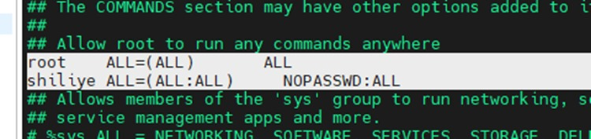
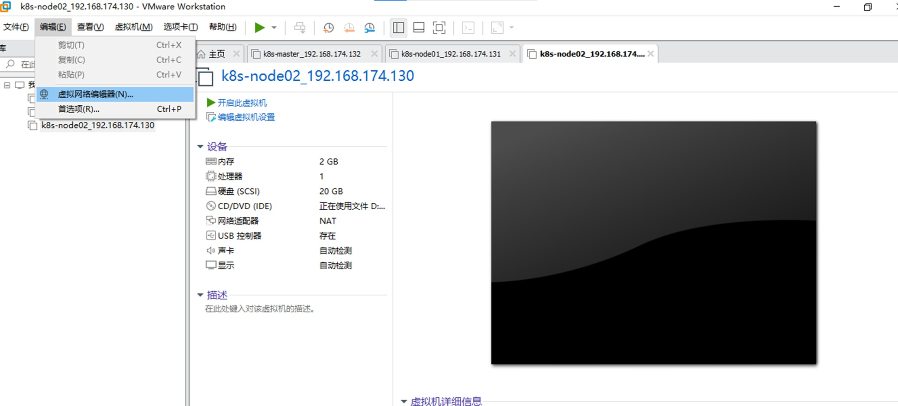
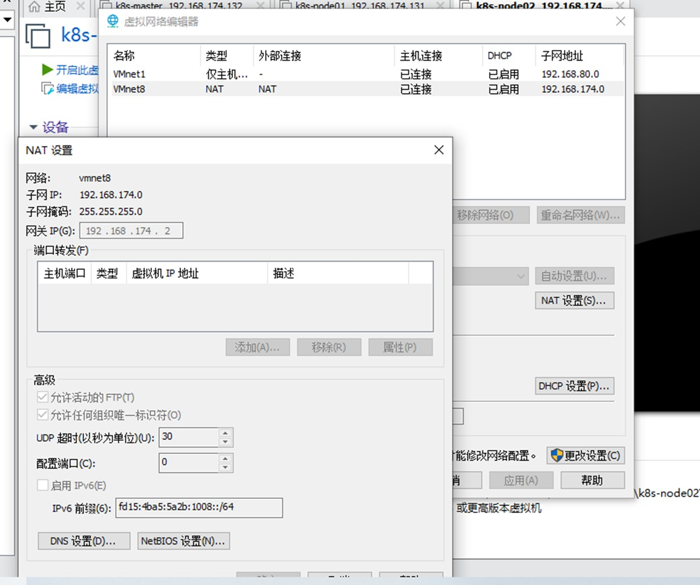
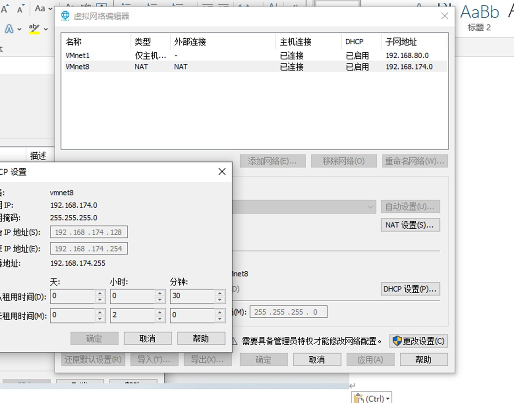
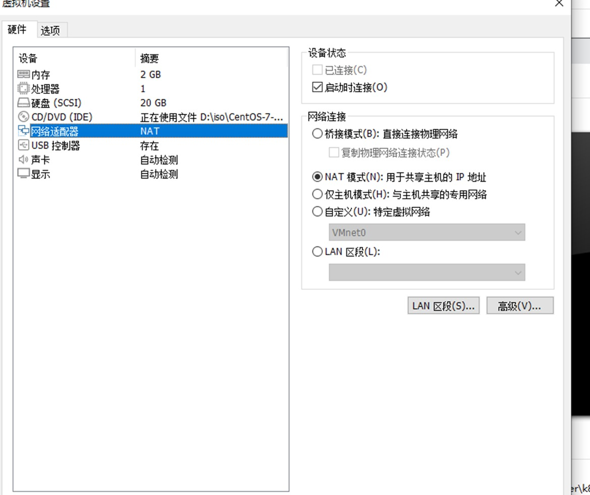
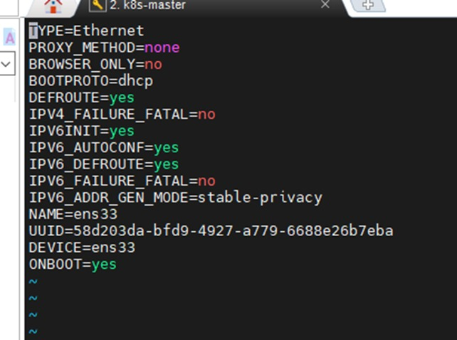

# 下载CentOS7镜像
点击以下URL，按照镜像名点击下载即可\
镜像下载URL：https://mirrors.aliyun.com/centos/7/isos/x86_64/?spm=a2c6h.25603864.0.0.63d44511Wukt6s\
镜像选择：CentOS-7-x86_64-Minimal-2207-02.iso


# 下载VMWare
按照下面的文档下载VM ware workstation Pro17\
参考文档：https://blog.csdn.net/air__j/article/details/142798842


# 创建虚拟机
打开VMware，利用下载的centos7镜像，创建3台虚拟机，配置如下
- 内存: 2GB	
- 处理器数: 2（K8s官方要求每个节点的处理器数至少是2）
- 硬盘: 20GB	


通过镜像创建虚拟机时，可以创建一个普通账号和一个root账号\
通过以下配置，可以使普通用户通过sudo -i命令无缝切换到root账号\
先登录Root账号，然后按照如下方式更改/etc/sudoers文件，即在原来root ALL=(ALL) ALL下追加一条\



# 配置虚拟机联外网
选中虚拟机，点击"编辑" → 点击 "虚拟网络编辑器"\



在虚拟网络编辑器页面，选中WMnet8 NAT，点击"NAT设置"，确保配置如以下弹出的NAT设置页面\



在虚拟网络编辑器页面，选中WMnet8，点击"DHCP设置"，确保配置如以下弹出的DHCP设置页面\



右键点击一个虚拟机，点击"设置" → 选中"网络适配器"，确保配置如下页面\



登录三台虚拟机，执行以下命令
```shell
vi /etc/sysconfig/network-script/ens33
```
将最下面的onboot=no改成yes，保存\



然后执行以下命令重启服务
```shell
service network restart
```

执行以下命令，验证是否可以联网
```shell
ping www.baidu.com
```

# 配置虚拟机互通
通过以下Scp 命令，确定可以发文件到其他节点，说明三个虚拟机是相互连通的
```shell
scp <path_to_file> root@<target server ip>:<path_to_file>
```