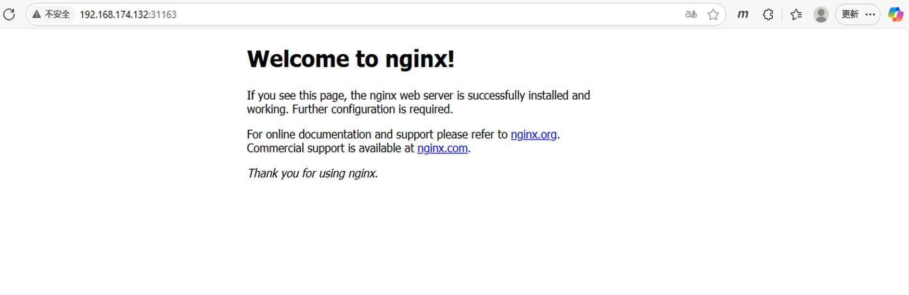

# 物理环境配置
注：安装K8s前，需要完成一些物理环境的准备工作，在每个机器上执行

执行以下命令，关闭swap，执行后要重启一下虚拟机
```shell
sudo sed -ri 's/.*swap.*/#&/' /etc/fstab
```


执行以下命令，分别在对应的机器上，根据规划设置hostname
```shell
hostnamectl set-hostname k8s-master  #k8s-master节点机器上执行
hostnamectl set-hostname k8s-node01  #k8s-node01节点机器上执行
hostnamectl set-hostname k8s-node02  #k8s-node02节点机器上执行
```


执行以下命令，登录root账号添加host\
注：IP地址请换成自己本地的IP地址
```shell
cat >> /etc/hosts <<EOF
192.168.174.132 k8s-master
192.168.174.131 k8s-node01
192.168.174.130 k8s-node02
EOF
```

执行以下命令，登录root账号，将桥接的IPv4的流量传递到iptables的链接
```shell
cat > /etc/sysctl.d/k8s.conf << EOF
net.bridge.bridge-nf-call-ip6tables = 1
net.bridge.bridge-nf-call-iptables = 1
EOF
```

执行以下命令，将以上配置生效
```shell
sysctl --system  #生效
```


执行以下命令，配置时间同步
```shell
# 备份原配置
mv /etc/yum.repos.d/CentOS-Base.repo /etc/yum.repos.d/CentOS-Base.repo.bak

# 下载国内阿里云源
curl -o /etc/yum.repos.d/CentOS-Base.repo http://mirrors.aliyun.com/repo/Centos-7.repo

# 清理缓存并生成新缓存
yum clean all
yum makecache

下载并安装
yum install ntpdate -y
ntpdate time.windows.com
```


# 基础软件安装
注：安装K8s前，需要安装一些基础软件，比如Docker，在每个机器上执行


执行以下命令，安装docker\
注：由于国内特殊原因，安装采用离线下载方式安装
```shell
sudo yum update -y
sudo yum install -y yum-utils device-mapper-persistent-data lvm2
sudo yum-config-manager --add-repo http://mirrors.aliyun.com/docker-ce/linux/centos/docker-ce.repo

sudo yum install wget
sudo yum install -y libseccomp
sudo yum install -y epel-release
sudo yum install -y container-selinux
wget https://mirrors.aliyun.com/docker-ce/linux/centos/7/x86_64/stable/Packages/containerd.io-1.6.24-3.1.el7.x86_64.rpm
sudo rpm -ivh containerd.io-1.6.24-3.1.el7.x86_64.rpm

sudo yum install -y docker-ce docker-ce-cli

curl -fsSL https://mirrors.aliyun.com/docker-ce/linux/centos/gpg -o /tmp/docker-gpg
sudo rpm --import /tmp/docker-gpg

sudo systemctl start docker
sudo systemctl enable docker
sudo docker --version
sudo docker run hello-world
```


执行以下命令，root账号下，添加阿里云yum源
```shell
cat > /etc/yum.repos.d/kubernetes.repo << EOF
[kubernetes]
name=Kubernetes
baseurl=https://mirrors.aliyun.com/kubernetes/yum/repos/kubernetes-el7-x86_64
enable=1
gpgcheck=0
repo_gpgcheck=0

gpgkey=https://mirrors.aliyun.com/kubernetes/yum/doc/yum-key.gpg https://mirrors.aliyun.com/kubernetes/yum/doc/rpm-package-key.gpg
EOF
```

# 安装K8s
注：K8s的安装包括kubeadm，kubectl，kubelet，在每个机器上执行


打开/etc/resolv.conf，追加以下记录
```shell
nameserver 114.114.114.114
nameserver 8.8.8.8
```

执行以下命令，安装kubelet并启用
```shell
yum install -y kubelet-1.23.6 kubeadm-1.23.6 kubectl-1.23.6
systemctl enable kubelet
```

编辑 Docker 配置文件/etc/docker/daemon.json，按照如下方式添加 exec-opts属性
```shell
{
  "exec-opts": ["native.cgroupdriver=systemd"],  # 与 kubelet 一致
  "registry-mirrors": ["https://你的镜像加速器"]  # 保留之前的加速器配置
}
```


修改完配置文件后，执行以下命令使配置生效
```shell
systemctl daemon-reload
systemctl restart docker
systemctl restart kubelet
```


# 配置master节点
配置master节点到集群\
注：仅在Master节点操作

执行以下命令，配置master节点
```shell
kubeadm init\						
      --apiserver-advertise-address=192.168.174.132 \						
      --image-repository registry.aliyuncs.com/google_containers \						
      --kubernetes-version v1.23.6 \						
      --service-cidr=10.96.0.0/12 \						
      --pod-network-cidr=10.244.0.0/16
```

执行以下命令，查看kubelet运行情况
```shell
systemctl status kubelet
```

执行以下命令，使init命令生效
```shell
mkdir -p $HOME/.kube	
sudo cp -i /etc/kubernetes/admin.conf $HOME/.kube/config	
sudo chown $(id -u):$(id -g) $HOME/.kube/config	
export KUBECONFIG=/etc/kubernetes/admin.conf	

echo "export KUBECONFIG=/etc/kubernetes/admin.conf" >> ~/.bash_profile
source ~/.bash_profile
```


执行以下命令，查看node运行情况
```shell
kubectl get nodes
```

执行以下命令，使其他node节点上也执行kubectl命令
```shell
scp /etc/kubernetes/admin.conf root@k8s-node01:~/.kube/config
scp /etc/kubernetes/admin.conf root@k8s-node02:~/.kube/config
```

执行以下命令，获取master控制台的token\
注：这个token的作用是用来将Node节点配置到集群
```shell
kubeadm token create   #如果token过期，就重新申请

kubeadm token list #如果token没有过期通过如下命令获取
```


执行以下命令，获取sha256 hash值\
注：\
- 这个token的作用是用来将Node节点配置到集群
- 以下是一条命令，整体copy执行
```shell
openssl x509 -pubkey -in /etc/kubernetes/pki/ca.crt | openssl rsa -pubin -outform der 2>/dev/null | \
openssl dgst -sha256 -hex | sed 's/^.* //'
```


# 配置Node节点

配置Node节点到集群\
注: 仅在每个Node节点机器上执行

执行以下命令，将Node节点配置到集群

```shell
kubeadm join <master IP>:<port> --token <master控制台的token>  --discovery-token-ca-cert-hash <master控制台的hash>  #hash值前要加前缀"sha256:"

#例如：kubeadm join 192.168.174.132:6443 --token oxhymi.7ldtextlmpeademo  --discovery-token-ca-cert-hash sha256:40547503894b476497b5322057b59438438a10f7a08c5a69fb1eecbc3411ac67
```


# 部署CNI网络插件(Master节点)

执行以下命令，下载calico配置文件并修改
```shell
wget https://docs.projectcalico.org/v3.20/manifests/calico.yaml
```

修改calico.yaml文件中的CALICO_IPV4POOL_CIDR配置，修改为与初始化的pod-network-cidr cidr相同
注：配置文件中，这个属性是被注释的状态，不修改的话会自动使用初始化的CIDR，也可以解除注释，将初始化CIDR更新进去

修改IP_AUTODETECTION_METHOD下的网卡名称
注：如果没找到这个属性，可以暂时不改

执行以下命令，会发现仓库地址的前缀都是docker.io/，这会导致下载镜像时它会从docker-hub下载，由于国内被封禁会导致无法正常下载进而导致无法正常安装插件
```shell
grep image calico.yaml
```
  
执行以下命令, 将下载的calico.yaml文件中，将所有仓库地址的docker.io/前缀都删掉
```shell
sed -i 's#docker.io/##g' calico.yaml
```

涉及的仓库有以下，执行以下命令，先将docker镜像pull到本地，这样创建pod的时候就可以直接获取本地pull好的镜像，而无需从远程仓库拉取
```shell
docker pull calico/cni:v3.20.0 
docker pull calico/node:v3.20.0 
docker pull calico/node:v3.20.0 
docker pull calico/kube-controllers:v3.20.0
```


# 部署CNI网络插件(Node节点)
在每个Node节点上，同样执行以下命令，拉取插件镜像
```shell
docker pull calico/cni:v3.20.0 
docker pull calico/node:v3.20.0 
docker pull calico/node:v3.20.0 
docker pull calico/kube-controllers:v3.20.0
```


# 测试集群

执行以下命令，创建deployment
```shell
kubectl create deployment nginx --image=nginx
```

执行以下命令，暴漏端口
```shell
kubectl expose deployment nginx --port=80 --type=NodePort
```

查看pod以及服务信息
```shell
kubectl get pod,svc
```

执行以下命令，验证nginx服务连通
```shell
curl 192.168.174.132:31163
```

浏览器访问URL，验证nginx服务连通
