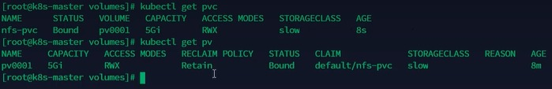

# 持久化存储


## Volumes


### HostPath
将节点上的文件或目录挂载到Pod上，此时它会变成持久化存储目录\
即便Pod被删除后重启，也可以重新加载到该目录，该目录下的文件不会丢失

执行kubectl create命令创建如下Pod，文件名volume-test-pd.yaml
```yaml
apiVersion: v1
kind: Pod
metadata:
  name: test-volume-pd
spec:
  containers:
  - image: nginx
    name: nginx-volume
    volumeMounts:
    - mountPath: /test-pd  # 挂载到容器哪个目录
      name: test-volume  # 挂载哪个volume
  volumes:
  - name: test-volume
    hostPath:  # 与主机共享目录，加载主机中的指定目录到容器
      path: /data  # 节点中的目录
      type: DirectoryOrCreate  # 检查类型，在挂载前对比挂载目录做什么检查操作，有多种选项，默认为空字符串，不做任何检查
```
Pod运行所在节点的/data目录和Pod容器内的/test-pd目录是互通的


**hostPath的检查类型**\
hostPath的type字段用于指定宿主机路径的预期类型，k8s会根据这个类型做一些校验，确保挂载的路径符合预期，避免因路径类型不符导致的错误

检查类型有以下几种： 
- **空字符串**\
  ""（空字符串\
  不做任何类型检查，路径必须存在，且类型不限（默认行为）

- **DirectoryOrCreate**\
  如果路径不存在，则创建目录，权限为755\
  如果存在则必须是目录

- **Directory**\
  路径必须存在且是一个目录

- **FileOrCreate**\
  如果路径不存在，则创建空文件，权限为644
  如果存在，则必须是普通文件

- **File**\
  路径必须存在且是一个普通文件

- **Socket**\
  路径必须存在且是一个Unix socket文件

- **CharDevice**\
  路径必须存在且是一个字符设备文件

- **BlockDevice**\
  路径必须存在且是一个块设备文件


### EmptyDir
EmptyDir主要用于一个Pod中的不同container间共享数据\
由于只是在Pod内部使用，因此与其他volume比较大的区别是，当Pod如果被删除了，那么emptyDir也会被删除

存储介质可以是任意类型，比如SSD，磁盘或网络存储，甚至内存\
当存储介质设置为内存时，emptyDir.medium被设置为Memory, 从而让k8s使用tmpfs(内存支持文件系统)，速度比较快\
但是重启tmpfs节点时，数据会被清除，且设置的大小会计入到Container的内存限制中

执行kubectl create命令创建如下Pod，文件名empty-dir-pd.yaml
```yaml
apiVersion: v1
kind: Pod
metadata:
  name: empty-dir-pd
spec:
  containers:
  - image: alpine
    name: nginx-emptydir1
    command: ["/bin/sh","-c","sleep 3600;"]
    volumeMounts:
    - mountPath: /cache
      name: cache-volume
  - image: alpine
    name: nginx-emptydir2
    command: ["/bin/sh","-c","sleep 3600;"]
    volumeMounts:
    - mountPath: /opt
      name: cache-volume 
  volumes:
  - name: cache-volume
    emptyDir: {}  # 表示创建一个临时的空目录卷，供Pod中的所有容器共享使用
```
nginx-emptydir1容器的/cache目录和nginx-emptydir2容器的/opt目录是互通的


## NFS挂载
NFS卷可以将NFS(网络文件系统)挂载到Pod中\
与emptyDir不同，NFS卷的内容在删除Pod时会被持久化保存，卷只是被卸载\
NFS卷可以被预先填充数据，并且这些数据可以在Pod之间共享\
NFS由于需要网络IO，因此它的效率并不高，不适合用于频繁以及高并发的读写操作


### NFS系统搭建
安装NFS包\
注：k8s每个节点都执行
```shell
yum install nfs-utils -y
```

启动NFS\
注：k8s每个节点都执行
```shell
systemctl start nfs-server
```

查看NFS版本\
注：k8s每个节点都执行
```shell
cat /proc/fs/nfsd/version
```

创建共享目录\
注：在Node01节点执行，即选择存储空间比较大的节点
```shell
mkdir -p /home/nfs
cd /home/nfs
mkdir rw
mkdir ro
```

设置共享目录export\
注：在Node01节点执行
```shell
vim /etc/exports

/home/nfs/rw 192.168.113.0/24(rw,sync,no_subtree_check,no_root_squash)
/home/nfs/ro 192.168.113.0/24(ro,sync,no_subtree_check,no_root_squash)

# 192.168.113.0/24是整个k8s的CIDR
```

重新加载(node01上操作)
```shell
exports -f
systemctl reload nfs-server

touch /home/nfs/ro/README.md
echo 'hello...nfs' > /home/nfs/ro/README.md
```

到Node02节点测试
```shell
mkdir -p /mnt/nfs/rw
mkdir -p /mnt/nfs/ro
mount -t nfs 192.168.113.121:/home/nfs/rw /mnt/nfs/rw  
mount -t nfs 192.168.113.121:/home/nfs/ro /mnt/nfs/ro 

# 192.168.113.121是node01的ip

ls /mnt/nfs/ro  # 会发现有README.md文件
touch /mnt/nfs/ro/test.csv  # 会报错，提示cannot touch test.csv, read-only file system

touch /mnt/nfs/rw/test.csv # 文件创建成功

# 登录node01节点，执行以下命令查询发现test.csv
ls /home/nfs/rw/
```

### 配置NFS到Pod
执行kubectl create命令创建如下Pod，文件名nfs-test-pd.yaml
```yaml
apiVersion: v1
kind: Pod
matadata:
  name: nfs-test-pd1
spec:
  containers:
  - image: nginx
    name: test_container
    volumeMounts:
    - mountPath: /my-nfs-data
      name: test-volume
  volumes:
  - name: test-volume
    nfs:
      server: 192.168.113.121  # 网络存储服务地址，即设置了共享目录的Node01节点的IP
      path: /home/nfs/rw/www/wolfcode  # 网络存储路径
      readOnly: false   # 是否只读
```

node1创建如下目录
```shell
mkdir -p /home/nfs/rw/www/wolfcode
echo 'hello ' > /home/nfs/rw/www/wolfcode/index.html
```
nfs-test-pd1 Pod容器中，可以看到/my-nfs-data目录下上一步创建的index.html文件\
即容器的/my-nfs-data和/home/nfs/rw/www/wolfcode是连通的

  
## PV和PVC
不论volume，NFS还是其他的持久化存储方法，它们都是具体实施方案\
由于Pod里，不同的持久化存储的实施方案是不同的，所以配置会很麻烦\
PV和PVC可以解决这个问题，它们其实是一层接口，对各个具体实时方案进行了封装\
这样Pod就可以直接使用PV和PVC接口，从而无需关心各种实施方案的细节


**PV和PVC的机制**\
PV是集群管理员或存储系统提供的存储资源，它是对底层存储的抽象\
PVC是用户对存储资源的请求，Pod通过PVC来声明需要的存储大小、访问模式等\
k8s会根据PVC的请求自动绑定一个合适的PV\
Pod只能挂载PVC，不能直接挂载PV\


### PV生命周期

- **构建**
  - **静态构建**\
    集群管理员创建若干PV卷，这些卷对象带有真实存储的细节信息，并且对集群用户可用(可见)，PV卷对象存在于k8s API中，可供用户消费(使用)
  - **动态构建**\
    如果集群中已经有的PV无法满足PVC的需求，那么集群会根据PVC自动构建一个PV，该操作是通过StorageClass实现的\
    想要实现这个操作，前提是PVC必须设置StorageClass，否则会无法动态构建该PV，可以通过启用DefaultStorageClass来实现PV的构建

- **绑定**\
  当用户创建一个PVC对象后，主节点会监测新的PVC对象，并且寻找与之匹配的PV卷，找到PV卷后将二者绑定在一起\
  如果找不到对应的PV，则需要看PVC是否设置StorageClass来决定是否动态创建PV\
  若没有配置，PVC就会一致处于未绑定状态，直到有与之匹配的PV后才会申领绑定关系

- **使用**\
  Pod将PVC当作存储卷来使用，集群会通过PVC找到绑定的PV，并为Pod挂载该卷\
  Pod一旦使用PVC绑定PV后，为了保护数据，避免数据丢失问题，PV对象会受到保护，在系统中无法被删除

- **回收策略**\
  当用户不再使用其存储卷时，它们可以从API中将PVC对象删除，从而允许该资源被回收再利用\
  当PVC删除后，绑定的PV进入 Released 状态(从申领中释放)，PV对象会根据不同的回收策略来处理数据卷

  - **Retained (保留)**\
    它使得用户可以手动回收资源，当PersistentVolumeClaim对象被删除时，PersistentVolume卷仍然i存在，对应的数据卷被视为"已释放(released)"\
    由于卷上仍然存在着前一申领人的数据，该卷还不能用于其他申请
    
    管理员可以通过下面的步骤来手动回收该卷：
    1) 删除PersistentVolume对象，与之相关的，位于外部基础设施中的存储资产(例如AWS EBS，GCE PD，Azure Disk或Clinder卷)在PV删除之后仍然存在
    2) 根据情况，手动清除所关联的存储资产上的数据
    3) 手动删除所关联的存储资产
   
    如果希望重用该存储资产，可以基于存储资产的定义创建新的PersistentVolume卷对象

  - **Recycled(回收)**\
    对于支持Delete回收策略的卷插件，删除动作会将PersistentVolume对象从k8s中移除，同时也会从外部基础设施(例如AWS EBS，GCE PD，Azure Disk或Clinder卷)中移除所关联的存储资产\
    动态制备的卷会继承其StorageClass中设置的回收策略，该策略默认为Delete\
    管理员需要根据用户的期望来配置StorageClass，否则PV卷被创建之后必须要被编辑或者修补

  - **Deleted(删除)**\
    警告：回收策略Recycle已经被废弃，取而代之的建议方案是使用动态制备\
    如果下层的卷插件支持，回收策略Recycle会在卷上执行一些基本的删除（rm -rf /thevolume/*）操作，之后允许该卷用于新的PVC申领

  **总结：**\
  Retianed：PV和存储都被保留，后续由人工删除\
  Recycled：删除存储，重置PV状态并等待下一次被申领\
  Deleted：删除PV以及存储，彻底释放，该方式不推荐，使用动态制备的方式取代


### PV
PV，持久卷， 英文全称Persistent Volume\
是集群中的一块存储资源，由管理员预先配置或动态供应，生命周期独立于 Pod\
它抽象了底层存储（如 NFS、iSCSI、云存储等）

PV有以下几种状态：
- Available: 空闲，未被绑定
- Bound: 已被PVC绑定
- Released: PVC被删除，资源已回收，但是PV未被重新使用
- Failed: 自动回收失败

执行kubectl create命令创建如下pv，文件名pv-nfs.yaml
```yaml
apiVersion: v1
kind: PersistentVolume  # 资源类型是pv
metadata:
  name: pv001 # pv的名字
spec:
  capacity:  # 容量配置
    storage: 5Gi  # pv的容量
  volumeMode: Filesystem  #存储类型为文件系统
  accessModes:  # 访问模式，ReadWriteOnce，ReadWriteMany，ReadOnlyMany
    - ReadWriteOnce  # 可被单节点读写
  persistentVolumeReclaimPolicy: Recycle  # 回收策略
  storageClassName: slow  # 创建PV的存储类名，需要与pvc的相同
  mountOptions:  # 加载配置
    - hard
    - nfsvers=4.1
  nfs: # 连接到nfs
    path: /home/nfs/rw/test-pv  # 存储路径
    server: 192.168.113.121  # nfs服务地址
```


### PVC
PVC，持久卷声明， 英文全称Persistent Volume Claim\
是用户对存储资源的请求，类似于“申请存储”\
用户通过PVC声明所需的存储大小、访问模式等，系统会绑定一个合适的PV给PVC

执行kubectl create命令创建如下pvc，文件名pvc-test.yaml
```yaml
apiVersion: v1
kind: PersistentVolumeClaim  # 资源类型为pvc
metadata:
  name: nfs-pvc  # pvc的名字
spec:
  accessModes:
    - ReadWriteOnce  # 权限需要与对应的pv相同
  volumeMode: Filesystem
  resources:
    request:
      storage: 8Gi  # 资源可以小于pv的，但是不能大于，如果大于就会匹配不到pv
  storageClassName: slow  # 名字需要与对应的pv相同
  # selector   也可以用selector/label的方式选择pv
```

执行kubectl create命令创建如下Pod，文件名pvc-test-pd.yaml
```yaml
apiVersion: v1
kind: Pod
metadata:
  name: test-pvc-pd
spec:
  containers:
  - image: nginx
    name: nginx-volume
    volumeMounts:
    - mountPath: /usr/share/nginx/html  # 挂载到容器的哪个目录
      name: nfs-pvc-test
  volumes:
  - name: nfs-pvc-test
    persistentVolumeClaim:  # 关联PVC
      claimName: nfs-pvc  # pvc的名称，该Pod绑定了PVC挂载
```

查看pv和pvc的状态和绑定状态，执行命令：
```shell
kubectl get pv
kubectl get pvc
```



### StorageClass


#### 制备器
每一个StorageClass都有一个制备器(Provisioner)\
它是一个负责动态创建PV的组件或插件，决定使用哪个卷插件制备PV

当用户创建PVC时，如果PVC指定了某个 StorageClass，k8s会调用对应的Provisioner自动创建一个符合要求的PV\
这样用户无需手动创建PV，存储资源可以按需动态供应

Provisioner工作流程：
1) 用户创建PVC，并指定storageClassName。
2) k8s调用对应StorageClass中的Provisioner
3) Provisioner根据参数（如存储大小、性能等级等）向底层存储系统请求创建存储卷
4) 创建成功后，Provisioner会生成一个PV，并绑定到该PVC
5) Pod通过PVC使用该PV


#### NFS动态制备案例
执行kubectl create命令创建如下storageClass，文件名nfs-storage-class.yaml
```yaml
apiVersion: storage.k8s.io/v1
kind: StorageClass
metadata:
  name: managed-nfs-storage
provisioner: fuseim.pri/ifs  # 外部制备器提供者，将StorageClass与制备器关联
parameters:
  archiveOnDelete: "false"  # 是否存档，false表示不存档，会删除oldPath下面的数据，true表示存档，会重命名路径
reclaimPolicy: Retain  # 回收策略，默认为Delete，可以配置为Retain
volumeBindingMode: Immediate  #默认为Immediate,表示创建PVC 立即进行绑定，只有azuredisk和AWSelasticblockstore支持其他值
```

执行kubectl create命令创建如下provisioner-deployment，文件名nfs-provisioner-deployment.yaml
```yaml
apiVersion: apps/v1
kind: Deployment
metadata:
  name: nfs-client-provisioner
  namespace: kube-system
  labels:
    app: nfs-client-provisioner
spec:
  replicas: 1
  strategy:
    type: Recreate
  selector:
    matchLabels:
      app: nfs-client-provisioner
  template:
    metadata:
      labels:
        app: nfs-client-provisioner
    spec:
      serviceAccountName: nfs-client-provisioner  # PVC需要调用API进行操作，比如构建PV，因此需要一个ServiceAccount
      containers:
        - name: nfs-client-provisioner
          image: registry.cn-beijing.aliyuncs.com/pylixm/nfs-subdir-external-provisioner:4.0.0
          volumeMounts:
            - name: nfs-client-root
              mountPath: /persistentvolumes
          env:
            - name: PROVISIONER_NAME
           	  value: fuseim.pri/ifs
            - name: NFS_SERVER
              value: 192.168.113.121
            - name: NFS_PATH
              value: /data/nfs/rw
       volumes:
         - name: nfs-client-root
           nfs:
             server: 192.168.113.121
             path: /data/nfs/rw
```

执行kubectl create命令创建如下statefulset，文件名nfs-sc-demo_statefulset.yaml
```yaml
---
appVersion: v1
kind: Service
metadata:
  name: nginx-sc
  labels:
    app: nginx-sc
spec:
  type: NodePort
  ports:
  - name: web
    port: 80
    protocal: TCP
  selector:
    app: nginx-sc
---
appVersion: apps/v1
kind: StatefulSet
metadata:
  name: nginx-sc
spec:
  replicas: 1
  serviceName: "nginx-sc"
  selector:
    matchLabels:
      app: nginx-sc
  template:
    metadata:
      labels:
        app: nginx-sc
    spec:
      containers:
      - image: nginx
        name" nginx-sc
        imagePullPolicy: IfNotPresent
        volumeMounts:
        - mountPath: /usr/share/nginx/html
          name: nginx-sc-test-pvc
  volumeClaimTemplates:
  - metadata:
      name: nginx-sc-test-pvc
    spec:
      storageClassName: managed-nfs-storage  # 关联sc
      accessModes:
      - ReadWriteMany
      resources:
        requests:
          storage: 1Gi
```

```shell
kubectl apply -f nfs-provisioner-rbac.yaml  # 创建角色

kubectl apply -f nfs-provisioner-deployment.yaml  # 创建provisioner

kubectl apply -f nfs-storage-class.yaml  # 创建sc

kubectl apply -f nfs-sc-demo-statefulset.yaml  # statefulset

kubectl get pv  # 查看新创建的pv
kubectl get pvc  # 查看新创建的pvc
```


创建以下pvc, 然后查看该pvc，发现它会自动的关联到一个pv
```yaml
appVersion: v1
kind: PersistentVolumeClaim
metadata:
  name: auto-pv-test-pvc
spec:
  accessModes:
  - ReadwriteOnce
  resources:
    requests:
      storage: 300Mi
  storageClassName: managed-nfs-storage
```