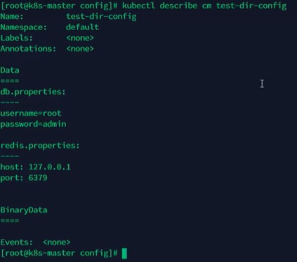
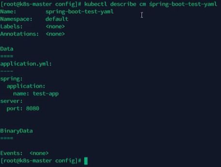
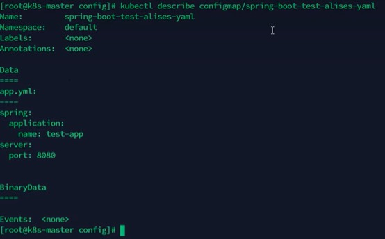
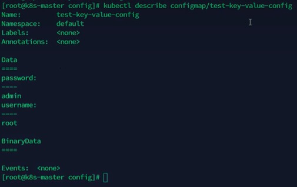
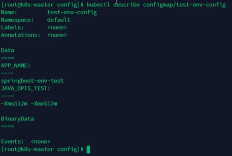
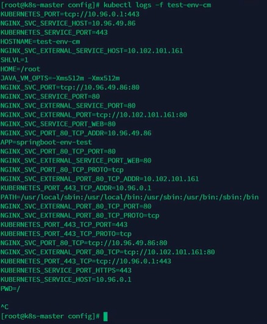
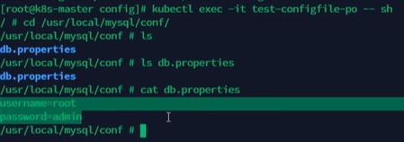
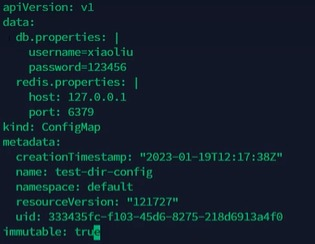

[目录](../目录.md)


# 关于ConfigMap
用于存储键值（key-value）格式的非敏感配置数据\
可以通过挂载文件夹，单个文件，环境变量注入的方式将内容注入到Pod中，供容器读取使用\
ConfigMap实现了应用与配置解耦，支持多Pod、多容器共享同一配置，集中管理、便于修改，大幅提升配置维护效率

**注：**
- ConfigMap存储明文数据，不提供任何加密能力, 因此敏感信息必须使用Secret


# ConfigMap创建
ConfigMap创建方式主要包括：
- 基于文件夹
- 基于文件(推荐)
- 直接指定key-value


## 基于文件夹
```shell
kubectl create configmap <configmap_name> --from-file=<path_to_folder>
```

**示例:**

创建db.properties文件，内容如下：
```shell
username=root
password=admin
```

创建redis.properties文件，内容如下：
```shell
host: 127.0.0.1
port: 6379
```

将db.properties和redis.properties两个文件保存至/test文件夹下\
进入到/test文件夹同级目录，创建configmap，执行命令：
```shell
kubectl create configmap test-dir-config --from-file=test/
```

获取configmap列表，执行命令：
```shell
kubectl get cm  # 可以查看刚才看到的configmap
```


查看configmap具体信息，执行命令：
```shell
kubectl describe cm test-dir-config
```



## 基于文件
```shell
kubectl create configmap <configmap_name> --from-file=<path_to_file>
```

- **示例1：** 通过文件创建ConfigMap

  创建application.yaml文件内容如下，并保存至/test目录下
  ```yaml
  spring:
    application:
      name: test-app
  server: 
    port: 8080
  ```

  创建configmap，执行命令：
  ```shell
  kubectl create configmap spring-boot-test-yaml --from-file=/test/application.yaml
  ```

  获取configmap列表，执行命令：
  ```shell
  kubectl get cm  # 可以查看刚才看到的configmap
  ```
  

  查看configmap具体信息，执行命令：
  ```shell
  kubectl describe cm spring-boot-test-yaml
  ```
  

  再次通过以下方式创建configmap，执行命令：
  ```shell
  kubectl create configmap spring-boot-test-alises-yaml --from-file=app.yml=/test/application.yaml
  ```

  查看configmap详细信息，执行命令：
  ```shell
  kubectl describe cm spring-boot-test-alises-yaml

  kubectl describe configmap/spring-boot-test-alises-yaml  #另一种表达方式
  ```
  \
  注：文件名变成了app.yml, 而不是application.yaml


- **示例2：** ConfigMap整体替换更新\
  当ConfigMap是基于文件创建且文件更新时，可以执行以下命令实现ConfigMap更新\
  通过dry run参数获得基于最新文件创建的ConfigMap的yaml定义，然后将yaml定义传给replace命令，达到更新configmap的目的\
  使用该方式，是因为--from-file参数只支持create，而不支持replace操作
  ```shell
  kubectl create cm test-dir-conig --from-file=db.properties --dry-run -o yaml | kubectl replace -f-
  ```


## 直接指定key-value
一般不建议使用该方式，但如果参数少是可以
```shell
kubectl create configmap <configmap_name> --from-literal=k1=v1 --from-literal=k2=v2...
```

创建configmap，执行命令：
```shell
kubectl create configmap test-key-value-config  --from-literal=username=root --from-literal=password=admin
```

查看configmap详细信息，执行命令：
```shell
kubectl describe configmap test-key-value-config
```
\
注：通过键值对直接创建cm是没有文件名的


# ConfigMap使用
ConfigMap使用方式主要包括：
- 环境变量注入
- Volume整目录挂载
- 单文件挂载(使用subPath)


## 环境变量注入
环境变量注入就是将ConfigMap中的键值对直接转为容器内的环境变量

**示例:**

创建configmap，执行命令：
```shell
kubectl create configmap test-env-config --from-literal=JAVA_OPTS_TEST='-Xms512m -Xmx512m' --from-literal=APP_NAME=springboot-env-test
```

查看configmap详细信息，执行命令：
```shell
kubectl describe configmap test-env-config
```



定义Pod
```yaml
apiVersion: v1
kind: Pod
metadata:
  name: test-env-pod
spec:
  containers:
  - name: env-test
    image: alpine  # 轻量级的linux系统
    command: ["/bin/sh","-c","env; sleep 3600"] # 为避免执行命令后直接退出容器，设置睡眠3600秒
    imagePullPolicy: IfNotPresent
    env:
    - name: JAVA_VM_OPTS
      valueFrom: 
        configMapKeyRef:
          name: test-env-config # configmap的名字
          key: JAVA_OPTS_TEST # 从configmap中获取名字为key的value，将其赋值给容器本地的环境变量JAVA_VM_OPTS     
    - name: APP
      valueFrom:
        configMapKeyRef:
          name: test-env-config
          key: APP_NAME
  restartPolicy: Never
```

查看Pod容器中的日志，可以发现环境变量已被设置，执行命令：
```shell
kubectl logs -f test-env-pod  # -f不是file，是follow的意思
```



## Volume整目录挂载
Volume整目录挂载就是将整个ConfigMap挂载为容器内的一个目录\
目录下一个key一个文件，文件内容为key的value值

**示例:**\
将db.properties文件挂载到容器内/usr/local/mysql/conf目录下

定义Pod
```yaml
apiVersion: v1
kind: Pod
metadata:
  name: test-configfile-pod
spec:
  containers:
  - name: config-test
    image: alpine  # 轻量级的linux系统
    command: ["/bin/sh","-c","env; sleep 3600"]
    imagePullPolicy: IfNotPresent
    env:
    - name: JAVA_VM_OPTS
      valueFrom: 
        configMapKeyRef:
          name: test-env-config # configmap的名字
          key: JAVA_OPTS_TEST # 从configmap中获取名字为key的value，将其赋值给容器本地的环境变量JAVA_VM_OPTS     
    - name: APP
      valueFrom:
        configMapKeyRef:
          name: test-env-config
          key: APP_NAME
    volumeMounts:  # 加载数据卷
    - name: db-config  # 要加载数据卷的名字
      mountPath: "/usr/local/mysql/conf"  # 想要将数据卷中的文件加载到哪个目录下
      readOnly: true  # 是否只读
  volumes:  #数据卷挂载， configMap，sercret
    - name: db-config  # 数据卷的名字，名字可以自定义
      configMap: #数据卷类型为configMap
        name: test-dir-config  # configMap的名字，跟想要加载的configmap name相同
        items:  # 对configmap中的key进行映射，如果不指定，默认会将configmap中所有的key全部转换为同名的文件
        - key: "db.properties"  # configmap中的key
          path: "db.properties"  # 将该key中的值转换为文件
  restartPolicy: Never
```
**注：**\
如果path: "db.properties" 改成path: "/test1/test2/db_test.properties",那么该文件在容器内的生成路径为/usr/local/mysql/conf/test1/test2/db_test.properties

进入容器，可以看到指定路径下有db.properties，执行命令：
```shell
kubectl exec -it test-configfile-pod -- sh

ls /usr/local/mysql/conf  # 可以发现db.properties文件存在
cat /usr/local/mysql/conf/db.properties  # 内容跟创建configmap时一致
```



## 单文件挂载(使用subPath)
单文件挂载就是只挂载ConfigMap中的某一个key作为单个文件

**注:**\
不支持将将整个configmap的内容挂载到一个单个文件,只能一个key一个文件

**示例**\
定义Pod
```yaml
apiVersion: v1
kind: Pod
metadata:
  name: test-subpath-pod
spec:
  containers:
  - name: config-test
    image: alpine
    command: ["/bin/sh","-c","env; sleep 3600"]
    imagePullPolicy: IfNotPresent
    env:
    - name: JAVA_VM_OPTS
      valueFrom: 
        configMapKeyRef:
          name: test-env-config
          key: JAVA_OPTS_TEST     
    - name: APP
      valueFrom:
          configMapKeyRef:
          name: test-env-config
          key: APP_NAME
    volumeMounts:
    - name: db-config
      mountPath: "/usr/local/mysql/conf/db.properties"  # 指向【具体文件】
      subPath: "db.properties"                           # 关键：加了 subPath！
      readOnly: true
  volumes:
    - name: db-config
      configMap:
        name: test-dir-config  # 还是用同一个 configmap
  restartPolicy: Never
```

进入容器，可以看到指定路径下有db.properties，内容仅包含configmap里db.properties key相关的内容，执行命令：
```shell
kubectl exec -it test-configfile-pod -- sh

ls /usr/local/mysql/conf  # 可以发现db.properties文件存在
cat /usr/local/mysql/conf/db.properties  # 内容跟创建configmap时一致，仅包含db.properties key相关的内容
```

# ConfigMap不可变
对于一些敏感服务的配置文件，在线上有时是不允许修改的\
此时在配置configmap时可以设置immutable：true来禁止修改\
