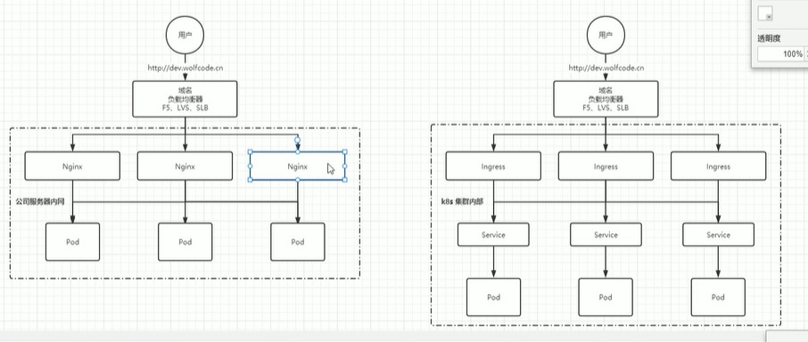

[目录](../目录.md)


# 关于Ingress
Ingress主要用于处理K8s外部网络请求，实现K8s内部服务暴露外网访问

ingress就是niginx的抽象以及实现\



# 安装Ingress
https://kubernetes.github.io/ingress-nginx/deploy/#using-helm

- 添加heml仓库
  ```shell
  helm repo add ingress-nginx https://kubernetes.github.io/ingress-nginx  # 添加仓库

  helm repo list   # 查看仓库列表
  helm search repo ingress-nginx  # 搜索ingress-nginx
  ```

- 下载包
  ```shell
  helm pull ingress-nginx/ingress-nginx
  ```

- 配置参数\
  将下载好的安装包解压
  ```shell
  tar xf ingress-nginx-XXXX.tgz
  ```

  解压后，进入解压完成的目录
  ```shell
  cd ingress-nginx
  ```

  修改values.yaml\
  镜像地址：修改为国内镜像\
  .controller.image.registry设置为registry.cn-hangzhou.aliyuncs.com\
  .controller.image.image设置为google_containers/nginx-ingress-controller\
  .controller.image.digest，.controller.image.digestChroot注释掉，即不需要校验哈希值\
  还有一些修改，没有记录


  hostNetwork: true\
  dnsPolicy: ClusterFirstWithHostNet\
  修改部署配置的kind: DaemonSet\
  nodeSelector:\
    ingress: "true" # 增加选择器，如果node上有ingress=true就部署\
  将service中的type由LoadBalancer修改为ClusterIP, 如果服务器是云平台才用LoadBalancer\
  将docker.io/jettech-webhook-certgen修改为国内镜像\
  3.4.6_服务发现-Ingress：安装ingress-nginx_哔哩哔哩_bilibili


- 创建namespace
  ```shell
  kubectl create ns ingress-nginx  # 为ingress专门创建一个namespace
  ```

- 安装ingress
  ```shell
  kubectl label node k8s-node2 ingress=true  #为需要部署ingress的节点上加标签

  helm install ingress-nginx -n ingress-nginx  # 安装ingress-nginx
  ```


# 示例

- 示例1:
  K8s集群下有三个Node，配置如下：
  - **Node1**\
    部署了Product Pod提供product-svc服务
  - **Node2**\
    部署了Order Pod提供order-svc服务
  - **Node3**\
    作为网关节点接受外部请求，部署了Ingress Controller\
    外部用户访问Node3的Ingress，Ingress将请求转发到集群内部的Pod中

  **注：**\
  Node1和Node2用来提供应用服务，Node3作为网关节点接受外部请求，并根据请求内容将流量转发至Node1和Node2\
  \
  


- 示例2:\
  通过以下配置创建Ingress，文件名wolfcode-ingress.yaml
  ```yaml
  apiVersionL networking.k8s.io/v1  # 网络相关的API
  kind: Ingress  # 资源类型是Ingress
  metadata:
    name: wolfcode-ingress-nginx
    annotations:
      kubernetes.io/ingress.class: "nginx"
  spec:
    rules:  # ingress规则配置，可以配置多个
    - host: k8s.wolfcode.cn  # 域名配置，可以使用通配符
      http:
        paths:  # 相当于nginx的location配置，可以配置多个
        - pathType: Prefix # 路径类型，按照路径类型进行匹配， ImplementationSpecific需要指定IngressClass，具体匹配规则以IngressClass中的规则为主。Exact：精确匹配URL需要与path完全匹配上，且区分大小写。Prefix：表示前缀匹配，以/为分隔符来进行前缀匹配 
          backend:
            service:
              name: nginx-svc # 代理到哪个service
              port: 
                number: 80  # service的端口
          path: /api  # 等价于nginx中的location的路径前缀匹配
  ```

  ```shell
  kubectl create -f wolfcode-ingress.yaml
  ```