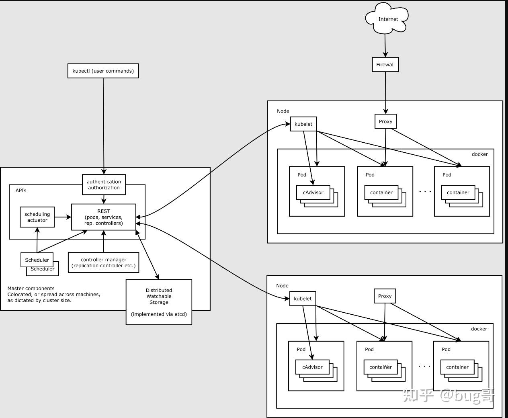
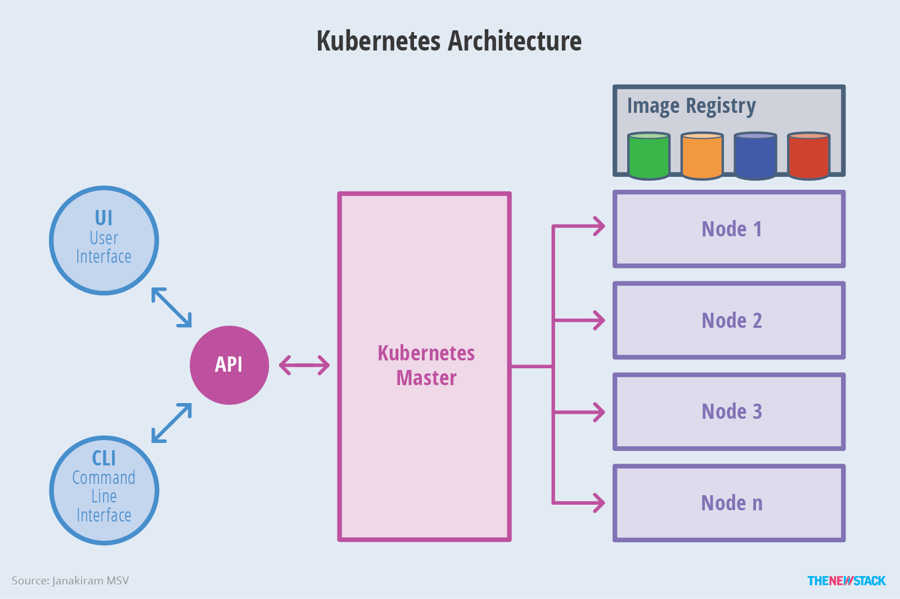
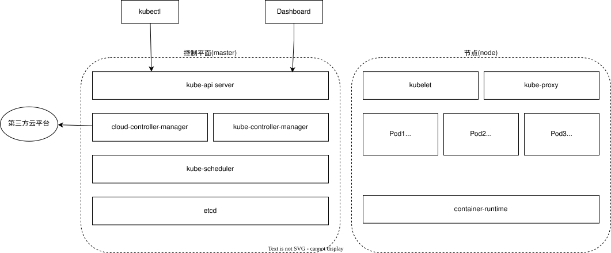
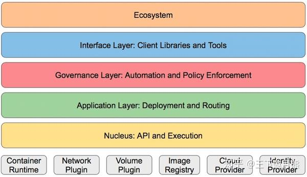

[目录](../目录.md)

# K8s集群架构
K8s是客户端 + 服务端 (C/S) 架构，其中服务端是主从结构, 即：控制平面 + 工作节点\
一般情况下，Pod只运行于工作节点，但也可以运行于控制平面节点，因此控制平面和工作节点可以是同一台机器（集群可以只有一个机器）

注：单节点集群就是一台机器同时承担控制平面和工作节点双重角色，多用于测试、学习环境

官方约定集群配置是：至少1个控制平面 + 至少1个工作节点

# K8s服务端架构
K8s服务端架构由以下组件组成：
- 控制平面(Control plane)
- 工作节点(Node)
- 附加组件

**注：**\
控制平面、工作节点为集群必备组件，附加组件用于拓展集群能力，根据实际需求选择安装

## 控制平面
控制平面是一种特殊的节点，它担当了K8s的master节点，架构图如下：\
\

核心组件：
- **kube-api server**\
  提供接口服务，基于REST风格开放K8s接口\
  所有控制平面和节点之间的通信都通过kube-api server实现的\
  例如，客户端(kubectl, Dashboard)请求，控制面板和节点间的通信，节点和节点间的通信

  kube-api server 包含了集群各类操作对应的接口 (比如各类节点任务处理)\
  对K8s发起的任何操作请求，都会先进入kube-api server，再调用对应接口执行操作\
  比如，kubectl命令行发出的指令，先是向API Server发送REST请求，再通过kube-api server接口完成操作

  因此，控制平面是集群最关键的组件，kube-api server又是控制平面最核心的组件

- **kube-controller-manager(控制器管理器)**\
  管理各种类型的控制器, 负责运行控制器进程

  **关于控制器**\
  控制器是K8s集群的组件，包含多种类型，负责持续将集群实际状态调整为期望状态\
  控制器对K8s各类资源进行管理，资源涵盖Pod、节点、任务、调度等不同层面\
  从逻辑上讲，每个控制器都是独立进程，为简化部署与维护，它们被编译为同一个可执行文件，统一在一个进程中运行

  控制器主要包括：
  - **节点控制器(node controller)**\
    负责节点出现故障时，做出监测、通知与响应处理
  - **任务控制器(job controller)**\
    监测一次性任务Job对象，创建Pod运行任务直至执行完成
  - **端点分片控制器(endpointslice controller)**\
    维护并填充EndpointSlice对象，建立Service与Pod之间的关联\
    具体作用：\
    1) 监听：Service、Pod、Node变化
    2) 自动生成/更新：EndpointSlice（端点分片）
    3) 作用：记录每个Service背后到底有哪些Pod（IP + 端口）,让kube-proxy知道把流量转发到哪些Pod
  - **服务账号控制器(servce account controller)**\
    为新建命名空间自动创建默认服务账号

- **cloud-controller-manager(云控制器管理器)**\
  用于对接第三方云平台的接口，实现相关资源管理功能\
  它独立于kube-controller-manager，专门管理云厂商相关资源（云服务器、负载均衡、弹性网卡等），在自建物理机集群中一般无需部署

- **kube-scheduler(调度器)**\
  按照既定算法，将Pod调度到合适的节点上, 比如：\
  存储要求高的Pod应用 → 分配给存储型节点\
  内存要求高的Pod应用 → 分配给内存型节点

- **etcd**\
  可理解为K8s内置的键值型分布式数据库，依托Raft算法实现集群高可用\
  etcd是K8s唯一的集群状态存储，所有资源数据、配置、状态都存在这里
  - 老版本: 内存为主，持久化支持但弱依赖（靠WAL + 快照落盘，可弱化）\
  - 新版本: 强制磁盘持久化，数据必须落盘，不支持纯内存运行

  注：WAL，Write Ahead Log（预写日志）在真正把数据写到存储之前，先把 “要做什么操作” 记到日志里，万一崩溃、断电，就靠这个日志恢复数据，保证数据不丢

注：控制平面是K8s集群的核心组件，生产环境基本都会将其部署在多个节点上，实现高可用

## 节点
K8s的节点架构图如下：\

核心组件：
- **kubelet**\
  kubelet是在每个节点上运行的代理，主要负责：
  - **Pod生命周期管理**\
    将集群定义的Pod转化为本地容器进程，维护其生命周期，并向控制平面上报状态
  - **存储管理**\
    处理节点本地存储相关操作，包括卷的挂载、卸载，以及容器内卷挂载等
  - **网络协调**\
    调用CNI插件，完成Pod网络命名空间、网卡、IP等网络初始化配置

  注：kubelet不直接实现路由、转发、Service负载均衡等网络转发功能

- **kube-proxy(网络代理)**\
  kube-proxy运行在所有节点上，负责实现Service的服务发现与四层负载均衡\
  它基于TCP/UDP做四层转发，不处理七层应用协议\
  它会监听Service与端点变化，动态更新节点网络规则，实现集群内部流量转发

- **container runtime(容器运行时环境)**\
  主流运行时包含：
  - Docker
  - Containerd
  - CRI-O
  
  **注：**\
  1) Docker并非K8s唯一支持的容器运行时
  2) 需提前在节点服务器安装对应运行时\
     例如选用Docker时，要先在节点装好Docker，再部署K8s集群
  3) 所有容器运行时都需遵循K8s的CRI标准，才能和kubelet正常交互
  4) CRI是容器运行时接口（Container Runtime Interface），是K8s定义的标准接口，并非运行时
     CRI-O才是兼容CRI的一款容器运行时

- **Pod**\
  用于容纳并运行容器，可将其视作一组关联容器的集合
  正常运行时：一个节点可包含多个Pod，一个Pod内至少有一个容器
  非正常运行时：异常/过渡状态（初始化、终止过程中），Pod也可以不存在业务容器

## 附加组件
- **kube-dns**\
  为整个集群提供DNS域名解析服务\
  集群内可直接通过服务名访问对应Service，无需使用IP地址

- **Ingress Controller**\
  为集群内Service提供统一的外网访问入口，实现七层流量转发

- **Prometheus**\
  负责集群资源、组件及业务应用的监控与指标采集

- **Dashboard**\
  K8s可视化图形界面（GUI），用于集群资源的查看与管理

- **Federation**\
  实现多集群管理，支持跨可用区、跨集群统一调度与访问

- **Fluentd-elasticsearch**\
  组合组件，完成集群日志的采集、存储与检索

# k8s分层架构

- **生态系统**\
  基于K8s搭建的各类工具与应用，附加组件属于该范畴

- **接口层**\
  生态内所有应用均调用K8s接口，接口整体构成接口层

- **管理层**\
  系统监控：统计基础配置、容器、网络等各项指标
  自动化：支持应用自动扩缩容、动态资源分配等能力
  策略管理：包含 RBAC 权限、资源配额、Pod 安全策略、网络策略等

- **应用层**\
  应用部署：支持无状态应用、有状态应用、批处理任务等
  流量路由：实现服务发现、DNS域名解析
  
- **核心层**\
  K8s底层核心能力，对外提供API支撑上层功能，对内提供插件化运行环境
