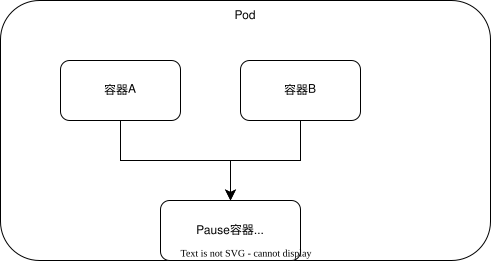

[目录](../目录.md)

# Pod
当多个容器存在强依赖、紧耦合关系时，可部署在同一个Pod中，它们会共享Pod内的网络栈与存储卷\
Pod是K8s中最小的可部署、调度单元，本质是一组容器的集合

一个Pod包含：
- 应用容器（单个或多个）
- 存储资源
- 独立唯一的Pod IP
- 容器运行配置
  
Pod代表集群中一个独立的应用运行实例\
K8s不会直接管理容器，所有容器都被封装在Pod中统一调度与管理\
Pod本身属于命名空间级资源

- **Pod和容器**\
  Pod和容器常见组合方式：
  - **one-container-per-pod**\
    一个Pod内仅运行一个容器，生产环境最常用, Pod可看作该容器的运行载体
  - **multi-containers-per-pod**\
    一个Pod内运行多个容器，适用于容器间紧密耦合、需要共享资源、必须协同运行的场景\
    同一Pod内所有容器共享同一个IP地址、端口空间，容器间可通过localhost直接通信

  **注：**\
  常规场景下一个Pod建议只运行主应用容器，多容器仅用于日志收集、监控等辅助侧容器场景

- **Pause容器**\
  K8s会为每个Pod自动创建一个Pause容器（也叫沙箱容器）\
  它是Pod内所有业务容器的基础，负责统一创建并共享网络栈、存储卷、PID命名空间等核心资源\
  因此同一Pod内的不同容器，可直接通过localhost互相访问
  \
  

  **注:**\
  - Pause容器功能极简，几乎不占用资源，生命周期贯穿整个Pod，Pod启停本质就是Pause容器启停
  - 所有业务容器都会加入Pause容器的命名空间，实现资源互通
  - 外部访问Pod，实际访问的也是Pause容器暴露的网络端点

- **Pod容器类型**\
  Docker曾是K8s Pod中主流的容器运行时\
  目前K8s遵循CRI标准，同时兼容多种容器引擎

# Pod Template
它是Pod的配置定义，并非独立资源，内嵌在各类控制器对象中，控制器用它来创建Pod
常见使用对象：Deployment、StatefulSet、DaemonSet、ReplicaSet、Job、CronJob
控制器依据该模板统一创建Pod

# Pod副本
副本指基于同一模板复制生成的多个Pod实例
副本仅Pod名称、UID等标识类信息不同，容器配置、运行应用等核心内容完全一致，对外提供相同服务

K8s控制器通过Pod模板和replicas（副本数）定义期望实例数量，并按模板创建对应个数的Pod
当集群内实际Pod数量与期望副本数不匹配时，控制器会自动调度，始终维持副本数量符合设定值

常见管理副本的控制器：
- Deployment
- ReplicaSet
- StatefulSet

**注:**\
- 同组副本Pod一般会调度到不同节点，实现负载均衡与故障容错
- Pod副本属于命名空间级资源