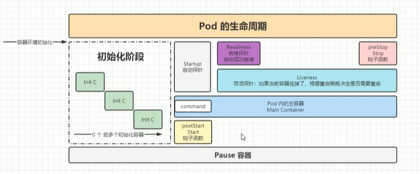

[目录](../目录.md)


# 关于Pod生命周期
\

生命周期按照以下步骤执行：

1) 容器环境初始化\
   比如下载容器镜像，设置环境变量等， 容器环境初始化后才可以开始Pod的生命周期

2) 执行初始化容器，如果有多个初始化容器，它们会依次执行\
   **注:**\
   初始化容器是在主容器启动之前运行的一类特殊容器，它们是Pod里自定义的\
   开始执行初始化容器的同时，也会同时创建Pause容器

3) 执行Start钩子函数(postStart)\
   比如启动主容器之前要做的一些操作，可以在这个函数里实现

4) 启动Pod内的主容器\
   容器启动期间，依次执行以下：
   1) 启动startupProbe
   2) 同时启动livenessProbe和readinessProbe
   
   注：主容器就是承担主要业务逻辑或核心功能的容器

5) 正常删除Pod，或者滚动更新替换容器时，执行PreStop钩子函数\
   比如应用关闭后保存一些重要信息，或者销毁缓存\
   注：如果Pod突然挂掉，该函数不会被执行

**注：**
1) 一般来说，preStop函数使用的多，而postStart比较少
2) Pod内的主容器在启动时，是可以执行一些命令的，而此时postStart函数可能也正在运行\
   因为两者都是在容器启动后执行, 两边的程序可能会造成冲突\
   因此推荐将postStart函数的逻辑放在初始化容器来实现\
   例如：
   ```yaml
    apiVersion: v1  
    kind: Pod  
    metadata:
    name: nginx-demo 
    labels:
        type: app
        version: 1.0.0
    namespace: 'default' 
    spec:  
    containers:  
    - name: nginx  
        image: nginx-1.7.9 
        imagePullPolicy: IfNotPresent  
        startupProbe: 
    ......
        lifecycle:  # 定义生命周期
        postStart: #容器创建完成后执行的动作，不能保证该操作一定在容器的command之前操作，一般不使用
            exec: #可以是exec， httpGet, tcpSocket
            command:
                - sh
                - -c 
                - 'mkdir /data'
        preStop: #在容器停止前执行的动作
            httpGet:  #发送一个http请求
            path: /
            port: 80  
    ......
   ```


# Pod退出流程
Pod退出后会依次做以下删除操作：

1) Endpoint删除Pod的ip地址
2) Pod变成Terminating状态\
   变为删除中的状态后，会给pod一个宽限期(terminationGracePeriodSeconds)，让Pod去执行一些清理或销毁操作
   配置如下
    ```yaml
    apiVersion: v1  
    kind: Pod  
    metadata:
    name: nginx-demo 
    labels:
        type: app
        version: 1.0.0
    namespace: 'default' 
    spec:  
    terminationGracePeriodSeconds: 30   #作用于pod中的所有容器
    containers:  
    - name: nginx  
        image: nginx-1.7.9 
        imagePullPolicy: IfNotPresent  
    ......
    ```
3) 执行preStop的指令


# PreStop的应用
PreStop有以下常用场景：
- 注册中心下线
- 数据清理
- 数据销毁


**示例**\
按照如下方式配置lifecycle中的postStart函数和preStop函数
```yaml
apiVersion: v1  #api文档版本 
kind: Pod  #资源对象类型，可以是Pod，Deployment，Statefulset一类的对象
metadata:
  name: nginx-demo  #Pod的名字
  labels:  #定义Pod的标签, 标签的key-value是自定义的
    type: app
    version: 1.0.0
  namespace: 'default'  #配置命名空间
spec:  #期望Pod按照这里的描述进行构建
  terminationGracePeriodSeconds: 60  #Pod被删除时，给Pod多长时间处理，即使比如prestop的command执行时间是50s，terminating状态也是30s
  containers:  #对于pod中的容器的描述
  - name: nginx  #容器的名称
    image: nginx-1.7.9 #执行容器的镜像，镜像必须存在于docker-hub或其他仓库
    imagePullPolicy: IfNotPresent  #镜像拉取策略，如果本地有就用本地的镜像，没有就拉取远程的镜像
    lifecycle:  #生命周期的配置
      postStart:  #生命周期启动阶段做的事情，不一定在command之前运行
        exec:
          command:
          - sh
          - -c
          - "echo '<h1>post start</h1>' > /usr/share/nginx/html/prestop.html"
       preStop:
         exec:
           command:
           - sh
           - -c
           - "sleep 50; echo 'sleep 50s finished.. pre stop' >> /usr/share/nginx/html/prestop.html"
    command:  #指定容器启动时执行的命令
    - nginx
    - -g
    - 'daemon off;'  #最终执行命令：nginx -g 'daemon off;'
    workingDir: /usr/share/nginx/html  #定义容器启动后的工作目录
    ports:
    - name: http  #端口名称，自定义
      containerPort: 80 #容器内要暴露的端口 
      protocol: TCP  #描述该端口基于哪种协议
    env:  #定义环境变量
    - name: JVM_OPTS
      value: '-Xms128m -Xmx128m'
    resources:
      requests:  #最少需要多少资源
        cpu: 100m  #限制CPU最少使用0.1个核心
        memory: 128Mi  #限制内存最少使用128M
      limits:  #最少需要多少资源
        cpu: 200m  #限制CPU最多使用0.2个核心
        memory: 256Mi  #限制内存最多使用256M 
  restartPolicy: OnFailure  #只有失败的情况才会重启
```


创建Pod后，宿主机执行以下命令会正常显示 \<h1\>post start\</h1\>
```shell
curl <pod ip>/prestop.html  # 返回<h1>post start</h1>
```
删除Pod后，Pod处于Terminating状态的时间为60s，宿主机执行以下命令会正常显示以下结果

```shell
<h1>post start</h1>
sleep 50s finished.. pre stop
```
注：如果terminationGracePeriodSeconds设置为30s，则 "sleep 50s finished.. pre stop"不会被显示，因为preStop命令需要至少50s的时间
