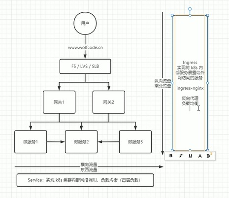

[目录](../目录.md)

# 关于Service
Service是K8s集群中用于实现网络通信与服务发现的核心资源\
主要用于集群内部通信，也可通过特定类型对外暴露服务\
Service的核心价值是提供稳定的访问入口，屏蔽后端Pod的动态变化，同时内置负载均衡能力，是K8s微服务通信的基础

- **核心定位**\
  由于Pod具有动态性（IP会随重建/调度变化），集群内无法直接通过固定方式访问Pod\
  因此通过Service提供一个稳定的访问入口，接收通信请求并转发到后端Pod\
  可以理解为：Service是一组Pod的抽象，定义了这组Pod的逻辑集合，以及访问这组Pod的负载均衡策略

- **集群内部通信**\
  无论是同一节点还是不同节点上的Pod，都可以通过Service的集群内IP（ClusterIP）和端口进行通信
  Service会自动将请求转发到后端健康的Pod，无需关心Pod的实际位置和IP

- **对外暴露请求**\
  部分Service类型支持处理外部请求，例如：
  - NodePort：在每个节点上暴露一个端口，外部可通过「节点IP+NodePort」访问服务
  - LoadBalancer：由云厂商提供外部负载均衡，将流量转发到集群内的Service
  这类场景下，Service会作为外部请求的入口，通过负载均衡转发到后端Pod

**注:**\
Service的核心场景仍是集群内部通信，对外暴露通常是附加能力，且更复杂的流量管理（如路由规则、域名解析）一般由Ingress来实现

# 东西流量和南北流量

- **东西流量**\
  横向流量, 通过service实现集群内部各个节点的访问
- **南北流量**\
  纵向流量，通过Ingress实现k8s内部服务暴漏外网访问

