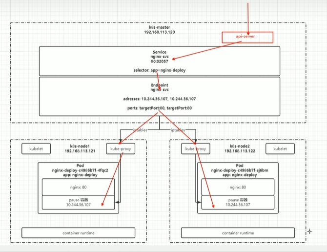

[目录](../目录.md)


# 关于Service
Service是K8s集群中用于实现网络通信与服务发现的核心资源\
主要用于集群内部通信，也可通过特定类型对外暴露服务\
Service的核心价值是提供稳定的访问入口，屏蔽后端Pod的动态变化，同时内置负载均衡能力，是K8s微服务通信的基础

- **核心定位**\
  由于Pod具有动态性（IP会随重建/调度变化），集群内无法直接通过固定方式访问Pod\
  因此通过Service提供一个稳定的访问入口，接收通信请求并转发到后端Pod\
  可以理解为：Service是一组Pod的抽象，定义了这组Pod的逻辑集合，以及访问这组Pod的负载均衡策略

- **集群内部通信**\
  无论是同一节点还是不同节点上的Pod，都可以通过Service的集群内IP（ClusterIP）和端口进行通信
  Service会自动将请求转发到后端健康的Pod，无需关心Pod的实际位置和IP

- **对外暴露请求**\
  部分Service类型支持处理外部请求，例如：
  - NodePort：在每个节点上暴露一个端口，外部可通过「节点IP+NodePort」访问服务
  - LoadBalancer：由云厂商提供外部负载均衡，将流量转发到集群内的Service
  这类场景下，Service会作为外部请求的入口，通过负载均衡转发到后端Pod

**注:**\
Service的核心场景仍是集群内部通信，对外暴露通常是附加能力，且更复杂的流量管理（如路由规则、域名解析）一般由Ingress来实现


# 东西流量和南北流量

- **东西流量**\
  横向流量, 通过service实现集群内部各个节点的访问
- **南北流量**\
  纵向流量，通过Ingress实现k8s内部服务暴漏外网访问


# 常用命令
```shell
kubectl get svc
kubectl get endpoints

endpoint返回的IP端口是pod所在node的ip和端口
```




# 创建Service
Service的创建方式有以下几种
- **定义配置文件**\
  执行命令：
  ```yaml
  kubectl create -f XXX.yaml
  ```

- **kubectl命令**\
  执行命令：
  ```yaml
  # 直接创建
  kubectl create service clusterip my-svc --tcp=80:8080

  # 从现有对象（deployment/pod/statefulset）生成Service
  kubectl expose deployment my-app --port=80 --target-port=8080 --type=ClusterIP --name=my-app-svc
  ```


# Service命令操作
创建service配置文件如下，文件名nginx-svc.yaml
```yaml
apiVersion: v1  
kind: Service  # 资源类型为Service
metadata:
  name: nginx-svc  # Service名字
  labels:
    app: nginx  # Service自己本身的标签
spec:
  selector:  # 匹配哪些pod会被该service代理
    app: nginx-deploy  # 所有匹配到该标签的pod会都可以被该service进行访问
  ports:  # 端口映射
  - port: 80  # service自己的端口，在使用内网IP时使用
    targetPort: 80  #目标Pod的端口，
    name: web  # 为端口起个名字
  type: NodePort  # 随机启动一个端口映射，映射到ports中的端口，该端口是直接绑定在node上的，且集群中每一个Node都会绑定这个端口，如果采用映射固定端口的方式，可能会产生端口冲突，随机的方式会避免这个问题，也可以将服务暴漏给外部访问，但是这种方式实际生产不推荐，因为效率较低，而且service是四层负载
```

查看service信息，通过service的cluster ip进行访问，执行命令：
```shell
kubectl get svc
```

查看Pod信息，通过Pod的ip进行访问，执行命令：
```shell
kubectl get po -o wide
```

创建其他pod通过service name进行访问(推荐)，执行命令
```shell
kubectl exec -it busybox -- sh  # 进入容器busybox
curl http://nginx-svc   # 容器内执行该命令
```

默认在当前namespace中访问，如果需要跨namespace访问pod，则在service name后面加上“.<namespace>”即可
```shell
curl http://nginx-svc.default
```


# 代理K8s外部服务
案例
- 各环境访问名称统一	
- 访问k8s集群外的其他服务	
- 项目迁移	

实现方式
1) 编写service配置文件时，不指定selector属性，当不指定selector时，k8s是不会自动创建endpoint的\
2) 自己创建endpoint


service配置, 执行kubectl create创建
```shell
apiVersion: v1  
kind: Service  # 资源类型为Service
metadata:
  name: nginx-svc-external  # Service名字
  labels:
    app: nginx  # Service自己本身的标签
spec:
  ports:  # 端口映射
  - port: 80  # service自己的端口，在使用内网IP时使用
    targetPort: 80  #目标Pod的端口，
    name: web  # 为端口起个名字
  type: ClusterIP
```

endpoint配置，执行kubectl create创建
```shell
apiVersion: v1
kind: Endpoints
metadata:
  labels:
    app: nginx # 与service一致
  name: nginx-svc-external # 与service一致
  namespace: default # 与service一致
subsets:
- address:
  - ip: <target ip> # 目标ip地址
  ports: # 与service一致
  - name: web
    port: 80
    protocal: TCP
```


# 反向代理外部域名
除了可以通过配置IP的方式，也可以配置为域名的方式
```shell
apiVersion: v1
kind: Service
metadata:
  labels:
    app: wolfcode-external-domain
  name: wolfcode-external-domain
spec:
  type: ExternalName
  externalName: www.wolfcode.cn
```


# 常用类型
- **ClusterIP**\
  只能在集群内部使用，不配置类型的话默认就是ClusterIP

- **ExternalName**\
  返回定义的CNAME别名，可以配置为域名

- **NodePort**\
  会在所有安装了kube-proxy的节点都绑定一个端口，此端口可以代理至对应的Pod\
  集群外部可以使用任意节点ip + nodePort的端口号访问到集群中对应Pod中的服务

  当类型设置为NodePort后，可以在ports配置中增加nodePort配置指定端口\
  需要在下方的端口范围内，如果不指定会随机指定端口\
  端口范围：30000~32767\
  端口范围配置在/usr/lib/systemd/system/kube-apiserver.service文件中

- **LoadBalancer**\
  使用云服务商(阿里云，腾讯云)提供的负载均衡器服务