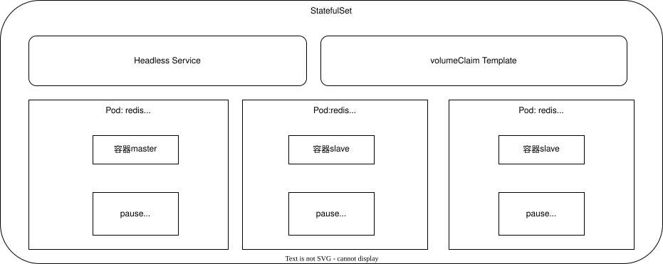

[目录](../目录.md)


# 关于StatefulSet
使用StatefulSet部署多个Pod时，Pod具备固定名称、有序创建、有序销毁的特性，实例之间有明确顺序\
Pod会按0、1、2…… 序号依次生成，默认先启动的实例常作为主节点（Master），后续实例作为从节点（Slave）\
典型架构中主节点负责读写，从节点提供只读能力，所有Pod启停、调度均严格遵循顺序\
StatefulSet要求版本: >= K8s v1.5


# StatefulSet主要特点
- **稳定的持久化存储**\
  通过volumeClaimTemplates为每个Pod自动创建独立PVC\
  Pod重建后仍绑定原有存储，数据永久保留

- **稳定的网络标志**\
  依赖Headless Service（无头服务）实现\
  每个Pod拥有固定域名，名称、IP重建后不会改变，便于集群内互相访问

- **有序部署和扩展**\
  Pod命名格式：名称-序号（序号从 0 开始），严格按照 0 → 1 → 2 … 顺序创建\
  只有前一个Pod处于Running或Ready状态，才会创建下一个Pod\
  该特性由StatefulSet控制器自身的核心机制控制
  
- **有序收缩，有序删除**\
  销毁Pod时顺序与创建相反，按最大序号 → 最小序号依次执行
        

# StatefulSet主要组成
- **Headless Service(无头服务)**\
  负责提供稳定网络标识与DNS解析，管理有状态服务的网络访问
  
  固定DNS域名格式:
  ```yaml
  pod序号.statefulSet名称.headless服务名.命名空间.svc.cluster.local
  ```
  
  字段说明:
  - pod序号: Pod编号，从0开始依次递增（0、1、2…）
  - statefulSet名称：当前StatefulSet的名称
  - headless服务名：通过serviceName字段指定的无头服务名称
  - namespace：命名空间，Headless Service与StatefulSet 必须处于同一命名空间
  - svc.cluster.local：集群默认域名后缀，同命名空间内访问可省略


- **VolumeClaim Template(存储卷模板)**\
  持久化存储模板，自动为每一个Pod创建独立PVC，实现数据持久化\
   


# StatefulSet示例
通过StatefulSet发布Pod，Pod副本数：3，Pod应用：MySQL数据库，每个Pod绑定独立PV/PVC

StatefulSet发布步骤：
1) **创建StatefulSet**\
   定义副本数3，配置.volumeClaimTemplates自动为每个Pod创建独立PVC

2) **创建Pod-0**\
   调度、挂载PVC、启动MySQL主节点，初始化数据目录，Pod-0 Ready
   1) StatefulSet控制器创建Pod-0
   2) K8s调度器将Pod-0调度到某个节点, 并挂载独立PVC
   3) Pod-0启动MySQL容器，初始化MySQL数据目录
   4) Pod-0进入Running&Ready状态
   
   **注：**\
   Pod-0是第一个启动的节点，MySQL业务脚本/镜像会把它自动配置为Master
   StatefulSet本身不分配主从角色，只保证顺序启动

3) **创建 Pod-1**\
   调度、挂载PVC、启动MySQL从节点，连接Pod-0进行数据复制，Pod-1 Ready
   1) StatefulSet控制器检测到Pod-0 Ready，开始创建Pod-1
   2) k8s调度器将Pod-1调度到某个节点，并挂载独立PVC
   3) Pod-1启动MySQL容器，初始化MySQL数据目录
   4) Pod-1启动后，通过启动脚本连接Pod-0（主节点）建立主从复制
   5) 数据同步完成后，Pod-1进入Ready状态

4) **创建 Pod-2**\
   调度、挂载PVC、启动MySQL从节点，连接主节点同步数据，Pod-2 Ready
   1) StatefulSet控制器检测到Pod-1 Ready，开始创建Pod-2
   2) K8s调度器将Pod-2调度到某个节点，并挂载独立PVC
   3) Pod-2启动MySQL容器，初始化MySQL数据目录
   4) Pod-2通过启动脚本连接主节点Pod-0进行数据同步
   5) Pod-2同步完成后进入 Ready

5) **集群运行**\
   三个Pod互相通信，数据同步，保证高可用和数据持久化

三个Pod都处于Ready，MySQL主从复制集群正常运行\
每个Pod有稳定的DNS名称，如mysql-0.mysql.default.svc.cluster.local，方便相互访问\
PVC保证数据持久化，Pod重启后数据不丢失

数据同步方式：
- 所有从节点都从主节点同步: 默认，最简单
- 从节点从其他从节点同步: 链式同步/级联同步

数据同步方式业务（MySQL）配置决定的，而不是由K8s或StatefulSet决定的

**注：**
- StatefulSet中Pod的存储，建议通过volumeClaimTemplates自动生成PVC绑定PV，也可使用管理员预先创建好的存储卷
- 为保证数据隔离与安全, 在删除StatefulSet时，一般不会同步删除PVC和PV，使数据得以保留
- StatefulSet依赖Headless Service提供稳定DNS解析，必须先创建Headless Service，再创建StatefulSet