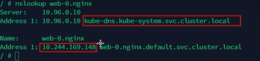

[目录](../目录.md)


# 关于StatefulSet
使用StatefulSet部署多个Pod时，Pod具备固定名称、有序创建、有序销毁的特性，实例之间有明确顺序\
Pod会按0、1、2…… 序号依次生成，默认先启动的实例常作为主节点（Master），后续实例作为从节点（Slave）\
典型架构中主节点负责读写，从节点提供只读能力，所有Pod启停、调度均严格遵循顺序\
StatefulSet要求版本: >= K8s v1.5


# StatefulSet主要特点
- **稳定的持久化存储**\
  通过volumeClaimTemplates为每个Pod自动创建独立PVC\
  Pod重建后仍绑定原有存储，数据永久保留

- **稳定的网络标志**\
  依赖Headless Service（无头服务）实现\
  每个Pod拥有固定域名，名称、IP重建后不会改变，便于集群内互相访问

- **有序部署和扩展**\
  Pod命名格式：名称-序号（序号从 0 开始），严格按照 0 → 1 → 2 … 顺序创建\
  只有前一个Pod处于Running或Ready状态，才会创建下一个Pod\
  该特性由StatefulSet控制器自身的核心机制控制
  
- **有序收缩，有序删除**\
  销毁Pod时顺序与创建相反，按最大序号 → 最小序号依次执行
        

# StatefulSet主要组成
- **Headless Service(无头服务)**\
  负责提供稳定网络标识与DNS解析，管理有状态服务的网络访问
  
  固定DNS域名格式:
  ```yaml
  pod序号.statefulSet名称.headless服务名.命名空间.svc.cluster.local
  ```
  
  字段说明:
  - pod序号: Pod编号，从0开始依次递增（0、1、2…）
  - statefulSet名称：当前StatefulSet的名称
  - headless服务名：通过serviceName字段指定的无头服务名称
  - namespace：命名空间，Headless Service与StatefulSet 必须处于同一命名空间
  - svc.cluster.local：集群默认域名后缀，同命名空间内访问可省略


- **VolumeClaim Template(存储卷模板)**\
  持久化存储模板，自动为每一个Pod创建独立PVC，实现数据持久化\
   


# StatefulSet示例
通过StatefulSet发布Pod，Pod副本数：3，Pod应用：MySQL数据库，每个Pod绑定独立PV/PVC

StatefulSet发布步骤：
1) **创建StatefulSet**\
   定义副本数3，配置.volumeClaimTemplates自动为每个Pod创建独立PVC

2) **创建Pod-0**\
   调度、挂载PVC、启动MySQL主节点，初始化数据目录，Pod-0 Ready
   1) StatefulSet控制器创建Pod-0
   2) K8s调度器将Pod-0调度到某个节点, 并挂载独立PVC
   3) Pod-0启动MySQL容器，初始化MySQL数据目录
   4) Pod-0进入Running&Ready状态
   
   **注：**\
   Pod-0是第一个启动的节点，MySQL业务脚本/镜像会把它自动配置为Master
   StatefulSet本身不分配主从角色，只保证顺序启动

3) **创建 Pod-1**\
   调度、挂载PVC、启动MySQL从节点，连接Pod-0进行数据复制，Pod-1 Ready
   1) StatefulSet控制器检测到Pod-0 Ready，开始创建Pod-1
   2) k8s调度器将Pod-1调度到某个节点，并挂载独立PVC
   3) Pod-1启动MySQL容器，初始化MySQL数据目录
   4) Pod-1启动后，通过启动脚本连接Pod-0（主节点）建立主从复制
   5) 数据同步完成后，Pod-1进入Ready状态

4) **创建 Pod-2**\
   调度、挂载PVC、启动MySQL从节点，连接主节点同步数据，Pod-2 Ready
   1) StatefulSet控制器检测到Pod-1 Ready，开始创建Pod-2
   2) K8s调度器将Pod-2调度到某个节点，并挂载独立PVC
   3) Pod-2启动MySQL容器，初始化MySQL数据目录
   4) Pod-2通过启动脚本连接主节点Pod-0进行数据同步
   5) Pod-2同步完成后进入 Ready

5) **集群运行**\
   三个Pod互相通信，数据同步，保证高可用和数据持久化

三个Pod都处于Ready，MySQL主从复制集群正常运行\
每个Pod有稳定的DNS名称，如mysql-0.mysql.default.svc.cluster.local，方便相互访问\
PVC保证数据持久化，Pod重启后数据不丢失

数据同步方式：
- 所有从节点都从主节点同步: 默认，最简单
- 从节点从其他从节点同步: 链式同步/级联同步

数据同步方式业务（MySQL）配置决定的，而不是由K8s或StatefulSet决定的

**注：**
- StatefulSet中Pod的存储，建议通过volumeClaimTemplates自动生成PVC绑定PV，也可使用管理员预先创建好的存储卷
- 为保证数据隔离与安全, 在删除StatefulSet时，一般不会同步删除PVC和PV，使数据得以保留
- StatefulSet依赖Headless Service提供稳定DNS解析，必须先创建Headless Service，再创建StatefulSet


# 创建StatefulSet
通过以下配置文件创建StatefulSet，文件名web.yaml
```yaml
---
apiVersion: v1
kind: Service
metadata:
  name: nginx
  labels:
    app: nginx
  spec:
    ports:
    - port: 80
      name: web
    clusterIP: None
    selector:
      app: nginx
---
apiVersion: apps/v1
kind: StatefulSet  # statefulset 类型资源
metadata:
  name: web  # statefulset对象名字
spec:
  serviceName: "nginx"  # 使用哪个servicve管理DNS
  replicas: 2  
  selector:
    matchLabels:
      app: nginx
  template:
    metadata:
      labels:
        app: nginx
    spec:
      containers:
      - name: nginx
        image: nginx:1.7.9
        ports:  
        - containerPort: 80  # 容器内部要暴露的端口
          name: web  # 该端口配置的名字
        volumeMounts:  # 加载数据卷
        - name: www  # 指定加载哪个数据卷
          mountPath: /usr/share/nginx/html  # 加载到容器中的哪个目录
  volumeClaimTemplates:  # 数据卷的模板，会按照这个模板创建一个数据卷
  - metadata:  # 数据卷的描述
      name: www  # 数据卷的名称
      annotations:  # 数据卷的注解
        volume.alpha.kubernetes.io/storage-class: anything
    spec:  # 数据卷的期望配置
      accessModes: [ "ReadwriteOnce" ]  # 数据卷的访问模式
      resources:
        requests:
          storage: 1Gi  # 数据卷需要的存储资源
```

查看service相关信息，执行命令：
```shell
kubectl get sts  # 获取statefulset的信息
kubectl get svc  # 获取service的信息
kubectl get pvc  # 获取持久卷的信息
```
执行会发现pvc没有创建成功过，执行kubectl describe pvc后发现存储卷没有创建成功

暂时先按照以下方式创建
```yaml
---
apiVersion: v1
kind: Service
metadata:
  name: nginx
  labels:
    app: nginx
  spec:
    ports:
    - port: 80
      name: web
    clusterIP: None
    selector:
      app: nginx
---
apiVersion: apps/v1
kind: StatefulSet  # statefulset 类型资源
metadata:
  name: web  # statefulset对象名字
spec:
  serviceName: "nginx"  # 使用哪个servicve管理DNS
  replicas: 2  
  selector:
    matchLabels:
      app: nginx
  template:
    metadata:
      labels:
        app: nginx
    spec:
      containers:
      - name: nginx
        image: nginx:1.7.9
        ports:  
        - containerPort: 80  # 容器内部要暴露的端口
          name: web  # 该端口配置的名字
```

为验证service连通性，需要在另外一个容器上验证，因此额外运行busybox容器\
注：busybox是打包了很多工具的镜像，该镜像运行的容器内可以利用很多工具进行测试
```shell
kubectl run -it --image busybox:1.28.4 dns-test  --restart=Never --rm /bin/sh
```

进入到busybox容器中, 验证是否可以ping到statefulset的两个服务，发现可以ping通，执行命令：
```shell
ping web-0.nginx # 可以ping通statefulset的第1个pod的服务
ping web-1.nginx # 可以ping通statefulset的第2个pod的服务
```
  
在busybox容器中，执行nslookup可以通过, 执行命令： 
```shell
nslookup web-0.nginx  #可以查看ip地址和整个服务的名字
nslookup web-1.nginx
```

  

# 扩缩容
通过以下方式实现扩缩容

- **扩容**
  ```shell
  kubectl scale statefulset web --replicas=5
  kubectl patch statefulset web -p '{"spec":{"replicas":5}}'
  ```

- **缩容**
  ```shell
  kubectl patch statefulset web -p '{"spec":{"replicas":3}}'
  kubectl scale statefulset web --replicas=3
  ```
  statefulSet扩缩容是按照顺序进行的


# 镜像更新
可以为statefulSet更新镜像，目前还不支持直接更新image，需要patch来间接实现
```shell
kubectl patch statefulset web -type='json' -p='[{"op":"replace","path": "/spec/template/spec/containers/0/image","value":"nginx:1.9.1"}]'
```


# StatefulSet更新
StatefulSet的更新操作有以下两种类型

- **RollingUpdate**\
  StatefulSet也可以采用滚动更新策略，同样是修改pod template属性后会触发更新\
  但是由于pod是有序的，在statefulset中更新时是基于pod的顺序倒序更新的

  - **灰度发布(金丝雀发布)**\
    目标：将项目上线后产生问题的影响尽量降低到最低\
    先将一部分pod更新，确认没有问题后再将剩下的pod滚动更新\
    确认有问题，就把更新的部分回滚

    利用滚动更新中的partition属性，可以实现简易的灰度发布的效果\
    例如：我们有5个pod，如果当前partition设置为3，那么此时滚动更新时，只会更新那些序号>=3的pod\
    利用该机制，可以通过控制partition的值，来决定只更新其中一部分pod，确认没有问题后再逐渐增大更新的pod数量，最终实现全部pod更新

  - **partition**\
    位置：.spec.updateStrategy.rollingUpdate.partition\
    如果值为0，表示statefulset变更后，序号>=0的pod都会更新，所有pod都会更新

- **OnDelet**\
  当设置为OnDelete时，执行kubectl eidit时是不会触发更新的，只有当pod被删除时，才会更新\
  优点：可以自主手动控制哪个pod进行更新\
  位置：.spec.updateStrategy.type = "OnDelete"


# 删除StatefulSet
删除statefulset包括删除statefulset和headless service\
删除statefulset包括级联删除和非级联删除

- **级联删除**\
  删除statefulset时会同时删除pods, 默认是级联删除
  ```shell
  kubectl delete statefulset web
  ```

- **非级联删除**\
  删除statefulset时，不会删除pods，删除sts后，pod依然运行
  ```shell
  kubectl delete sts web --cascade=false
  ```


# 删除service
删除statefulset后，与之关联的service不会被自动删除，因此需要手工删除headless service
```shell
kubectl delete service nginx
```


# 删除pvc
statefulset删除后，PVC还会保留着，如果数据不再使用的话也需要删除
```shell
kubectl delete pvc <pvc_name>
```