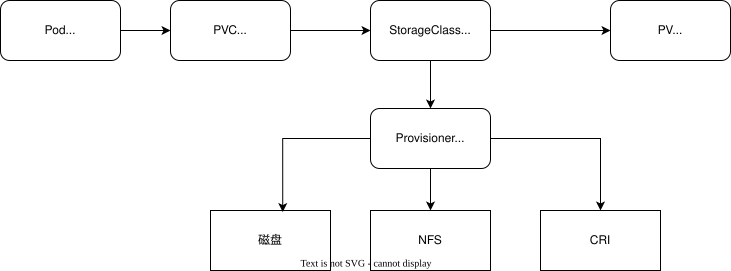

[目录](../目录.md)


# 关于StorageClass



# 制备器
每个StorageClass都必须配置一个制备器（Provisioner）
它是负责动态创建PV的核心组件/插件，决定使用哪种底层存储驱动来制备存储卷

当用户创建PVC并指定StorageClass时，K8s会自动调用对应制备器，无需管理员手动创建PV，实现存储资源的动态按需供给\
制备器就是StorageClass的执行器，专门负责自动创建PV

制备器工作流程
1) 用户创建PVC，并在配置中指定storageClassName
2) K8s根据StorageClass找到对应的制备器
3) 制备器依据PVC要求（存储大小、访问模式等），向底层存储系统申请创建真实存储卷
4) 存储创建完成后，制备器自动生成对应的PV对象，并与PVC完成绑定
5) Pod通过挂载PVC使用关联的PV存储


# 示例
NFS动态制备案例
- 创建storageClass
```yaml
apiVersion: storage.k8s.io/v1
kind: StorageClass
metadata:
  name: managed-nfs-storage
provisioner: fuseim.pri/ifs  # 外部制备器提供者，将StorageClass与制备器关联
parameters:
  archiveOnDelete: "false"  # 是否存档，false表示不存档，会删除oldPath下面的数据，true表示存档，会重命名路径
reclaimPolicy: Retain  # 回收策略，默认为Delete，可以配置为Retain
volumeBindingMode: Immediate  #默认为Immediate,表示创建PVC 立即进行绑定，只有azuredisk和AWSelasticblockstore支持其他值
```

- 创建provisioner-deployment
```yaml
apiVersion: apps/v1
kind: Deployment
metadata:
  name: nfs-client-provisioner
  namespace: kube-system
  labels:
    app: nfs-client-provisioner
spec:
  replicas: 1
  strategy:
    type: Recreate
  selector:
    matchLabels:
      app: nfs-client-provisioner
  template:
    metadata:
      labels:
        app: nfs-client-provisioner
    spec:
      serviceAccountName: nfs-client-provisioner  # PVC需要调用API进行操作，比如构建PV，因此需要一个ServiceAccount
      containers:
        - name: nfs-client-provisioner
          image: registry.cn-beijing.aliyuncs.com/pylixm/nfs-subdir-external-provisioner:4.0.0
          volumeMounts:
            - name: nfs-client-root
              mountPath: /persistentvolumes
          env:
            - name: PROVISIONER_NAME
           	  value: fuseim.pri/ifs
            - name: NFS_SERVER
              value: 192.168.113.121
            - name: NFS_PATH
              value: /data/nfs/rw
       volumes:
         - name: nfs-client-root
           nfs:
             server: 192.168.113.121
             path: /data/nfs/rw
```

创建statefulset
```yaml
---
appVersion: v1
kind: Service
metadata:
  name: nginx-sc
  labels:
    app: nginx-sc
spec:
  type: NodePort
  ports:
  - name: web
    port: 80
    protocal: TCP
  selector:
    app: nginx-sc
---
appVersion: apps/v1
kind: StatefulSet
metadata:
  name: nginx-sc
spec:
  replicas: 1
  serviceName: "nginx-sc"
  selector:
    matchLabels:
      app: nginx-sc
  template:
    metadata:
      labels:
        app: nginx-sc
    spec:
      containers:
      - image: nginx
        name" nginx-sc
        imagePullPolicy: IfNotPresent
        volumeMounts:
        - mountPath: /usr/share/nginx/html
          name: nginx-sc-test-pvc
  volumeClaimTemplates:
  - metadata:
      name: nginx-sc-test-pvc
    spec:
      storageClassName: managed-nfs-storage  # 关联sc
      accessModes:
      - ReadWriteMany
      resources:
        requests:
          storage: 1Gi
```

查看PV和PVC
```shell
kubectl get pv  # 查看新创建的pv
kubectl get pvc  # 查看新创建的pvc
```

创建pvc, 然后查看该pvc，发现它会自动的关联到一个pv
```yaml
appVersion: v1
kind: PersistentVolumeClaim
metadata:
  name: auto-pv-test-pvc
spec:
  accessModes:
  - ReadwriteOnce
  resources:
    requests:
      storage: 300Mi
  storageClassName: managed-nfs-storage
```