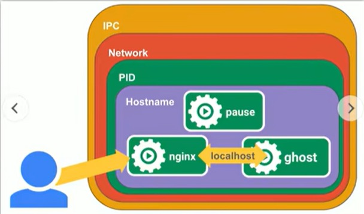

[目录](../目录.md)


# 关于工作负载型资源
工作负载型资源主要用于支撑K8s的运行

主要包括：
- Pod
- Pod副本
- 控制器


# Pod
当多个容器存在强依赖、紧耦合关系时，可部署在同一个Pod中，它们会共享Pod内的网络栈与存储卷\
Pod是K8s中最小的可部署、调度单元，本质是一组容器的集合

一个Pod包含：
- 应用容器（单个或多个）
- 存储资源
- 独立唯一的Pod IP
- 容器运行配置
  
Pod代表集群中一个独立的应用运行实例\
K8s不会直接管理容器，所有容器都被封装在Pod中统一调度与管理\
Pod本身属于命名空间级资源


- **Pod和容器**\
  Pod和容器常见组合方式：
  - **one-container-per-pod**\
    一个Pod内仅运行一个容器，生产环境最常用, Pod可看作该容器的运行载体
  - **multi-containers-per-pod**\
    一个Pod内运行多个容器，适用于容器间紧密耦合、需要共享资源、必须协同运行的场景\
    同一Pod内所有容器共享同一个IP地址、端口空间，容器间可通过localhost直接通信

  **注：**\
  常规场景下一个Pod建议只运行主应用容器，多容器仅用于日志收集、监控等辅助侧容器场景


- **Pause容器**\
  K8s会为每个Pod自动创建一个Pause容器（也叫沙箱容器）\
  它是Pod内所有业务容器的基础，负责统一创建并共享网络栈、存储卷、PID命名空间等核心资源\
  因此同一Pod内的不同容器，可直接通过localhost互相访问
  \
  

  **注:**\
  - Pause容器功能极简，几乎不占用资源，生命周期贯穿整个Pod，Pod启停本质就是Pause容器启停
  - 所有业务容器都会加入Pause容器的命名空间，实现资源互通
  - 外部访问Pod，实际访问的也是Pause容器暴露的网络端点

- **Pod容器类型**\
  Docker曾是K8s Pod中主流的容器运行时\
  目前K8s遵循CRI标准，同时兼容多种容器引擎

- **Pod Template**\
  它是Pod的配置定义，并非独立资源，内嵌在各类控制器对象中，控制器用它来创建Pod
  常见使用对象：Deployment、StatefulSet、DaemonSet、ReplicaSet、Job、CronJob
  控制器依据该模板统一创建Pod

# Pod副本
副本指基于同一模板复制生成的多个Pod实例
副本仅Pod名称、UID等标识类信息不同，容器配置、运行应用等核心内容完全一致，对外提供相同服务

K8s控制器通过Pod模板和replicas（副本数）定义期望实例数量，并按模板创建对应个数的Pod
当集群内实际Pod数量与期望副本数不匹配时，控制器会自动调度，始终维持副本数量符合设定值

常见管理副本的控制器：
- Deployment
- ReplicaSet
- StatefulSet

**注:**\
- 同组副本Pod一般会调度到不同节点，实现负载均衡与故障容错
- Pod副本属于命名空间级资源


# 控制器
不同类型的服务，需要搭配对应的控制器进行部署

按照服务场景，控制器主要分以下几类：
- 无状态服务控制器
- 有状态服务控制器
- 守护进程服务控制器
- 任务/定时任务控制器

**注:**\
所有控制器均为命名空间级资源


## 无状态服务控制器

专门用于部署无状态服务的控制器:
- ReplicationController
- ReplicaSet
- Deployment

**注：**\
可以直接创建ReplicationController和ReplicaSet，但一般建议创建Deployment

- **ReplicationController(RC)**\
  根据Pod模板维持指定副本数，确保运行中的Pod数量与期望一致
  现已被ReplicaSet取代，K8s主流版本已弃用

- **ReplicaSet(RS)**\
  ReplicationController的升级版，支持更强大的标签选择器（Selector/Label），可精准匹配管理Pod
  可直接创建使用，但推荐通过Deployment管理，不建议手动创建

- **Deployment(Deploy)**\
  对ReplicaSet进行高级封装，提供完整的应用生命周期管理能力，生产环境首选

  核心功能：
  - **创建ReplicaSet/Pod**\
    创建Deployment时，会自动创建关联的ReplicaSet，并由ReplicaSet创建Pod

  - **滚动升级/回滚**\
    修改镜像/配置后自动触发滚动更新，保证服务不间断、用户无感知

    ----------------------示例---------------------
    背景：当前Deployment对应ReplicaSet1, ReplicaSet1下包括Pod A和Pod B

    - **滚动升级**\
      当更新了Deployment里的Pod Template之后，会执行以下步骤执行滚动升级：

      1) Deployment创建ReplicaSet2，ReplicaSet2是空的，不包含任何Pod
      2) 在ReplicaSet2里，基于修改后的Pod Template创建Pod C
      3) 禁用ReplicaSet1的Pod A
      4) 在ReplicaSet2里，基于修改后的Pod Template创建Pod D
      5) 禁用ReplicaSet1的Pod B
      注：ReplicaSet1整体会被保留一段时间，不会立即删除，以备未来做回滚

    - **滚动回滚**\
      滚动升级后，执行kubectl rollout命令后，会按照以下步骤执行滚动回滚：

      1) 恢复ReplicaSet1的Pod A
      2) 禁用ReplicaSet2的Pod C
      3) 恢复ReplicaSet1的Pod B
      4) 禁用ReplicaSet2的Pod D
      注：ReplicaSet2不会被立即删除，它的replica数会变成0

  - **平滑扩缩容**\
    通过kubectl scale命令实现，可作用于Deployment或ReplicaSet
    推荐对Deployment 操作，不建议直接操作ReplicaSet

  - **暂停与恢复Deployment**\
    若需多次修改配置，可先暂停Deployment，避免频繁触发滚动更新
    修改完成后恢复，仅执行一次最终更新，减少不必要的版本切换

    若滚动更新过程中再次修改配置, 会执行以下操作：
    - 当前更新立即停止，已变更版本记入历史
    - 最新修改触发新一轮滚动更新

    
## 有状态服务控制器
专门用于部署有状态服务的控制器:
- StatefulSet

使用StatefulSet部署多个Pod时，Pod具备固定名称、有序创建、有序销毁的特性，实例之间有明确顺序
Pod会按0、1、2…… 序号依次生成，默认先启动的实例常作为主节点（Master），后续实例作为从节点（Slave）
典型架构中主节点负责读写，从节点提供只读能力，所有Pod启停、调度均严格遵循顺序
StatefulSet要求版本: >= K8s v1.5

StatefulSet主要特点:
- **稳定的持久化存储**\
  通过volumeClaimTemplates为每个Pod自动创建独立PVC
  Pod重建后仍绑定原有存储，数据永久保留

- **稳定的网络标志**\
  依赖Headless Service（无头服务）实现
  每个Pod拥有固定域名，名称、IP重建后不会改变，便于集群内互相访问

- **有序部署和扩展**\
  Pod命名格式：名称-序号（序号从 0 开始），严格按照 0 → 1 → 2 … 顺序创建
  只有前一个Pod处于Running或Ready状态，才会创建下一个Pod
  该特性由StatefulSet控制器自身的核心机制控制
  
- **有序收缩，有序删除**\
  销毁Pod时顺序与创建相反，按最大序号 → 最小序号依次执行
        

StatefulSet主要组成：
- **Headless Service(无头服务)**\
  负责提供稳定网络标识与DNS解析，管理有状态服务的网络访问
  
  固定DNS域名格式:
  ```yaml
  pod序号.statefulSet名称.headless服务名.命名空间.svc.cluster.local
  ```
  
  字段说明:
  - pod序号: Pod编号，从0开始依次递增（0、1、2…）
  - statefulSet名称：当前StatefulSet的名称
  - headless服务名：通过serviceName字段指定的无头服务名称
  - namespace：命名空间，Headless Service与StatefulSet 必须处于同一命名空间
  - svc.cluster.local：集群默认域名后缀，同命名空间内访问可省略


- **VolumeClaim Template(存储卷模板)**\
  持久化存储模板，自动为每一个Pod创建独立PVC，实现数据持久化
     


StatefulSet示例:
通过StatefulSet发布Pod，Pod副本数：3，Pod应用：MySQL数据库，每个Pod绑定独立PV/PVC

StatefulSet发布步骤：
1) **创建StatefulSet**\
   定义副本数3，配置.volumeClaimTemplates自动为每个Pod创建独立PVC

2) **创建Pod-0**\
   调度、挂载PVC、启动MySQL主节点，初始化数据目录，Pod-0 Ready
   1) StatefulSet控制器创建Pod-0
   2) K8s调度器将Pod-0调度到某个节点, 并挂载独立PVC
   3) Pod-0启动MySQL容器，初始化MySQL数据目录
   4) Pod-0进入Running&Ready状态
   
   **注：**\
   Pod-0是第一个启动的节点，MySQL业务脚本/镜像会把它自动配置为Master
   StatefulSet本身不分配主从角色，只保证顺序启动

3) **创建 Pod-1**\
   调度、挂载PVC、启动MySQL从节点，连接Pod-0进行数据复制，Pod-1 Ready
   1) StatefulSet控制器检测到Pod-0 Ready，开始创建Pod-1
   2) k8s调度器将Pod-1调度到某个节点，并挂载独立PVC
   3) Pod-1启动MySQL容器，初始化MySQL数据目录
   4) Pod-1启动后，通过启动脚本连接Pod-0（主节点）建立主从复制
   5) 数据同步完成后，Pod-1进入Ready状态

4) **创建 Pod-2**\
   调度、挂载PVC、启动MySQL从节点，连接主节点同步数据，Pod-2 Ready
   1) StatefulSet控制器检测到Pod-1 Ready，开始创建Pod-2
   2) K8s调度器将Pod-2调度到某个节点，并挂载独立PVC
   3) Pod-2启动MySQL容器，初始化MySQL数据目录
   4) Pod-2通过启动脚本连接主节点Pod-0进行数据同步
   5) Pod-2同步完成后进入 Ready

5) **集群运行**\
   三个Pod互相通信，数据同步，保证高可用和数据持久化

三个Pod都处于Ready，MySQL主从复制集群正常运行\
每个Pod有稳定的DNS名称，如mysql-0.mysql.default.svc.cluster.local，方便相互访问\
PVC保证数据持久化，Pod重启后数据不丢失

数据同步方式：
- 所有从节点都从主节点同步
  默认，最简单
- 从节点从其他从节点同步
  链式同步/级联同步

数据同步方式业务（MySQL）配置决定的，而不是由K8s或StatefulSet决定的

**注：**
- StatefulSet中Pod的存储，建议通过volumeClaimTemplates自动生成PVC绑定PV，也可使用管理员预先创建好的存储卷
- 为保证数据隔离与安全, 在删除StatefulSet时，一般不会同步删除PVC和PV，使数据得以保留
- StatefulSet依赖Headless Service提供稳定DNS解析，必须先创建Headless Service，再创建StatefulSet


## 守护进程服务控制器
专门用于部署守护进程服务的控制器:
- DaemonSet

DaemonSet通过节点选择器（selector）筛选节点，在每个匹配节点上运行一个Pod(守护程序)
常用于部署集群日志、监控、网络、存储等节点级系统组件

典型场景:
- **日志收集**\
  fluentd，logstash等

- **节点监控**\
  Prometheus Node Exporter，collectd等监控组件

- **集群基础程序**\
  kube-proxy、glusterd、Ceph 客户端等


## 任务/定时任务控制器
专门用于部署任务/定时任务的控制器:
- job
- cronjob

- **job**\
  用于运行一次性任务，任务执行完成后Pod自动销毁，不会重新启动新容器
- **cronjob**\
  在Job之上增加定时调度功能，可按照预设周期重复执行任务