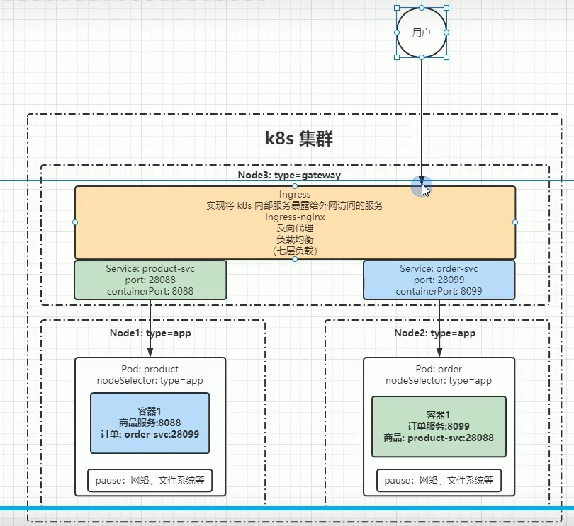
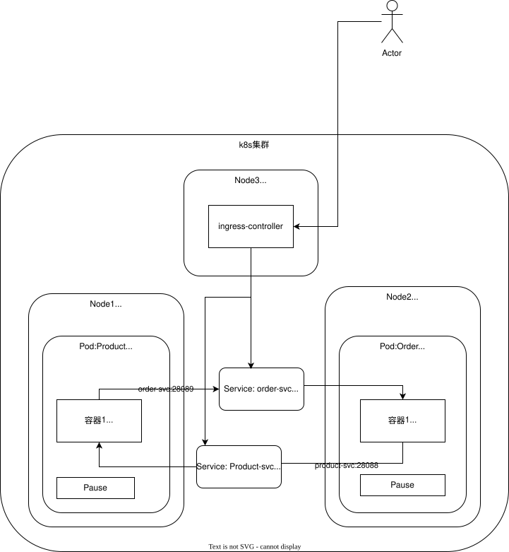

[目录](../目录.md)

# 关于服务发现

##### Service
Service主要用于k8s集群内部的网络通信，比如Node之间，Pod之间的通信(即便Pod处在不同的Node里)\
由于k8s内部是无法直接访问Pod的，因此就通过Service暴露端口的方式接收通信请求，再将请求转发到Pod\
也就是Pod是通过service来暴露自己，进而提供服务的

如果一个应用的背后由一组Pod支撑，那么Service就是这个应用服务的抽象，它定义了Pod逻辑集合和访问这个Pod集合的策略\
Service不代表一个Node，而是代表一组Pod

Service也可以处理外部请求，对外提供一个访问入口，外部请求访问该入口后，通过负载均衡转发到Pod集合中某一个Pod的容器内\
这仅限于某些service类型，比如NodePort，LoadBalancer，但Service主要还是处理k8s内部请求

**东西流量和南北流量**

- **东西流量**\
  横向流量, 通过service实现集群内部各个节点的访问

- **南北流量**\
  纵向流量，通过Ingress实现k8s内部服务暴漏外网访问

##### Ingress
Ingress主要用于处理k8s外部网络请求，实现k8s内部服务暴露外网访问

**示例**\
k8s集群下有三个Node，配置如下：

- **Node1**\
  部署了Product Pod提供product-svc服务

- **Node2**\
  部署了Order Pod提供order-svc服务

- **Node3**\
  作为网关节点接受外部请求，部署了Ingress Controller\
  外部用户访问Node3的Ingress，Ingress将请求转发到集群内部的Pod中

注：Node1和Node2用来提供应用服务，Node3作为网关节点接受外部请求，并根据请求内容将流量转发至Node1和Node2\
\
