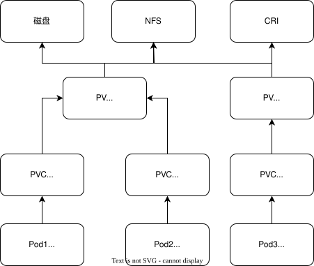
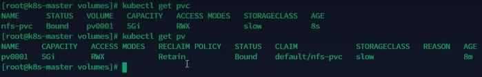

[目录](../目录.md)


# 关于持久卷和持久卷声明
HostPath、NFS等均为底层具体存储实现方案，各类存储挂载配置语法各不相同，直接在Pod中配置存储会造成使用繁琐、耦合底层硬件\
持久卷(PV)和持久卷声明(PVC)作为存储抽象中间层，屏蔽各类存储实现细节\
使用者只需通过PVC申请存储资源，Pod挂载PVC即可使用存储，无需关心后端是NFS/本地磁盘等具体存储类型


**PV和PVC机制**\
PV由集群管理员或存储驱动创建，是底层存储资源的抽象封装\
PVC为业务侧存储申请，定义所需存储容量、访问权限等需求\
K8s依据PVC的规格匹配闲置PV，完成二者绑定\
Pod挂载存储时引用PVC，不直接绑定PV，实现应用与底层存储解耦

**注:**\
PV和PVC的绑定为一对一，PVC一旦绑定PV无法随意更换\



# 持久卷(PV)
持久卷(Persistent Volume,PV)用于为整个集群提供可用的持久化存储载体\
它对NFS、云盘、iSCSI等底层存储进行统一抽象

**持久卷特点包括:**
- 既可手动创建，也可通过StorageClass动态自动创建
- 生命周期独立于Pod，不受Pod启停、删除影响
- 可定义存储容量、访问模式（如 ReadWriteOnce、ReadOnlyMany、ReadWriteMany）、存储类型、回收策略等属性


# 持久卷生命周期
持久卷生命周期包括：
- 构建
- 绑定
- 使用
- 回收


## 构建
持久卷的构建方式包括：
- **静态制备**\
  管理员预先手动创建PV，配置后端存储参数（NFS/HostPath 等）,即真实存储的细节信息\
  PV存入集群API资源，等待PVC申领绑定
- **动态制备**\
  现有空闲PV不满足PVC申请规格时，依托StorageClass自动生成对应PV\
  PVC需显式指定StorageClass，或集群配置默认StorageClass(DefaultStorageClass)才可自动创建PV

## 绑定
用户创建PVC后，控制器检索集群空闲PV，依据容量、访问模式等规则匹配并完成PV与PVC一对一绑定\
若无符合条件的存量PV：PVC指定StorageClass → 触发动态供给，自动新建PV并绑定\
若未配置StorageClass → PVC持续处于Pending未绑定状态，直至出现适配PV

**注：**\
PV一经绑定PVC，短期内无法解绑复用其他PVC

## 使用
Pod直接挂载PVC使用存储，集群经由PVC关联绑定的PV并完成挂载\
PV被PVC占用时受保护，无法直接删除，防止存储数据误删

**注：**\
需先删除关联PVC，才能正常删除PV


## 回收
用户不再使用存储时删除PVC，与之绑定的PV转为Released释放状态，随后依据PV配置的回收策略处理底层存储数据，实现资源回收复用

常用回收策略包括：
- **Retained (保留)**\
  删除PVC后PV保留、状态变为Released，原有业务数据仍留存卷内\
  因此该PV无法直接被新PVC绑定使用
  
  如果回收策略为Retained，数据且数据需要清楚，管理员需手动执行以下回收步骤：
  1) 删除集群内PV资源对象\
     仅删掉K8s API里的PV资源，宿主机/NFS/云盘的真实存储目录、原有数据完全保留
  2) 手动清理存储里遗留数据\
     保留存储目录本身，只删除目录内部所有业务文件, 目录载体还在，后续能基于该目录新建PV复用存储
     例：NFS目录清空里面所有文件，但NFS文件夹不删
  3) 按需删除底层存储硬件资源\
     若要复用原有存储，可依托现有存储重新创建PV\
     连带存储目录、底层存储载体一起删除，存储空间彻底释放，无法再直接复用\
     例：删掉NFS共享目录、卸载删除云硬盘

- **Recycled(回收)**\
  删 PVC → 自动执行"rm -rf"清空卷内数据 → PV变回Available空闲，可被新PVC绑定复用

  **注:**\
  K8s 1.23 + 彻底移除，不再使用，官方用「动态SC+Delete」替代复用场景

- **Deleted(删除)**\
  删除PVC时，集群同步删除PV对象与后端真实存储资源
  该策略为动态SC自动创建的PV的默认回收策略


# 持久卷的状态
持久卷的状态包括：
- Available: 空闲，未被绑定
- Bound: 已被PVC绑定
- Released: PVC被删除，资源已回收，但是PV未被重新使用
- Failed: 自动回收失败

示例：
```yaml
apiVersion: v1
kind: PersistentVolume  # 资源类型是pv
metadata:
  name: pv001 # pv的名字
spec:
  capacity:  # 容量配置
    storage: 5Gi  # pv的容量
  volumeMode: Filesystem  #存储类型为文件系统
  accessModes:  # 访问模式，ReadWriteOnce，ReadWriteMany，ReadOnlyMany
    - ReadWriteOnce  # 可被单节点读写
  persistentVolumeReclaimPolicy: Recycle  # 回收策略
  storageClassName: slow  # 创建PV的存储类名，需要与pvc的相同
  mountOptions:  # 加载配置
    - hard
    - nfsvers=4.1
  nfs: # 连接到nfs
    path: /home/nfs/rw/test-pv  # 存储路径
    server: 192.168.113.121  # nfs服务地址
```


# 持久卷声明
持久卷声明(Persistent Volume Claim,PVC)是用户发起的存储资源申请\
用于指定所需存储的规格, 类似于“我要一个多大容量、什么访问模式的存储卷”

持久卷声明的作用是解耦使用者与底层存储，简化存储申请流程\
即：用户无需关心底层存储细节，只需声明需求即可使用持久化存储

**特点：**\
- 用户仅声明存储容量、访问模式等需求，无需感知底层存储细节
- 创建后会自动匹配并绑定符合条件的PV，PV与PVC为一对一绑定
- 生命周期不强制和Pod绑定，Pod通过挂载PVC来使用存储

示例：
- 创建pvc
  ```yaml
  apiVersion: v1
  kind: PersistentVolumeClaim  # 资源类型为pvc
  metadata:
    name: nfs-pvc  # pvc的名字
  spec:
    accessModes:
      - ReadWriteOnce  # 权限需要与对应的pv相同
    volumeMode: Filesystem
    resources:
      request:
        storage: 8Gi  # 资源可以小于pv的，但是不能大于，如果大于就会匹配不到pv
    storageClassName: slow  # 名字需要与对应的pv相同
    # selector   也可以用selector/label的方式选择pv
  ```
- 创建Pod
  ```yaml
  apiVersion: v1
  kind: Pod
  metadata:
    name: test-pvc-pd
  spec:
    containers:
    - image: nginx
      name: nginx-volume
      volumeMounts:
      - mountPath: /usr/share/nginx/html  # 挂载到容器的哪个目录
        name: nfs-pvc-test
    volumes:
    - name: nfs-pvc-test
      persistentVolumeClaim:  # 关联PVC
        claimName: nfs-pvc  # pvc的名称，该Pod绑定了PVC挂载
  ```

- 查看pv和pvc的状态和绑定状态
  ```shell
  kubectl get pv
  kubectl get pvc
  ```



