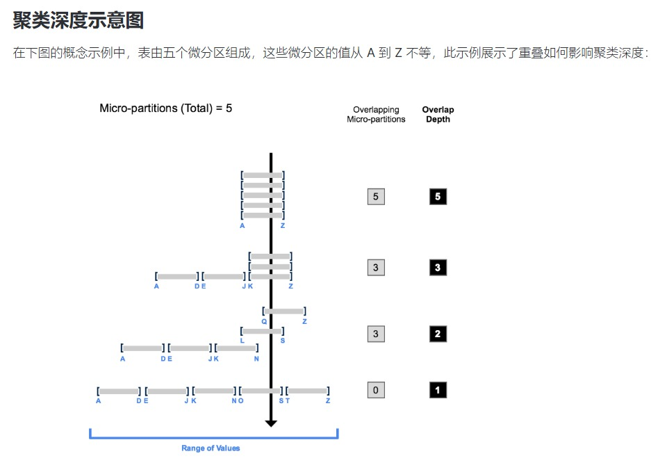

# 关于微分区
微分区(micro-partition)是连续的存储单元，Snowflake表中的所有数据都会自动划分到各个微分区中
每个微分区包含50 MB至500 MB的未压缩数据
注：存储在微分区中的数据都是经过压缩的，这里的50 MB至500 MB是指如果将压缩的数据解压，那么解压后的数据应该是50 MB到500 MB之间，并非指微分区内会有未压缩的数据

表中一组记录会映射到指定某个微分区内，并以列式方式组织
这种大小和结构允许对超大型表进行高度精细的修剪
一个典型的Snowflake表可能包含数百万乃至数亿个微分区

Snowflake会存储微分区内所有记录的元数据，包括：
- 微分区中各列的值范围
- 非重复值的数量
- 用于优化和高效查询处理的附加属性

**注：**\
1) Snowflake表的微分区都是自动运行的
2) 当数据被插入或加载到表中时，Snowflake 会按照数据的写入顺序，把数据切分成很多微分区，并为每个微分区自动维护统计信息

# 微分区的优势
Snowflake表的微分区的优势，有以下几点：
- 微分区是自动生成的，无需事先显式定义，也无需用户进行维护，维护成本低
- 微分区非常小，能实现极高效的DML和细粒度修剪，查询和更新快
- 微分区的值范围可以重叠，且体积较小，有助于防止数据扭曲
- 微分区内，列是单独存储的，即列式存储，只需扫描查询引用的列，扫描效率高
- 微分区内，列是单独压缩的，对于分区中的每个列，Snowflake会自动为其确定最有效的压缩算法，存储效率高

可以通过为每个表指定群集密钥，在表上启用群集，来提高查询性能
群集密钥的指定，可以手动显式定义，也可以自动定义
可在以下命令中，指定自定义的群集密钥
- CREATE TABLE
- ALTER TABLE

注：混合表不支持标准 Snowflake表中可用的某些功能（例如群集密钥），因为其基于的架构不支持

# 微分区的影响

## DML
所有DML操作（如 DELETE、 UPDATE、 MERGE）都利用了底层的微分区元数据，以方便和简化表的维护
例如，某些操作（如删除表中的所有行），是仅针对元数据的操作，不涉及对表中实际数据的操作

## 删除表中的列
删除表中的一列后，执行 drop 语句时不会对包含已删除列数据的微分区进行重写
删除的列中的数据仍在存储中

## 查询修剪
Snowflake 维护的微分区元数据可在查询运行时精确修剪微分区中的列，包括含有半结构化数据的列
换言之，如果某查询指定了针对一个值范围的筛选谓词，以访问该范围内 10% 的值，那么理想情况下，该查询只扫描 10% 的微分区

例如，假设一个大型表包含一年的历史数据，其中有日期和小时列，
假设数据的分布非常理想和均匀，线性顺序的分布在各个微分区内，那么，针对特定小时的查询应该扫描表中 1/8760 的微分区，然后仅扫描对应微分区内对应小时列的数据部分
Snowflake使用分区的列式扫描，因此，则不会扫描整个分区

如果查询仅按一列进行筛选，Snowflake不会扫描整个分区，它只扫描分区内筛选的列

扫描的微分区和列式数据的比例和实际选定数据的比例越接近，对表进行修剪的效率就越高
比如，查询时间序列数据时，如果修剪的程度细化到一小时甚至更短，其响应时间可以是亚秒级

并非所有谓词表达式都能用于修剪
比如，一个查询的谓词如果是基于子查询的，即便子查询的结果是常量，Snowflake也不会修剪微分区

# 数据聚类
在 Snowflake 中，当数据插入/加载到表中时，系统会收集并记录在此过程中创建的每个微分区的聚类元数据
Snowflake在查询期间，会根据这些聚类信息，避免扫描不必要的微分区，从而提高查询性能

Snowflake会按照以下顺序查询表：
1) 根据聚类元数据，跳过不必要的微分区，只扫描必要的微分区，这个过程叫修剪查询
2) 在必要的微分区内按列进行修剪

# 为微分区维护的聚类信息
Snowflake维护表中微分区的聚类元数据，包括：
- 构成表的微分区总数
- 包含彼此重叠的值（指定的表的列子集内）的微分区数量
- 重叠的微分区的深度

# 聚类深度
填充表的聚类深度(cluster deepth)用于衡量表中指定列的重叠微分区的平均深度（1 或更大）
平均深度越小，表与指定列相关的聚类就越好

如果表里有数据，则其底层的微分区被填充了数据，叫填充表
如果表里没数据，则它没有微分区，叫未填充表或空表，其聚类深度为0

聚类深度可用于以下用途：
- 监控大型表的聚类“健康状况”，尤其是在对表执行 DML 的过程中
- 确定大型表能否受益于显式定义群集密钥

表的聚类深度是否良好的绝对或精确衡量标准不是深度值的大小，查询性能才是衡量表聚类程度的最佳指标
如果对某个表的查询的执行效果符合需要或预期，则该表很可能聚类良好
如果查询性能随着时间的推移而降低，则表很可能不再聚类良好，并且有可能从聚类中受益

**恒定状态**
如果不论如何重新聚类，都难以更进一步降低重叠或提高裁剪效果的话
那么此时，指标(比如聚类深度)会处于稳定区间并围绕某个值波动，该状态叫恒定状态

示例：

最初，所有微分区的值范围是重叠的
随着重叠微分区数量的减少，重叠深度也随之缩小
在没有任何微分区的值范围存在重叠时，微分区被认为处于恒定状态（即无法通过聚类加以改进）

**注：**
1) 实际情况下，表中的数据被包含在大量微分区中，没必要专注于使微分区达到恒定状态，查询性能达到预期状态即可
2) 所谓恒定状态，是指指标值(比如聚类深度)可以是低也可以是高，不一定是0 (即没有任何微分区的值范围存在重叠)

# 监控表的聚类信息
以下系统视图提供了表的聚类信息
- SYSTEM$CLUSTERING_DEPTH
- SYSTEM$CLUSTERING_INFORMATION （包括聚类深度）