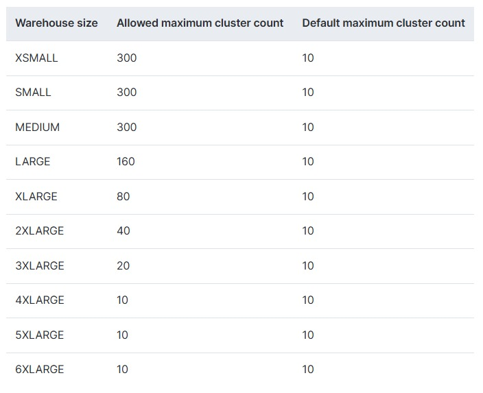

# 关于多集群仓库
多集群(multi-cluster)仓库拥有多个集群，可以根据并发量自动调整集群的数量\
Snowflake支持版本：Enterprise 及以上版本

默认情况下，一个仓库只有一个集群\
当多个查询提交到仓库时，仓库会分配计算资源去执行，没有分配资源的查询会排队等待，直到它被分配到资源\
多集群仓库可以通过动态或者静态的方式，提供更多的可运行资源

多集群仓路通过以下属性配置：
- 最大集群数\
  大于1，不同大小的仓库可以设置的最大集群数是不同的
- 最小集群数\
  要小于或等于最大集群数

注：最大集群数是可以等于1的，但这样就成了单集群(single-cluster)仓库了


多集群仓路支持所有单集群仓库同样的属性和操作，比如
- 指定仓库的大小
- 任何时间调整仓库大小
- auto-suspend正在运行的仓库
- auto-resume正在suspend的仓库

注：对于auto-suspend和auto-resume，它针对的是仓库下的所有集群，不能只针对单独某一个集群执行该操作

不同大小的仓库，可以配置的集群数量是不同的\



如果创建仓库时不指定MIN_CLUSTER_COUNT和MAX_CLUSTER_COUNT，那么创建的仓库的集群数就是1\
通过Snowsight可以设置的最大c集群数为10，但如果需要设置更多集群，需要通过sql命令的方式进行设置


# Maximized和Auto-scale
多集群仓库可以设置为以下两种模式
- Maximized	\
  最大集群数和最小集群数必须一致，且都必须大于1\
  仓库会启动所有集群，来保持最大资源运行\
  可有效的通过静态控制的方式控制计算资源，尤其是在并发用户会话或查询数量众多且数量变化不大时
- Auto-scale	\
  最大集群数和最小集群数必须不一致，最小集群数要小于最大集群数\
  仓库会根据工作负载动态启动新的集群

  注：通过create/alter wharehouse命令里的SCALING_POLICY属性，可以指定scaling policy种类，用于启停集群，从而控制credit的消耗

  在定义最大集群数和最小集群数时，可以先设置它们为最小值，比如最小集群数=1，最大集群数=2或3\
  然后持续查看负载情况，再根据负载情况持续优化调整，最终确定最大集群数和最小集群数


# 多集群大小和credit使用量
每个集群中的计算资源量由仓库大小决定：
- 仓库每小时消耗的最大credit = 仓库大小对应的每小时消耗Credit数 * 该仓库大小所允许的最大集群数
- 如果调整仓库大小，新的大小会被应用到当前正在运行以及未来会启动的集群上

注：实际消耗的credit取决于每小时正在运行的集群数量

如果多集群仓库使用Query Acceleration Service (QAS)，请考虑将其 QAS 比例因子调整至高于单集群仓库\
这有助于将 QAS 优化应用于仓库的所有集群


# 多集群的优点
如果没有多集群，那么：\
如果工作负载增加，需要额外配置仓库或者提高当前仓库的大小\
如果工作负载减少，还需要手动的downsize当前仓库，或者suspend额外配置的仓库

有了多集群，那么：\
在auto-scale模式下，可以在不改变仓库大小的情况下，通过动态扩缩集群数量的方式，应对负载变化\
在Maximized模式下，可以在不改变仓库大小的情况下，通过静态手动调整集群数量的方式，应对负载变化

注：多集群可以提高多并发的性能，如果查询很复杂执行很慢，或进行数据加载，多集群对性能提升帮助不大，应提高仓库的大小


# 创建多集群仓库
创建多集群仓库，可以通过以下方式：
- Web UI\
  通过Snowsight UI手动创建和查看
- 通过SQL命令\
  创建仓库
  ```sql
  create warehouse if not exists wh_mc_demo
    with warehouse_size = 'SMALL'
         max_cluster_count = 3
         min_cluster_count = 1
         auto_suspend = 300
         auto_resume = true;
  ```

  查看当前所有的仓库
  ```sql
  show warehouses;
  ```

  通过pipe operator对输出结果优化
  ```sql
  SHOW WAREHOUSES
    ->> SELECT "name", "state", "size", "max_cluster_count", "started_clusters", "type"
          FROM $1
          WHERE "state" IN ('STARTED','SUSPENDED')
          ORDER BY "type" DESC, "name";
  ```
  注：除了这些操作，其他的操作，多集群仓库和单集群仓库是相同的


# Scaling Policy
通过Scaling Policy可以让仓库使用指定的扩展策略，根据需要合理扩缩集群数量\
Scaling Policy只适用于auto-scaling模式，不适用于maximized模式

scaling policy分以下两种：

- Standard(标准型)
  - 说明\
    相比于节省credit，更倾向于启动更多的集群减少排队
  - 启动新集群\
    当查询排队时，或者如果Snowflake 估计当前运行的集群没有足够的资源来处理任何额外的查询时，Snowflake会增加仓库中的集群数量
    - 当仓库的MAX_CLUSTER_COUNT<=10时，Snowflake会新启动一个集群
    - 当仓库的MAX_CLUSTER_COUNT>10时，Snowflake会一次性新启动多个集群，应对负载的快速增长
  - 关闭空闲或轻负载的集群\
    在低负载状态持续一段时间后，当查询结束时，Snowflake会关闭这些负载最低的集群中的一个或多个
	  - 当集群数 >10 时，Snowflake可能会一次性关闭多个集群
    - 当集群数<= 10 时，Snowflake 会一次性关闭所有空闲的集群
- Economy(经济型)
  - 说明\
    通过让运行的集群保持满负载，而不是启动更多的集群的方式，来节省credit\
    它会导致查询排队或使查询更长的时间完成
  - 启动新集群\
    只有当系统估计有足够的查询负载让集群忙碌至少 6 分钟时才会启动新的集群
  - 关闭空闲或轻负载的集群\
    当集群被评估还有6分钟就完成工作时，Snowflake会将其标注为"最低负载"，并在集群完成所有查询后关闭它
    - 当集群数 >10 时，Snowflake可能会一次性关闭多个集群
    - 当集群数<= 10 时，Snowflake 会一次性关闭所有空闲的集群


**设置Scaling-Policy**
- 通过Snowsight UI手动创建和查看
- 通过SQL命令
```sql
CREATE WAREHOUSE mywh WITH MAX_CLUSTER_COUNT = 2, SCALING_POLICY = 'STANDARD';
ALTER WAREHOUSE mywh SET SCALING_POLICY = 'ECONOMY';
```

# 调整集群数
可以在任何时间调整集群数量，包括仓库运行时，语句运行时

通过以下方式调整：

- 通过Snowsight UI手动创建和查看\
  通过该方式，cluster最大数只能调整到10，如果要更高，只能通过sql命令的方式
- 通过SQL命令
  ```sql
  alter warehouse wh_demo
    set min_cluster_count = 3,
        max_cluster_count = 4;
  ```

仓库处于不同模式，更改集群的最大数和最小数的值的效果也不同
- auto-scaling模式\
  提高集群最大数和最小数：指定数量的集群立即启动\
  降低集群最大数和最小数：指定数量的集群在执行完语句且自动暂停期结束后关闭
- maximizated模式\
  提高集群最大数：如果 new_max_clusters > running_clusters，则在需要更多集群之前不做任何更改\
  降低集群最大数：如果满足 new_max_clusters < running_clusters, 多余的集群在执行完语句和满足扩展策略条件后会关闭\
  提高集群最小数：如果 new_min_clusters > running_clusters，则立即启动更多集群以满足最小数量要求\
  降低集群最小数：如果满足 new_min_clusters < running_clusters, 多余的集群在执行完语句和满足扩展策略条件后会关闭 


# Multi-cluster仓库监控
通过Snowsight UI查看